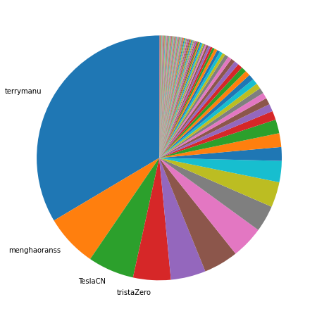
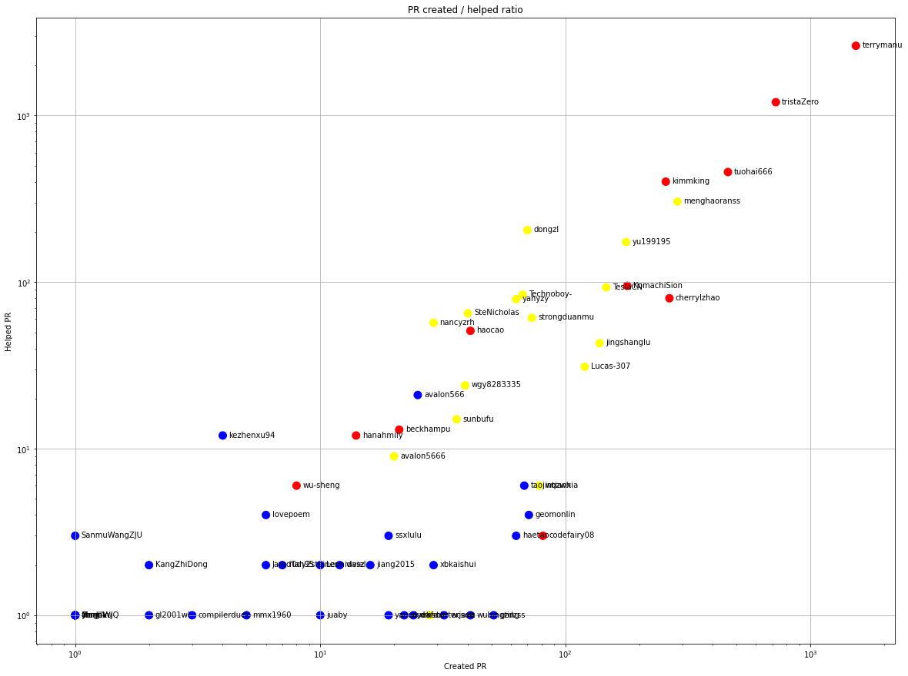
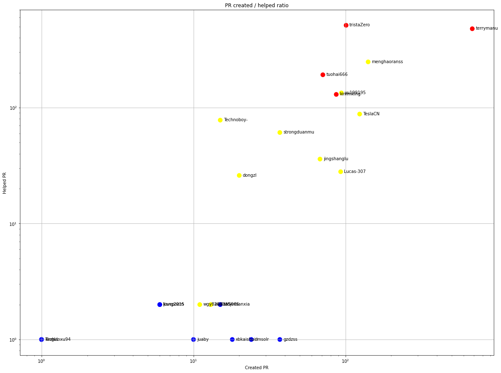
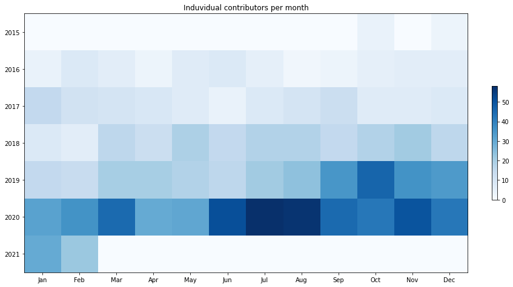
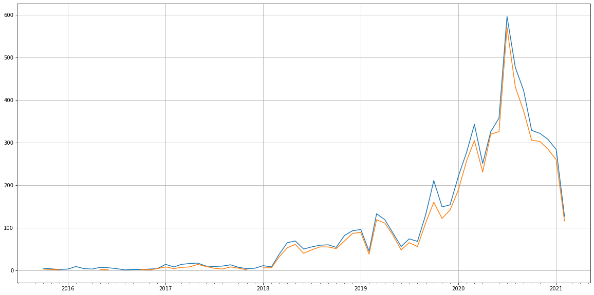
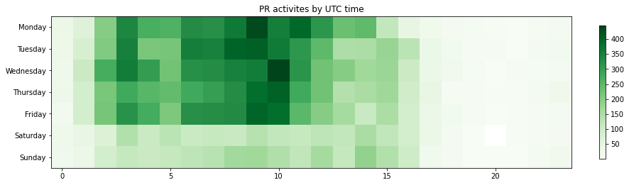

Latest record from the dataset:

<table border="1" class="dataframe">
  <thead>
    <tr style="text-align: right;">
      <th></th>
      <th>org</th>
      <th>repo</th>
      <th>type</th>
      <th>identifier</th>
      <th>subidentifier</th>
      <th>date</th>
      <th>author</th>
      <th>owner</th>
      <th>project</th>
    </tr>
  </thead>
  <tbody>
    <tr>
      <th>20146</th>
      <td>apache</td>
      <td>shardingsphere</td>
      <td>PR_COMMENTED</td>
      <td>9361</td>
      <td>NaN</td>
      <td>2021-02-13 04:58:20+00:00</td>
      <td>ThanoshanMV</td>
      <td>ThanoshanMV</td>
      <td>shardingsphere</td>
    </tr>
  </tbody>
</table>

# Github Contributions per user

<table border="1" class="dataframe">
  <thead>
    <tr style="text-align: right;">
      <th></th>
      <th>contributions</th>
    </tr>
    <tr>
      <th>author</th>
      <th></th>
    </tr>
  </thead>
  <tbody>
    <tr>
      <th>terrymanu</th>
      <td>4979</td>
    </tr>
    <tr>
      <th>tristaZero</th>
      <td>2674</td>
    </tr>
    <tr>
      <th>coveralls</th>
      <td>2088</td>
    </tr>
    <tr>
      <th>tuohai666</th>
      <td>960</td>
    </tr>
    <tr>
      <th>kimmking</th>
      <td>802</td>
    </tr>
    <tr>
      <th>codecov-io</th>
      <td>753</td>
    </tr>
    <tr>
      <th>menghaoranss</th>
      <td>612</td>
    </tr>
    <tr>
      <th>dongzl</th>
      <td>399</td>
    </tr>
    <tr>
      <th>yu199195</th>
      <td>361</td>
    </tr>
    <tr>
      <th>Technoboy-</th>
      <td>235</td>
    </tr>
  </tbody>
</table>

## Contributors per participations in PRs which are not created by self (helping PRs)

<table border="1" class="dataframe">
  <thead>
    <tr style="text-align: right;">
      <th></th>
      <th>identifier</th>
    </tr>
    <tr>
      <th>author</th>
      <th></th>
    </tr>
  </thead>
  <tbody>
    <tr>
      <th>terrymanu</th>
      <td>2621</td>
    </tr>
    <tr>
      <th>coveralls</th>
      <td>2012</td>
    </tr>
    <tr>
      <th>tristaZero</th>
      <td>1203</td>
    </tr>
    <tr>
      <th>codecov-io</th>
      <td>752</td>
    </tr>
    <tr>
      <th>tuohai666</th>
      <td>458</td>
    </tr>
    <tr>
      <th>kimmking</th>
      <td>401</td>
    </tr>
    <tr>
      <th>menghaoranss</th>
      <td>304</td>
    </tr>
    <tr>
      <th>dongzl</th>
      <td>205</td>
    </tr>
    <tr>
      <th>yu199195</th>
      <td>174</td>
    </tr>
    <tr>
      <th>codecov-commenter</th>
      <td>150</td>
    </tr>
    <tr>
      <th>KomachiSion</th>
      <td>95</td>
    </tr>
    <tr>
      <th>TeslaCN</th>
      <td>93</td>
    </tr>
    <tr>
      <th>Technoboy-</th>
      <td>84</td>
    </tr>
    <tr>
      <th>cherrylzhao</th>
      <td>80</td>
    </tr>
    <tr>
      <th>yanyzy</th>
      <td>79</td>
    </tr>
    <tr>
      <th>SteNicholas</th>
      <td>65</td>
    </tr>
    <tr>
      <th>strongduanmu</th>
      <td>61</td>
    </tr>
    <tr>
      <th>nancyzrh</th>
      <td>57</td>
    </tr>
    <tr>
      <th>haocao</th>
      <td>51</td>
    </tr>
    <tr>
      <th>jingshanglu</th>
      <td>43</td>
    </tr>
  </tbody>
</table>

## Contributors per participations in any PRs

<table border="1" class="dataframe">
  <thead>
    <tr style="text-align: right;">
      <th></th>
      <th>identifier</th>
    </tr>
    <tr>
      <th>author</th>
      <th></th>
    </tr>
  </thead>
  <tbody>
    <tr>
      <th>terrymanu</th>
      <td>4034</td>
    </tr>
    <tr>
      <th>coveralls</th>
      <td>2012</td>
    </tr>
    <tr>
      <th>tristaZero</th>
      <td>1907</td>
    </tr>
    <tr>
      <th>tuohai666</th>
      <td>912</td>
    </tr>
    <tr>
      <th>codecov-io</th>
      <td>752</td>
    </tr>
    <tr>
      <th>kimmking</th>
      <td>657</td>
    </tr>
    <tr>
      <th>menghaoranss</th>
      <td>571</td>
    </tr>
    <tr>
      <th>yu199195</th>
      <td>351</td>
    </tr>
    <tr>
      <th>cherrylzhao</th>
      <td>343</td>
    </tr>
    <tr>
      <th>dongzl</th>
      <td>275</td>
    </tr>
    <tr>
      <th>KomachiSion</th>
      <td>273</td>
    </tr>
    <tr>
      <th>TeslaCN</th>
      <td>240</td>
    </tr>
    <tr>
      <th>jingshanglu</th>
      <td>181</td>
    </tr>
    <tr>
      <th>Technoboy-</th>
      <td>151</td>
    </tr>
    <tr>
      <th>Lucas-307</th>
      <td>151</td>
    </tr>
    <tr>
      <th>codecov-commenter</th>
      <td>150</td>
    </tr>
    <tr>
      <th>yanyzy</th>
      <td>142</td>
    </tr>
    <tr>
      <th>strongduanmu</th>
      <td>134</td>
    </tr>
    <tr>
      <th>SteNicholas</th>
      <td>105</td>
    </tr>
    <tr>
      <th>haocao</th>
      <td>91</td>
    </tr>
  </tbody>
</table>

# Bus factor (number of contributors responsible for the 50% of the prs) from last half year

## Contributors until the half of the all contributions

<table border="1" class="dataframe">
  <thead>
    <tr style="text-align: right;">
      <th></th>
      <th>author</th>
      <th>identifier</th>
      <th>cs</th>
      <th>ratio</th>
    </tr>
  </thead>
  <tbody>
    <tr>
      <th>0</th>
      <td>terrymanu</td>
      <td>683</td>
      <td>683</td>
      <td>33.546169</td>
    </tr>
    <tr>
      <th>1</th>
      <td>menghaoranss</td>
      <td>141</td>
      <td>824</td>
      <td>6.925344</td>
    </tr>
    <tr>
      <th>2</th>
      <td>TeslaCN</td>
      <td>124</td>
      <td>948</td>
      <td>6.090373</td>
    </tr>
  </tbody>
</table>

## Pony number (bus factor)

    4

## Dev power (All the contributions in the ration of the top contributor)

    2.9809663250366025

    

    

## People with created PRs > reviewed/commented PRS

    

    

## Same graph with focusing to the last 6 month

Only contributors with both created pr and helped pr visible

    

    

# Number of individual contributors per month

Number of different Github users who either created PR, commented PR, added review to a PR

Note: only events from apache/hadoop-ozone repository are included. Earlier PRs/comments are not here.

    

    

# Number of PRs closed/created per month

    /usr/lib/python3.9/site-packages/pandas/core/arrays/datetimes.py:1101: UserWarning: Converting to PeriodArray/Index representation will drop timezone information.
      warnings.warn(

    

    

# PR activity heatmap

    

    

