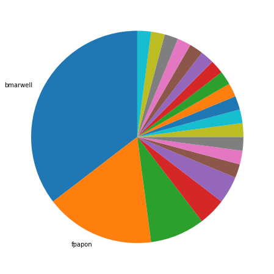
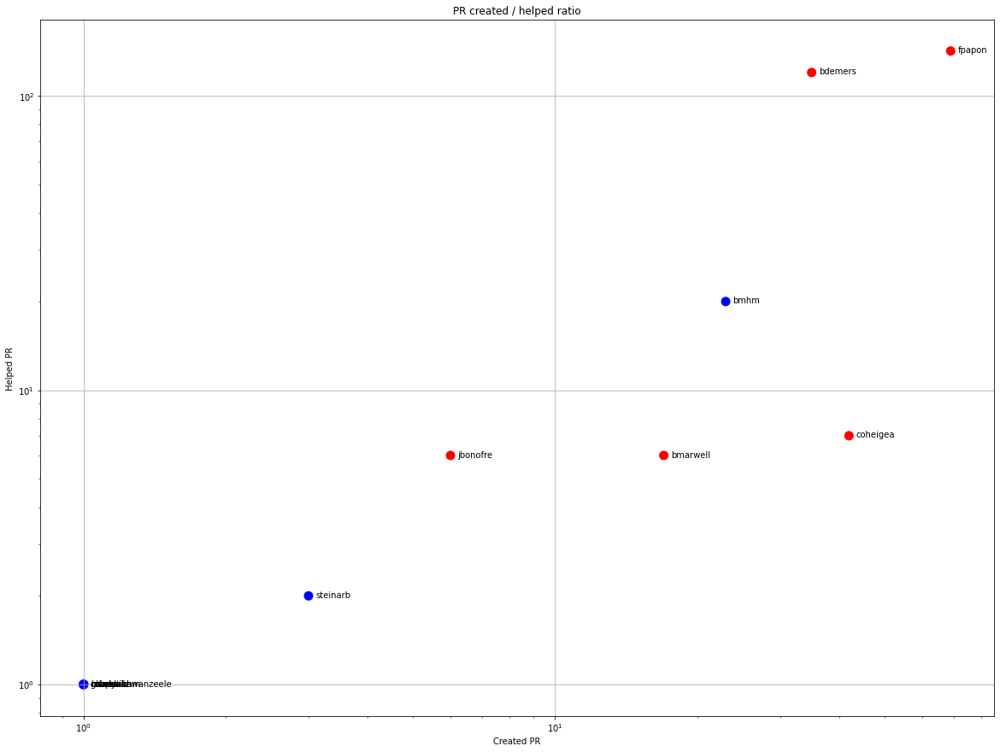
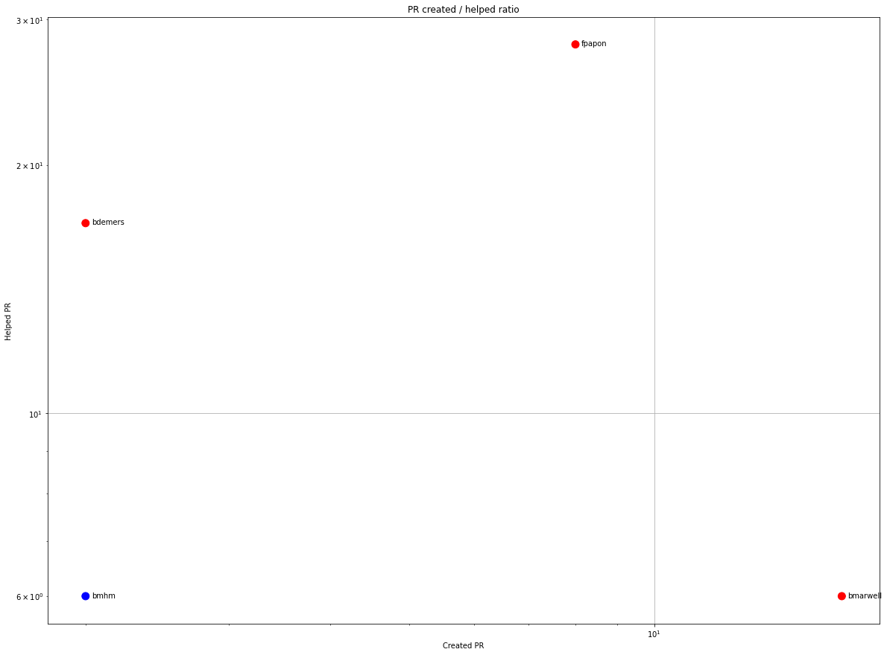
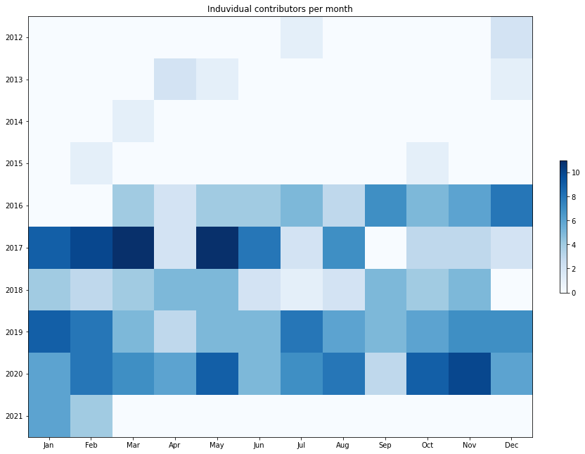
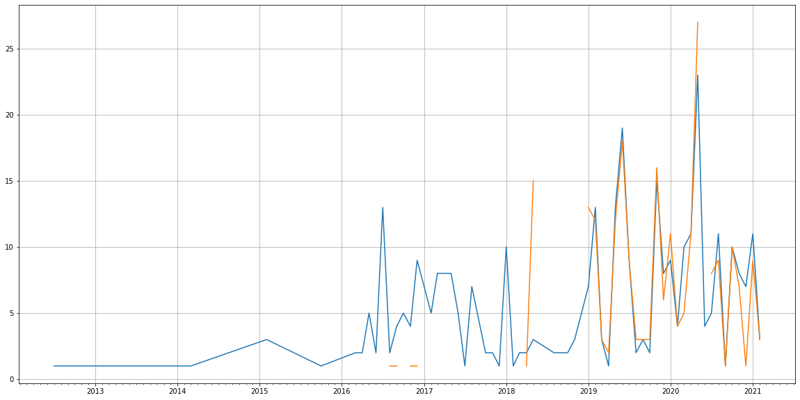
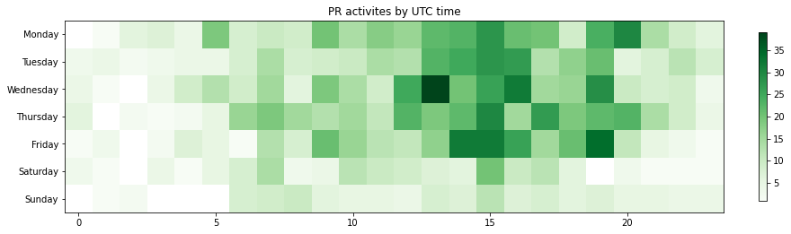

Latest record from the dataset:

<table border="1" class="dataframe">
  <thead>
    <tr style="text-align: right;">
      <th></th>
      <th>org</th>
      <th>repo</th>
      <th>type</th>
      <th>identifier</th>
      <th>subidentifier</th>
      <th>date</th>
      <th>author</th>
      <th>owner</th>
      <th>project</th>
    </tr>
  </thead>
  <tbody>
    <tr>
      <th>1842</th>
      <td>apache</td>
      <td>shiro-site</td>
      <td>PR_COMMENTED</td>
      <td>76</td>
      <td>NaN</td>
      <td>2021-02-08 14:29:22+00:00</td>
      <td>bmarwell</td>
      <td>bmarwell</td>
      <td>shiro</td>
    </tr>
  </tbody>
</table>

# Github Contributions per user

<table border="1" class="dataframe">
  <thead>
    <tr style="text-align: right;">
      <th></th>
      <th>contributions</th>
    </tr>
    <tr>
      <th>author</th>
      <th></th>
    </tr>
  </thead>
  <tbody>
    <tr>
      <th>fpapon</th>
      <td>411</td>
    </tr>
    <tr>
      <th>bdemers</th>
      <td>332</td>
    </tr>
    <tr>
      <th>asfgit</th>
      <td>168</td>
    </tr>
    <tr>
      <th>asf-ci</th>
      <td>73</td>
    </tr>
    <tr>
      <th>bmhm</th>
      <td>41</td>
    </tr>
    <tr>
      <th>leleuj</th>
      <td>18</td>
    </tr>
    <tr>
      <th>bmarwell</th>
      <td>11</td>
    </tr>
    <tr>
      <th>coheigea</th>
      <td>8</td>
    </tr>
    <tr>
      <th>jbonofre</th>
      <td>7</td>
    </tr>
    <tr>
      <th>mcroteau</th>
      <td>7</td>
    </tr>
  </tbody>
</table>

## Contributors per participations in PRs which are not created by self (helping PRs)

<table border="1" class="dataframe">
  <thead>
    <tr style="text-align: right;">
      <th></th>
      <th>identifier</th>
    </tr>
    <tr>
      <th>author</th>
      <th></th>
    </tr>
  </thead>
  <tbody>
    <tr>
      <th>fpapon</th>
      <td>142</td>
    </tr>
    <tr>
      <th>bdemers</th>
      <td>120</td>
    </tr>
    <tr>
      <th>asfgit</th>
      <td>101</td>
    </tr>
    <tr>
      <th>asf-ci</th>
      <td>35</td>
    </tr>
    <tr>
      <th>bmhm</th>
      <td>20</td>
    </tr>
    <tr>
      <th>coheigea</th>
      <td>7</td>
    </tr>
    <tr>
      <th>bmarwell</th>
      <td>6</td>
    </tr>
    <tr>
      <th>jbonofre</th>
      <td>6</td>
    </tr>
    <tr>
      <th>leleuj</th>
      <td>3</td>
    </tr>
    <tr>
      <th>lhazlewood</th>
      <td>3</td>
    </tr>
    <tr>
      <th>steinarb</th>
      <td>2</td>
    </tr>
    <tr>
      <th>panchitoboy</th>
      <td>1</td>
    </tr>
    <tr>
      <th>mcroteau</th>
      <td>1</td>
    </tr>
    <tr>
      <th>mookkiah</th>
      <td>1</td>
    </tr>
    <tr>
      <th>mtraynham</th>
      <td>1</td>
    </tr>
    <tr>
      <th>721806280</th>
      <td>1</td>
    </tr>
    <tr>
      <th>rakeshk15</th>
      <td>1</td>
    </tr>
    <tr>
      <th>rubenvanwanzeele</th>
      <td>1</td>
    </tr>
    <tr>
      <th>sepe81</th>
      <td>1</td>
    </tr>
    <tr>
      <th>sourabhsparkala</th>
      <td>1</td>
    </tr>
  </tbody>
</table>

## Contributors per participations in any PRs

<table border="1" class="dataframe">
  <thead>
    <tr style="text-align: right;">
      <th></th>
      <th>identifier</th>
    </tr>
    <tr>
      <th>author</th>
      <th></th>
    </tr>
  </thead>
  <tbody>
    <tr>
      <th>fpapon</th>
      <td>205</td>
    </tr>
    <tr>
      <th>bdemers</th>
      <td>142</td>
    </tr>
    <tr>
      <th>asfgit</th>
      <td>101</td>
    </tr>
    <tr>
      <th>coheigea</th>
      <td>49</td>
    </tr>
    <tr>
      <th>bmhm</th>
      <td>42</td>
    </tr>
    <tr>
      <th>asf-ci</th>
      <td>35</td>
    </tr>
    <tr>
      <th>bmarwell</th>
      <td>23</td>
    </tr>
    <tr>
      <th>jbonofre</th>
      <td>12</td>
    </tr>
    <tr>
      <th>ankon</th>
      <td>5</td>
    </tr>
    <tr>
      <th>OlafvdSpek</th>
      <td>5</td>
    </tr>
    <tr>
      <th>steinarb</th>
      <td>5</td>
    </tr>
    <tr>
      <th>lhazlewood</th>
      <td>3</td>
    </tr>
    <tr>
      <th>boris-petrov</th>
      <td>3</td>
    </tr>
    <tr>
      <th>leleuj</th>
      <td>3</td>
    </tr>
    <tr>
      <th>lucamilanesio</th>
      <td>3</td>
    </tr>
    <tr>
      <th>tomsun28</th>
      <td>3</td>
    </tr>
    <tr>
      <th>raupachz</th>
      <td>3</td>
    </tr>
    <tr>
      <th>alexcom</th>
      <td>3</td>
    </tr>
    <tr>
      <th>mattbishop</th>
      <td>3</td>
    </tr>
    <tr>
      <th>rbowen</th>
      <td>2</td>
    </tr>
  </tbody>
</table>

# Bus factor (number of contributors responsible for the 50% of the prs) from last half year

## Contributors until the half of the all contributions

<table border="1" class="dataframe">
  <thead>
    <tr style="text-align: right;">
      <th></th>
      <th>author</th>
      <th>identifier</th>
      <th>cs</th>
      <th>ratio</th>
    </tr>
  </thead>
  <tbody>
    <tr>
      <th>0</th>
      <td>bmarwell</td>
      <td>17</td>
      <td>17</td>
      <td>35.416667</td>
    </tr>
  </tbody>
</table>

## Pony number (bus factor)

    2

## Dev power (All the contributions in the ration of the top contributor)

    2.823529411764705

    

    

## People with created PRs > reviewed/commented PRS

    

    

## Same graph with focusing to the last 6 month

Only contributors with both created pr and helped pr visible

    

    

# Number of individual contributors per month

Number of different Github users who either created PR, commented PR, added review to a PR

Note: only events from apache/hadoop-ozone repository are included. Earlier PRs/comments are not here.

    

    

# Number of PRs closed/created per month

    /usr/lib/python3.9/site-packages/pandas/core/arrays/datetimes.py:1101: UserWarning: Converting to PeriodArray/Index representation will drop timezone information.
      warnings.warn(

    

    

# PR activity heatmap

    

    

