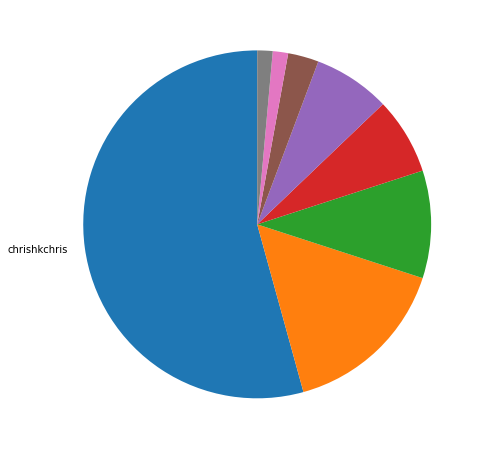
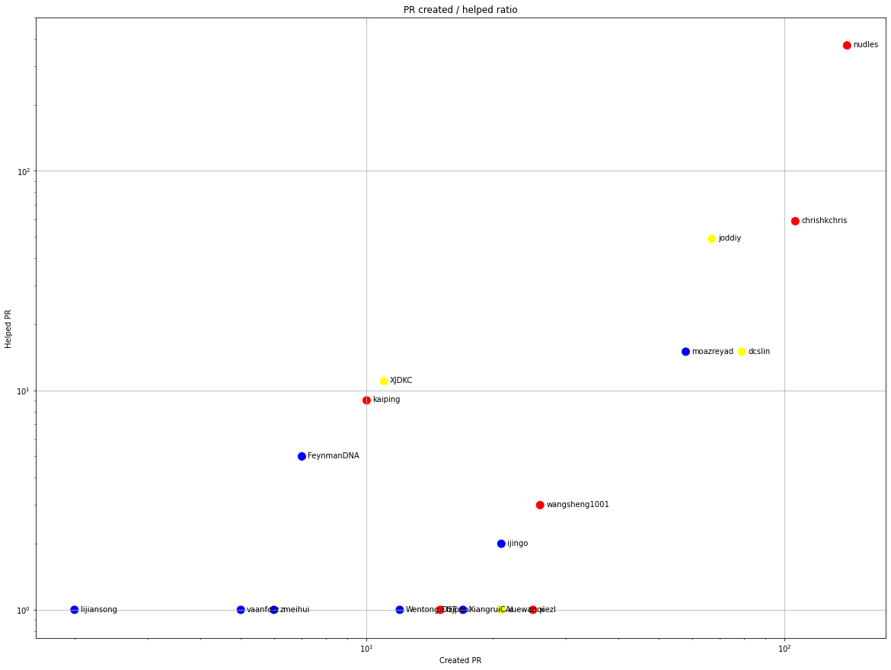
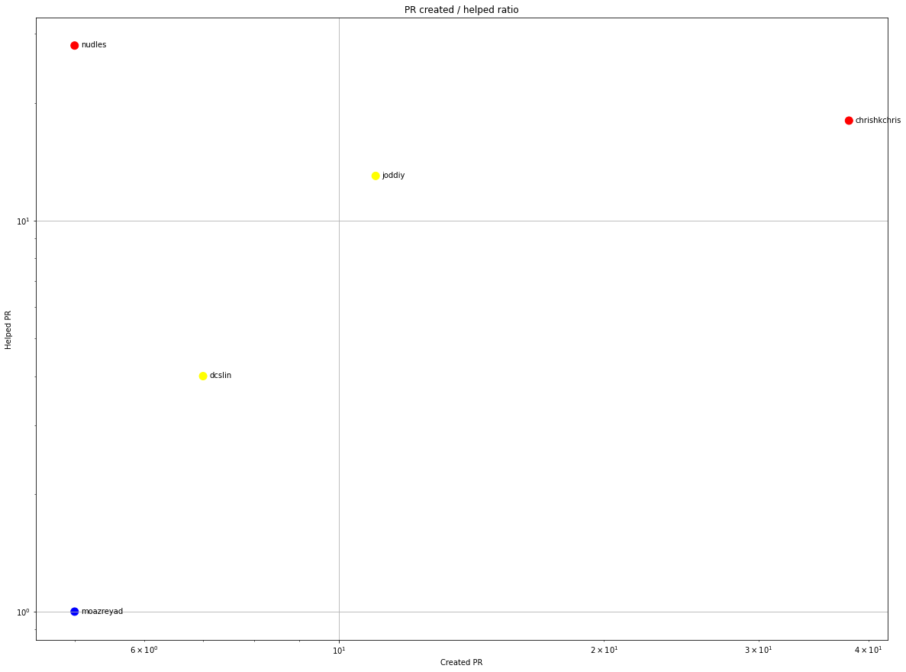
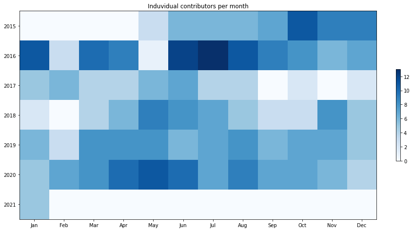
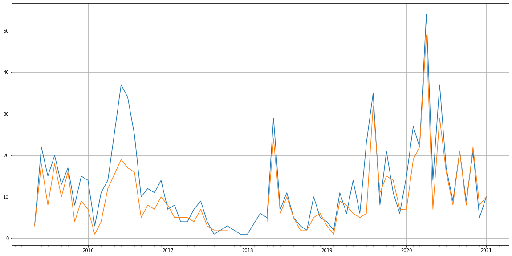
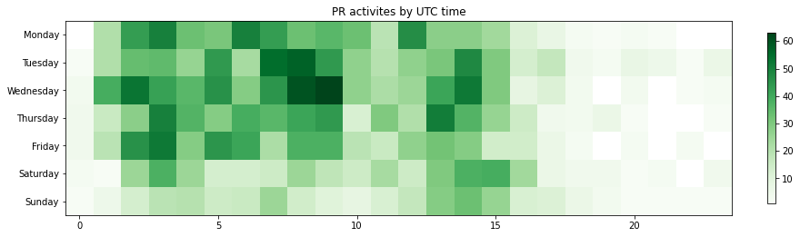

Latest record from the dataset:

<table border="1" class="dataframe">
  <thead>
    <tr style="text-align: right;">
      <th></th>
      <th>org</th>
      <th>repo</th>
      <th>type</th>
      <th>identifier</th>
      <th>subidentifier</th>
      <th>date</th>
      <th>author</th>
      <th>owner</th>
      <th>project</th>
    </tr>
  </thead>
  <tbody>
    <tr>
      <th>3214</th>
      <td>apache</td>
      <td>singa</td>
      <td>PR_MERGED</td>
      <td>832</td>
      <td>NaN</td>
      <td>2021-01-29 11:48:23+00:00</td>
      <td>lzjpaul</td>
      <td>chrishkchris</td>
      <td>singa</td>
    </tr>
  </tbody>
</table>

# Github Contributions per user

<table border="1" class="dataframe">
  <thead>
    <tr style="text-align: right;">
      <th></th>
      <th>contributions</th>
    </tr>
    <tr>
      <th>author</th>
      <th></th>
    </tr>
  </thead>
  <tbody>
    <tr>
      <th>nudles</th>
      <td>730</td>
    </tr>
    <tr>
      <th>asfgit</th>
      <td>297</td>
    </tr>
    <tr>
      <th>lgtm-com</th>
      <td>223</td>
    </tr>
    <tr>
      <th>chrishkchris</th>
      <td>187</td>
    </tr>
    <tr>
      <th>joddiy</th>
      <td>107</td>
    </tr>
    <tr>
      <th>XJDKC</th>
      <td>53</td>
    </tr>
    <tr>
      <th>codecov</th>
      <td>33</td>
    </tr>
    <tr>
      <th>moazreyad</th>
      <td>33</td>
    </tr>
    <tr>
      <th>dcslin</th>
      <td>31</td>
    </tr>
    <tr>
      <th>kaiping</th>
      <td>12</td>
    </tr>
  </tbody>
</table>

## Contributors per participations in PRs which are not created by self (helping PRs)

<table border="1" class="dataframe">
  <thead>
    <tr style="text-align: right;">
      <th></th>
      <th>identifier</th>
    </tr>
    <tr>
      <th>author</th>
      <th></th>
    </tr>
  </thead>
  <tbody>
    <tr>
      <th>nudles</th>
      <td>373</td>
    </tr>
    <tr>
      <th>asfgit</th>
      <td>297</td>
    </tr>
    <tr>
      <th>chrishkchris</th>
      <td>59</td>
    </tr>
    <tr>
      <th>lgtm-com</th>
      <td>55</td>
    </tr>
    <tr>
      <th>joddiy</th>
      <td>49</td>
    </tr>
    <tr>
      <th>codecov</th>
      <td>33</td>
    </tr>
    <tr>
      <th>dcslin</th>
      <td>15</td>
    </tr>
    <tr>
      <th>moazreyad</th>
      <td>15</td>
    </tr>
    <tr>
      <th>XJDKC</th>
      <td>11</td>
    </tr>
    <tr>
      <th>kaiping</th>
      <td>9</td>
    </tr>
    <tr>
      <th>FeynmanDNA</th>
      <td>5</td>
    </tr>
    <tr>
      <th>wangsheng1001</th>
      <td>3</td>
    </tr>
    <tr>
      <th>ijingo</th>
      <td>2</td>
    </tr>
    <tr>
      <th>Wentong-DST</th>
      <td>1</td>
    </tr>
    <tr>
      <th>lijiansong</th>
      <td>1</td>
    </tr>
    <tr>
      <th>lzjpaul</th>
      <td>1</td>
    </tr>
    <tr>
      <th>XiangruiCAI</th>
      <td>1</td>
    </tr>
    <tr>
      <th>vaanforz</th>
      <td>1</td>
    </tr>
    <tr>
      <th>xiezl</th>
      <td>1</td>
    </tr>
    <tr>
      <th>xuewanqi</th>
      <td>1</td>
    </tr>
  </tbody>
</table>

## Contributors per participations in any PRs

<table border="1" class="dataframe">
  <thead>
    <tr style="text-align: right;">
      <th></th>
      <th>identifier</th>
    </tr>
    <tr>
      <th>author</th>
      <th></th>
    </tr>
  </thead>
  <tbody>
    <tr>
      <th>nudles</th>
      <td>500</td>
    </tr>
    <tr>
      <th>asfgit</th>
      <td>297</td>
    </tr>
    <tr>
      <th>chrishkchris</th>
      <td>160</td>
    </tr>
    <tr>
      <th>joddiy</th>
      <td>116</td>
    </tr>
    <tr>
      <th>dcslin</th>
      <td>94</td>
    </tr>
    <tr>
      <th>moazreyad</th>
      <td>73</td>
    </tr>
    <tr>
      <th>lgtm-com</th>
      <td>55</td>
    </tr>
    <tr>
      <th>codecov</th>
      <td>33</td>
    </tr>
    <tr>
      <th>wangsheng1001</th>
      <td>29</td>
    </tr>
    <tr>
      <th>xiezl</th>
      <td>26</td>
    </tr>
    <tr>
      <th>ShichengChen</th>
      <td>25</td>
    </tr>
    <tr>
      <th>pinpom</th>
      <td>25</td>
    </tr>
    <tr>
      <th>ijingo</th>
      <td>23</td>
    </tr>
    <tr>
      <th>XJDKC</th>
      <td>22</td>
    </tr>
    <tr>
      <th>xuewanqi</th>
      <td>22</td>
    </tr>
    <tr>
      <th>kaiping</th>
      <td>19</td>
    </tr>
    <tr>
      <th>XiangruiCAI</th>
      <td>18</td>
    </tr>
    <tr>
      <th>dbxinj</th>
      <td>17</td>
    </tr>
    <tr>
      <th>aaronwwf</th>
      <td>17</td>
    </tr>
    <tr>
      <th>lzjpaul</th>
      <td>16</td>
    </tr>
  </tbody>
</table>

# Bus factor (number of contributors responsible for the 50% of the prs) from last half year

## Contributors until the half of the all contributions

<table border="1" class="dataframe">
  <thead>
    <tr style="text-align: right;">
      <th></th>
      <th>author</th>
      <th>identifier</th>
      <th>cs</th>
      <th>ratio</th>
    </tr>
  </thead>
  <tbody>
  </tbody>
</table>

## Pony number (bus factor)

    1

## Dev power (All the contributions in the ration of the top contributor)

    1.8421052631578947

    

    

## People with created PRs > reviewed/commented PRS

    

    

## Same graph with focusing to the last 6 month

Only contributors with both created pr and helped pr visible

    

    

# Number of individual contributors per month

Number of different Github users who either created PR, commented PR, added review to a PR

Note: only events from apache/hadoop-ozone repository are included. Earlier PRs/comments are not here.

    

    

# Number of PRs closed/created per month

    /usr/lib/python3.9/site-packages/pandas/core/arrays/datetimes.py:1101: UserWarning: Converting to PeriodArray/Index representation will drop timezone information.
      warnings.warn(

    

    

# PR activity heatmap

    

    

