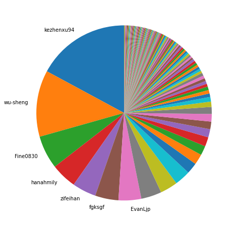
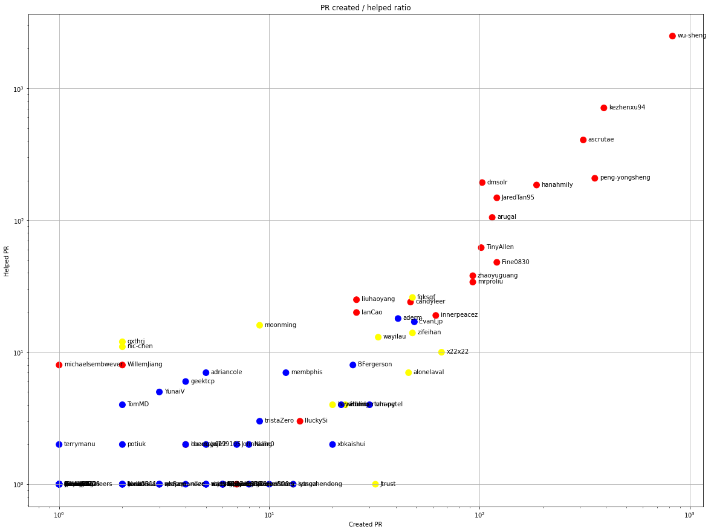
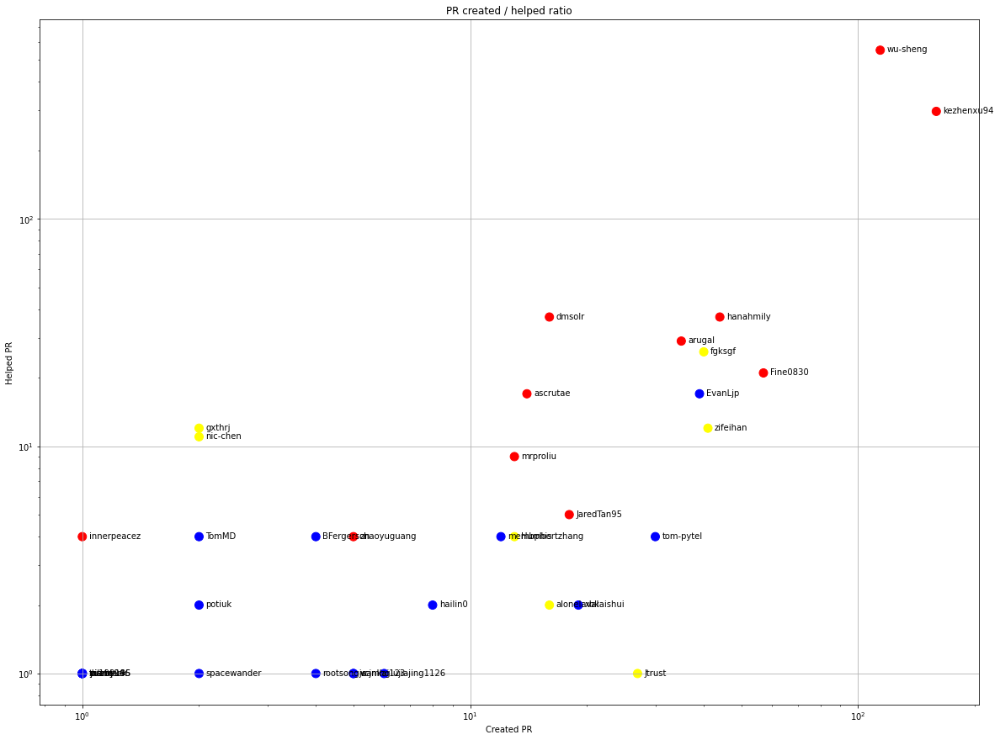
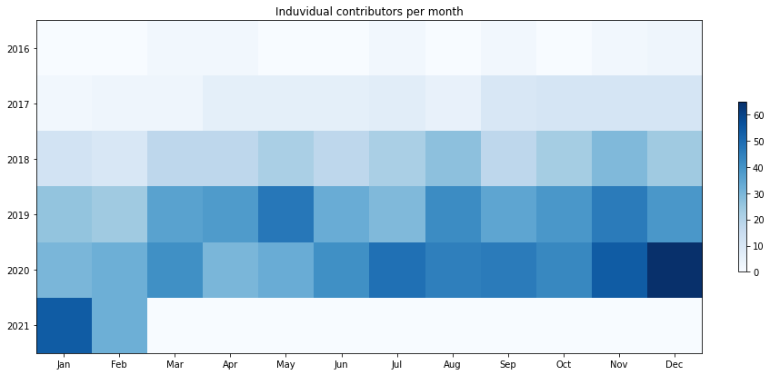
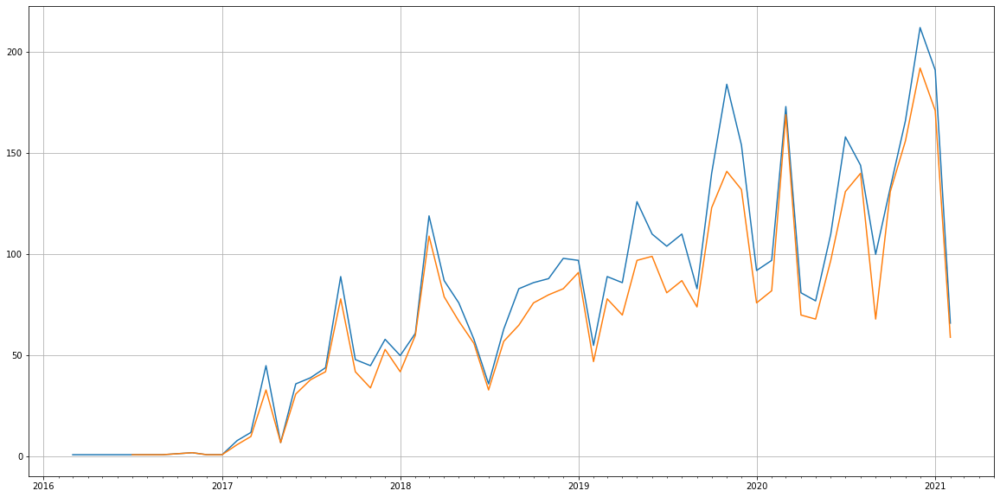
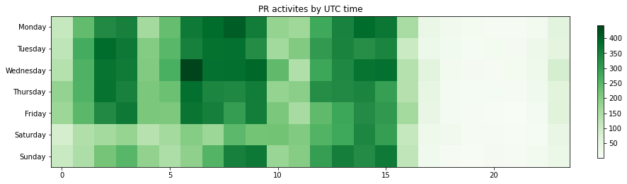

Latest record from the dataset:

<table border="1" class="dataframe">
  <thead>
    <tr style="text-align: right;">
      <th></th>
      <th>org</th>
      <th>repo</th>
      <th>type</th>
      <th>identifier</th>
      <th>subidentifier</th>
      <th>date</th>
      <th>author</th>
      <th>owner</th>
      <th>project</th>
    </tr>
  </thead>
  <tbody>
    <tr>
      <th>30979</th>
      <td>apache</td>
      <td>skywalking-satellite</td>
      <td>PR_REVIEW_COMMENTED</td>
      <td>26</td>
      <td>NaN</td>
      <td>2021-02-14 00:21:54+00:00</td>
      <td>EvanLjp</td>
      <td>EvanLjp</td>
      <td>skywalking</td>
    </tr>
  </tbody>
</table>

# Github Contributions per user

<table border="1" class="dataframe">
  <thead>
    <tr style="text-align: right;">
      <th></th>
      <th>contributions</th>
    </tr>
    <tr>
      <th>author</th>
      <th></th>
    </tr>
  </thead>
  <tbody>
    <tr>
      <th>wu-sheng</th>
      <td>12407</td>
    </tr>
    <tr>
      <th>kezhenxu94</th>
      <td>1960</td>
    </tr>
    <tr>
      <th>coveralls</th>
      <td>1772</td>
    </tr>
    <tr>
      <th>ascrutae</th>
      <td>682</td>
    </tr>
    <tr>
      <th>codecov</th>
      <td>635</td>
    </tr>
    <tr>
      <th>peng-yongsheng</th>
      <td>409</td>
    </tr>
    <tr>
      <th>hanahmily</th>
      <td>401</td>
    </tr>
    <tr>
      <th>dmsolr</th>
      <td>398</td>
    </tr>
    <tr>
      <th>codecov-io</th>
      <td>346</td>
    </tr>
    <tr>
      <th>JaredTan95</th>
      <td>263</td>
    </tr>
  </tbody>
</table>

## Contributors per participations in PRs which are not created by self (helping PRs)

<table border="1" class="dataframe">
  <thead>
    <tr style="text-align: right;">
      <th></th>
      <th>identifier</th>
    </tr>
    <tr>
      <th>author</th>
      <th></th>
    </tr>
  </thead>
  <tbody>
    <tr>
      <th>wu-sheng</th>
      <td>2486</td>
    </tr>
    <tr>
      <th>coveralls</th>
      <td>1329</td>
    </tr>
    <tr>
      <th>kezhenxu94</th>
      <td>710</td>
    </tr>
    <tr>
      <th>codecov</th>
      <td>635</td>
    </tr>
    <tr>
      <th>ascrutae</th>
      <td>406</td>
    </tr>
    <tr>
      <th>codecov-io</th>
      <td>345</td>
    </tr>
    <tr>
      <th>peng-yongsheng</th>
      <td>208</td>
    </tr>
    <tr>
      <th>dmsolr</th>
      <td>193</td>
    </tr>
    <tr>
      <th>hanahmily</th>
      <td>185</td>
    </tr>
    <tr>
      <th>JaredTan95</th>
      <td>148</td>
    </tr>
    <tr>
      <th>arugal</th>
      <td>105</td>
    </tr>
    <tr>
      <th>SkyWalkingRobot</th>
      <td>63</td>
    </tr>
    <tr>
      <th>TinyAllen</th>
      <td>62</td>
    </tr>
    <tr>
      <th>Fine0830</th>
      <td>48</td>
    </tr>
    <tr>
      <th>zhaoyuguang</th>
      <td>38</td>
    </tr>
    <tr>
      <th>muse-dev</th>
      <td>36</td>
    </tr>
    <tr>
      <th>mrproliu</th>
      <td>34</td>
    </tr>
    <tr>
      <th>fgksgf</th>
      <td>26</td>
    </tr>
    <tr>
      <th>liuhaoyang</th>
      <td>25</td>
    </tr>
    <tr>
      <th>candyleer</th>
      <td>24</td>
    </tr>
  </tbody>
</table>

## Contributors per participations in any PRs

<table border="1" class="dataframe">
  <thead>
    <tr style="text-align: right;">
      <th></th>
      <th>identifier</th>
    </tr>
    <tr>
      <th>author</th>
      <th></th>
    </tr>
  </thead>
  <tbody>
    <tr>
      <th>wu-sheng</th>
      <td>3208</td>
    </tr>
    <tr>
      <th>coveralls</th>
      <td>1329</td>
    </tr>
    <tr>
      <th>kezhenxu94</th>
      <td>952</td>
    </tr>
    <tr>
      <th>ascrutae</th>
      <td>713</td>
    </tr>
    <tr>
      <th>codecov</th>
      <td>635</td>
    </tr>
    <tr>
      <th>peng-yongsheng</th>
      <td>553</td>
    </tr>
    <tr>
      <th>hanahmily</th>
      <td>353</td>
    </tr>
    <tr>
      <th>codecov-io</th>
      <td>345</td>
    </tr>
    <tr>
      <th>dmsolr</th>
      <td>291</td>
    </tr>
    <tr>
      <th>JaredTan95</th>
      <td>257</td>
    </tr>
    <tr>
      <th>arugal</th>
      <td>200</td>
    </tr>
    <tr>
      <th>Fine0830</th>
      <td>166</td>
    </tr>
    <tr>
      <th>TinyAllen</th>
      <td>160</td>
    </tr>
    <tr>
      <th>zhaoyuguang</th>
      <td>131</td>
    </tr>
    <tr>
      <th>mrproliu</th>
      <td>118</td>
    </tr>
    <tr>
      <th>innerpeacez</th>
      <td>78</td>
    </tr>
    <tr>
      <th>x22x22</th>
      <td>76</td>
    </tr>
    <tr>
      <th>fgksgf</th>
      <td>73</td>
    </tr>
    <tr>
      <th>candyleer</th>
      <td>71</td>
    </tr>
    <tr>
      <th>EvanLjp</th>
      <td>65</td>
    </tr>
  </tbody>
</table>

# Bus factor (number of contributors responsible for the 50% of the prs) from last half year

## Contributors until the half of the all contributions

<table border="1" class="dataframe">
  <thead>
    <tr style="text-align: right;">
      <th></th>
      <th>author</th>
      <th>identifier</th>
      <th>cs</th>
      <th>ratio</th>
    </tr>
  </thead>
  <tbody>
    <tr>
      <th>0</th>
      <td>kezhenxu94</td>
      <td>159</td>
      <td>159</td>
      <td>17.115178</td>
    </tr>
    <tr>
      <th>1</th>
      <td>wu-sheng</td>
      <td>114</td>
      <td>273</td>
      <td>12.271259</td>
    </tr>
    <tr>
      <th>2</th>
      <td>Fine0830</td>
      <td>57</td>
      <td>330</td>
      <td>6.135630</td>
    </tr>
    <tr>
      <th>3</th>
      <td>hanahmily</td>
      <td>44</td>
      <td>374</td>
      <td>4.736276</td>
    </tr>
    <tr>
      <th>4</th>
      <td>zifeihan</td>
      <td>41</td>
      <td>415</td>
      <td>4.413348</td>
    </tr>
    <tr>
      <th>5</th>
      <td>fgksgf</td>
      <td>40</td>
      <td>455</td>
      <td>4.305705</td>
    </tr>
  </tbody>
</table>

## Pony number (bus factor)

    7

## Dev power (All the contributions in the ration of the top contributor)

    5.842767295597484

    

    

## People with created PRs > reviewed/commented PRS

    

    

## Same graph with focusing to the last 6 month

Only contributors with both created pr and helped pr visible

    

    

# Number of individual contributors per month

Number of different Github users who either created PR, commented PR, added review to a PR

Note: only events from apache/hadoop-ozone repository are included. Earlier PRs/comments are not here.

    

    

# Number of PRs closed/created per month

    /usr/lib/python3.9/site-packages/pandas/core/arrays/datetimes.py:1101: UserWarning: Converting to PeriodArray/Index representation will drop timezone information.
      warnings.warn(

    

    

# PR activity heatmap

    

    

