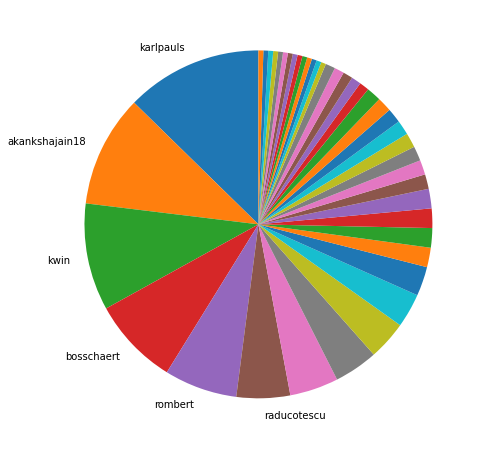
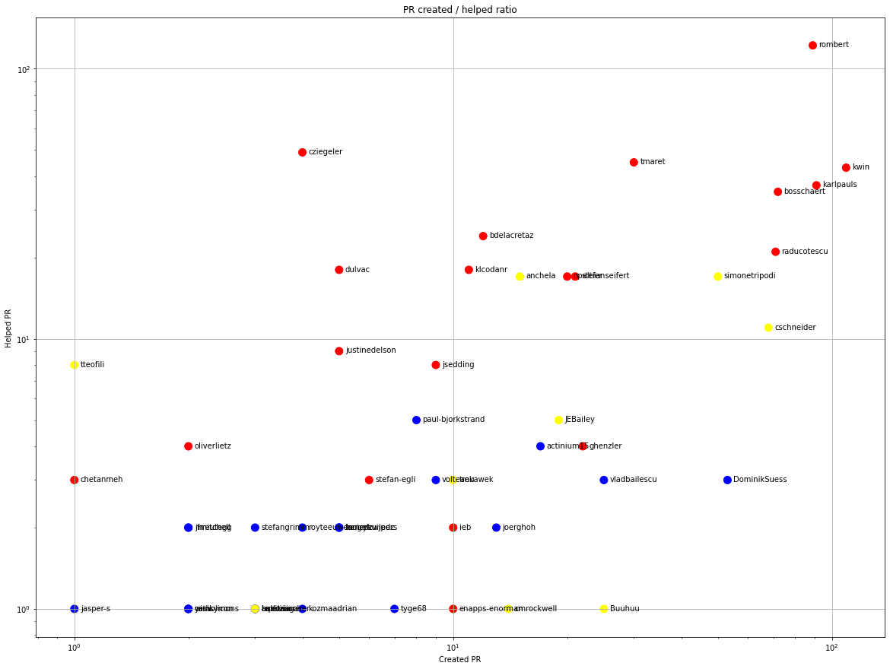
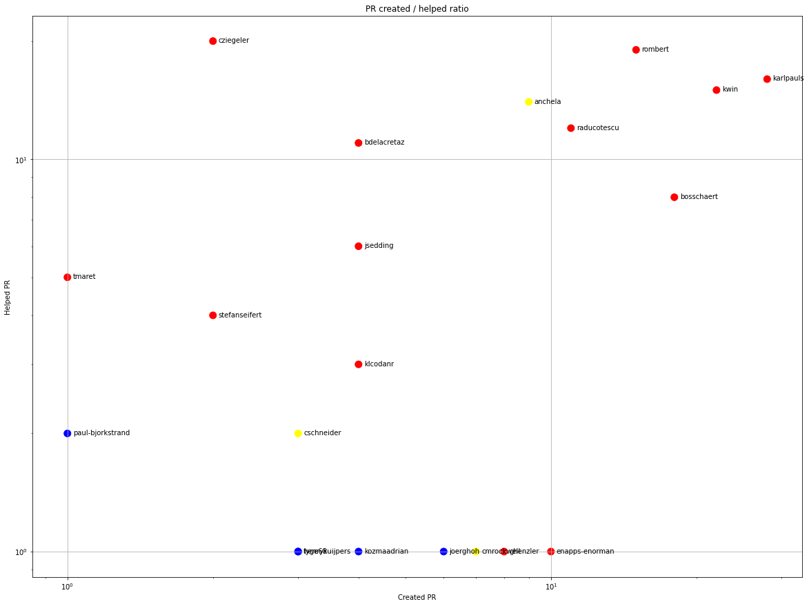
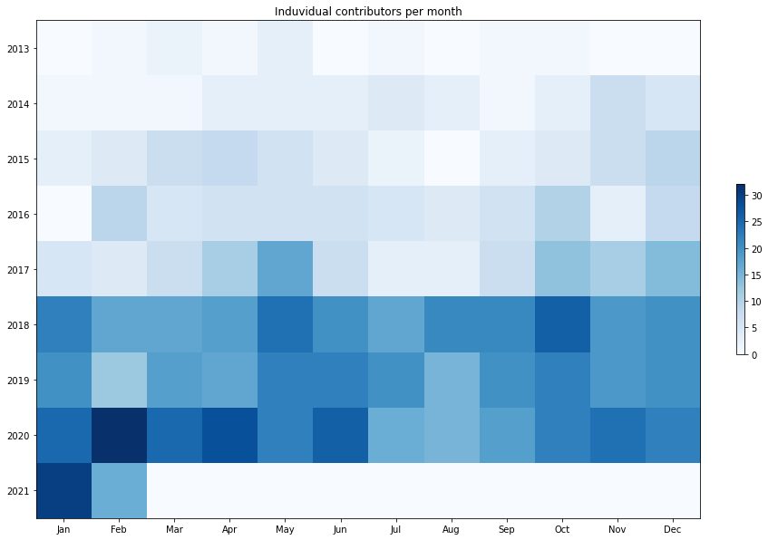
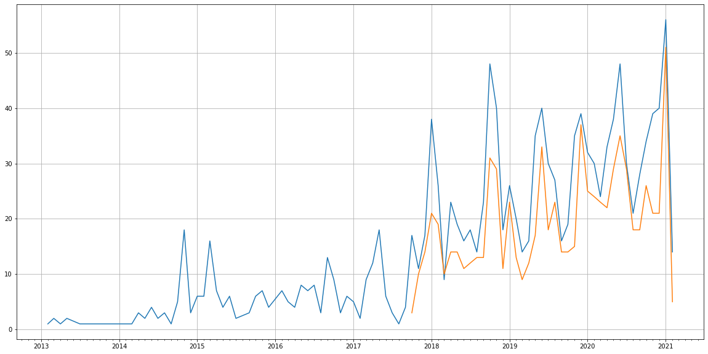
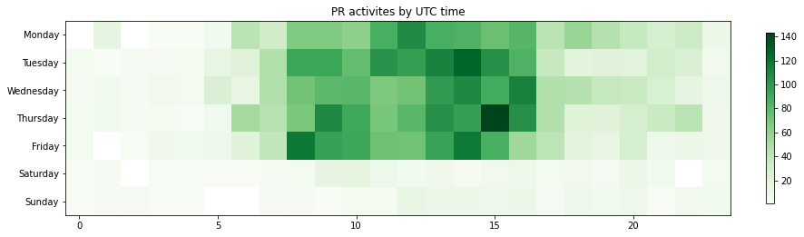

Latest record from the dataset:

<table border="1" class="dataframe">
  <thead>
    <tr style="text-align: right;">
      <th></th>
      <th>org</th>
      <th>repo</th>
      <th>type</th>
      <th>identifier</th>
      <th>subidentifier</th>
      <th>date</th>
      <th>author</th>
      <th>owner</th>
      <th>project</th>
    </tr>
  </thead>
  <tbody>
    <tr>
      <th>2976</th>
      <td>apache</td>
      <td>sling-org-apache-sling-i18n</td>
      <td>PR_COMMENTED</td>
      <td>5</td>
      <td>NaN</td>
      <td>2021-02-14 03:48:52+00:00</td>
      <td>sonarcloud</td>
      <td>enapps-enorman</td>
      <td>sling</td>
    </tr>
  </tbody>
</table>

# Github Contributions per user

<table border="1" class="dataframe">
  <thead>
    <tr style="text-align: right;">
      <th></th>
      <th>contributions</th>
    </tr>
    <tr>
      <th>author</th>
      <th></th>
    </tr>
  </thead>
  <tbody>
    <tr>
      <th>rombert</th>
      <td>601</td>
    </tr>
    <tr>
      <th>sonarcloud</th>
      <td>403</td>
    </tr>
    <tr>
      <th>cziegeler</th>
      <td>301</td>
    </tr>
    <tr>
      <th>kwin</th>
      <td>210</td>
    </tr>
    <tr>
      <th>bosschaert</th>
      <td>169</td>
    </tr>
    <tr>
      <th>tmaret</th>
      <td>140</td>
    </tr>
    <tr>
      <th>karlpauls</th>
      <td>99</td>
    </tr>
    <tr>
      <th>bdelacretaz</th>
      <td>94</td>
    </tr>
    <tr>
      <th>raducotescu</th>
      <td>88</td>
    </tr>
    <tr>
      <th>npeltier</th>
      <td>59</td>
    </tr>
  </tbody>
</table>

## Contributors per participations in PRs which are not created by self (helping PRs)

<table border="1" class="dataframe">
  <thead>
    <tr style="text-align: right;">
      <th></th>
      <th>identifier</th>
    </tr>
    <tr>
      <th>author</th>
      <th></th>
    </tr>
  </thead>
  <tbody>
    <tr>
      <th>rombert</th>
      <td>122</td>
    </tr>
    <tr>
      <th>sonarcloud</th>
      <td>68</td>
    </tr>
    <tr>
      <th>cziegeler</th>
      <td>49</td>
    </tr>
    <tr>
      <th>tmaret</th>
      <td>45</td>
    </tr>
    <tr>
      <th>kwin</th>
      <td>43</td>
    </tr>
    <tr>
      <th>karlpauls</th>
      <td>37</td>
    </tr>
    <tr>
      <th>bosschaert</th>
      <td>35</td>
    </tr>
    <tr>
      <th>bdelacretaz</th>
      <td>24</td>
    </tr>
    <tr>
      <th>raducotescu</th>
      <td>21</td>
    </tr>
    <tr>
      <th>dulvac</th>
      <td>18</td>
    </tr>
    <tr>
      <th>klcodanr</th>
      <td>18</td>
    </tr>
    <tr>
      <th>stefanseifert</th>
      <td>17</td>
    </tr>
    <tr>
      <th>simonetripodi</th>
      <td>17</td>
    </tr>
    <tr>
      <th>npeltier</th>
      <td>17</td>
    </tr>
    <tr>
      <th>anchela</th>
      <td>17</td>
    </tr>
    <tr>
      <th>cschneider</th>
      <td>11</td>
    </tr>
    <tr>
      <th>justinedelson</th>
      <td>9</td>
    </tr>
    <tr>
      <th>tteofili</th>
      <td>8</td>
    </tr>
    <tr>
      <th>jsedding</th>
      <td>8</td>
    </tr>
    <tr>
      <th>JEBailey</th>
      <td>5</td>
    </tr>
  </tbody>
</table>

## Contributors per participations in any PRs

<table border="1" class="dataframe">
  <thead>
    <tr style="text-align: right;">
      <th></th>
      <th>identifier</th>
    </tr>
    <tr>
      <th>author</th>
      <th></th>
    </tr>
  </thead>
  <tbody>
    <tr>
      <th>rombert</th>
      <td>142</td>
    </tr>
    <tr>
      <th>kwin</th>
      <td>72</td>
    </tr>
    <tr>
      <th>sonarcloud</th>
      <td>68</td>
    </tr>
    <tr>
      <th>tmaret</th>
      <td>60</td>
    </tr>
    <tr>
      <th>karlpauls</th>
      <td>56</td>
    </tr>
    <tr>
      <th>cschneider</th>
      <td>55</td>
    </tr>
    <tr>
      <th>cziegeler</th>
      <td>50</td>
    </tr>
    <tr>
      <th>bosschaert</th>
      <td>46</td>
    </tr>
    <tr>
      <th>raducotescu</th>
      <td>33</td>
    </tr>
    <tr>
      <th>DominikSuess</th>
      <td>33</td>
    </tr>
    <tr>
      <th>anchela</th>
      <td>32</td>
    </tr>
    <tr>
      <th>stefanseifert</th>
      <td>30</td>
    </tr>
    <tr>
      <th>simonetripodi</th>
      <td>30</td>
    </tr>
    <tr>
      <th>npeltier</th>
      <td>28</td>
    </tr>
    <tr>
      <th>vladbailescu</th>
      <td>27</td>
    </tr>
    <tr>
      <th>bdelacretaz</th>
      <td>27</td>
    </tr>
    <tr>
      <th>ghenzler</th>
      <td>23</td>
    </tr>
    <tr>
      <th>akankshajain18</th>
      <td>23</td>
    </tr>
    <tr>
      <th>Buuhuu</th>
      <td>23</td>
    </tr>
    <tr>
      <th>dulvac</th>
      <td>22</td>
    </tr>
  </tbody>
</table>

# Bus factor (number of contributors responsible for the 50% of the prs) from last half year

## Contributors until the half of the all contributions

<table border="1" class="dataframe">
  <thead>
    <tr style="text-align: right;">
      <th></th>
      <th>author</th>
      <th>identifier</th>
      <th>cs</th>
      <th>ratio</th>
    </tr>
  </thead>
  <tbody>
    <tr>
      <th>0</th>
      <td>karlpauls</td>
      <td>28</td>
      <td>28</td>
      <td>12.669683</td>
    </tr>
    <tr>
      <th>1</th>
      <td>akankshajain18</td>
      <td>23</td>
      <td>51</td>
      <td>10.407240</td>
    </tr>
    <tr>
      <th>2</th>
      <td>kwin</td>
      <td>22</td>
      <td>73</td>
      <td>9.954751</td>
    </tr>
    <tr>
      <th>3</th>
      <td>bosschaert</td>
      <td>18</td>
      <td>91</td>
      <td>8.144796</td>
    </tr>
    <tr>
      <th>4</th>
      <td>rombert</td>
      <td>15</td>
      <td>106</td>
      <td>6.787330</td>
    </tr>
  </tbody>
</table>

## Pony number (bus factor)

    6

## Dev power (All the contributions in the ration of the top contributor)

    7.892857142857142

    

    

## People with created PRs > reviewed/commented PRS

    

    

## Same graph with focusing to the last 6 month

Only contributors with both created pr and helped pr visible

    

    

# Number of individual contributors per month

Number of different Github users who either created PR, commented PR, added review to a PR

Note: only events from apache/hadoop-ozone repository are included. Earlier PRs/comments are not here.

    

    

# Number of PRs closed/created per month

    /usr/lib/python3.9/site-packages/pandas/core/arrays/datetimes.py:1101: UserWarning: Converting to PeriodArray/Index representation will drop timezone information.
      warnings.warn(

    

    

# PR activity heatmap

    

    

