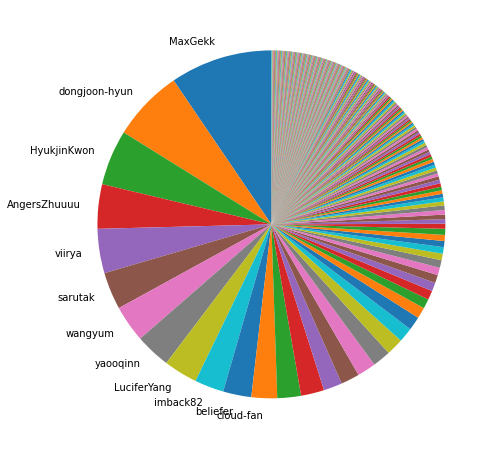
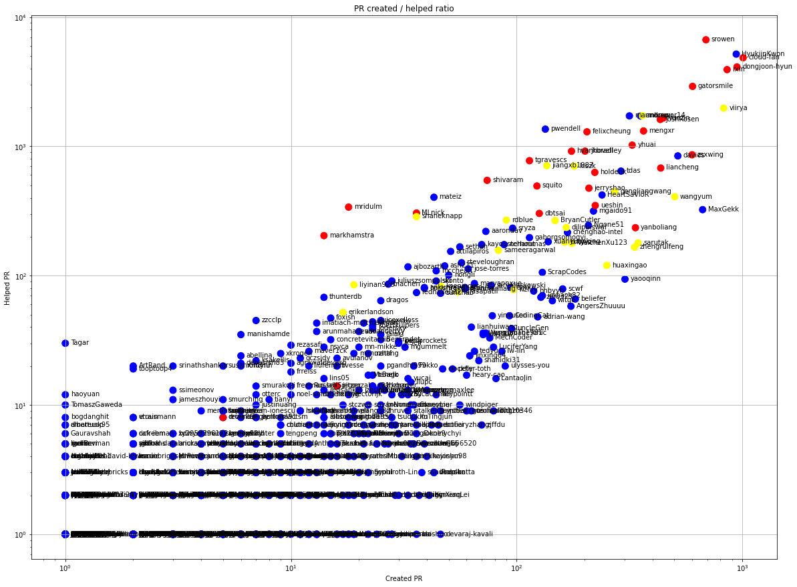
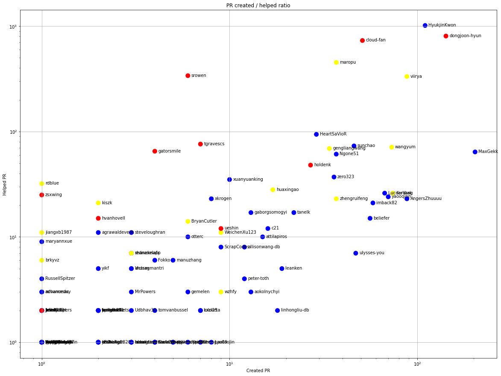
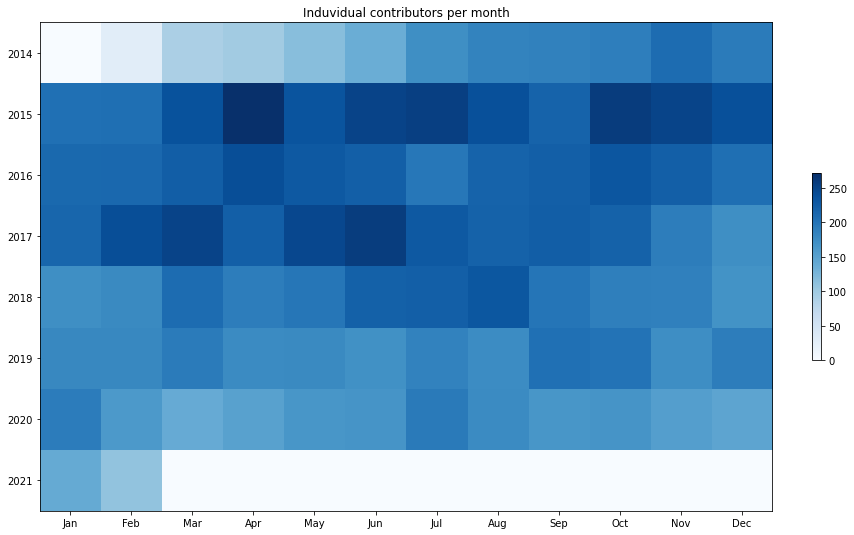
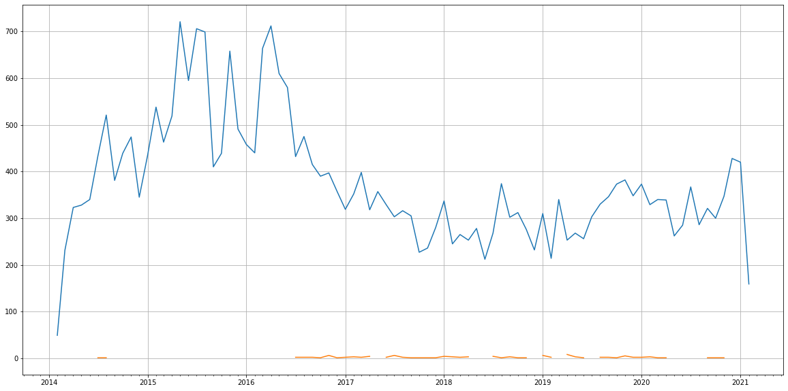
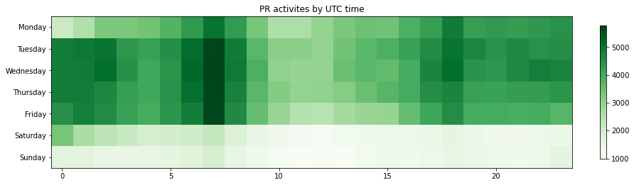

Latest record from the dataset:

<table border="1" class="dataframe">
  <thead>
    <tr style="text-align: right;">
      <th></th>
      <th>org</th>
      <th>repo</th>
      <th>type</th>
      <th>identifier</th>
      <th>subidentifier</th>
      <th>date</th>
      <th>author</th>
      <th>owner</th>
      <th>project</th>
    </tr>
  </thead>
  <tbody>
    <tr>
      <th>451647</th>
      <td>apache</td>
      <td>spark</td>
      <td>PR_COMMENTED</td>
      <td>31561</td>
      <td>NaN</td>
      <td>2021-02-14 09:26:18+00:00</td>
      <td>SparkQA</td>
      <td>attilapiros</td>
      <td>spark</td>
    </tr>
  </tbody>
</table>

# Github Contributions per user

<table border="1" class="dataframe">
  <thead>
    <tr style="text-align: right;">
      <th></th>
      <th>contributions</th>
    </tr>
    <tr>
      <th>author</th>
      <th></th>
    </tr>
  </thead>
  <tbody>
    <tr>
      <th>SparkQA</th>
      <td>144048</td>
    </tr>
    <tr>
      <th>AmplabJenkins</th>
      <td>31874</td>
    </tr>
    <tr>
      <th>cloud-fan</th>
      <td>24412</td>
    </tr>
    <tr>
      <th>HyukjinKwon</th>
      <td>17314</td>
    </tr>
    <tr>
      <th>srowen</th>
      <td>16632</td>
    </tr>
    <tr>
      <th>dongjoon-hyun</th>
      <td>15631</td>
    </tr>
    <tr>
      <th>gatorsmile</th>
      <td>11122</td>
    </tr>
    <tr>
      <th>rxin</th>
      <td>7902</td>
    </tr>
    <tr>
      <th>maropu</th>
      <td>7516</td>
    </tr>
    <tr>
      <th>viirya</th>
      <td>6674</td>
    </tr>
  </tbody>
</table>

## Contributors per participations in PRs which are not created by self (helping PRs)

<table border="1" class="dataframe">
  <thead>
    <tr style="text-align: right;">
      <th></th>
      <th>identifier</th>
    </tr>
    <tr>
      <th>author</th>
      <th></th>
    </tr>
  </thead>
  <tbody>
    <tr>
      <th>SparkQA</th>
      <td>27202</td>
    </tr>
    <tr>
      <th>AmplabJenkins</th>
      <td>7411</td>
    </tr>
    <tr>
      <th>srowen</th>
      <td>6672</td>
    </tr>
    <tr>
      <th>HyukjinKwon</th>
      <td>5171</td>
    </tr>
    <tr>
      <th>cloud-fan</th>
      <td>4848</td>
    </tr>
    <tr>
      <th>dongjoon-hyun</th>
      <td>4113</td>
    </tr>
    <tr>
      <th>rxin</th>
      <td>3924</td>
    </tr>
    <tr>
      <th>gatorsmile</th>
      <td>2911</td>
    </tr>
    <tr>
      <th>viirya</th>
      <td>1976</td>
    </tr>
    <tr>
      <th>maropu</th>
      <td>1729</td>
    </tr>
    <tr>
      <th>marmbrus</th>
      <td>1721</td>
    </tr>
    <tr>
      <th>andrewor14</th>
      <td>1718</td>
    </tr>
    <tr>
      <th>vanzin</th>
      <td>1656</td>
    </tr>
    <tr>
      <th>JoshRosen</th>
      <td>1615</td>
    </tr>
    <tr>
      <th>pwendell</th>
      <td>1359</td>
    </tr>
    <tr>
      <th>mengxr</th>
      <td>1316</td>
    </tr>
    <tr>
      <th>felixcheung</th>
      <td>1296</td>
    </tr>
    <tr>
      <th>yhuai</th>
      <td>1023</td>
    </tr>
    <tr>
      <th>jkbradley</th>
      <td>919</td>
    </tr>
    <tr>
      <th>hvanhovell</th>
      <td>917</td>
    </tr>
  </tbody>
</table>

## Contributors per participations in any PRs

<table border="1" class="dataframe">
  <thead>
    <tr style="text-align: right;">
      <th></th>
      <th>identifier</th>
    </tr>
    <tr>
      <th>author</th>
      <th></th>
    </tr>
  </thead>
  <tbody>
    <tr>
      <th>SparkQA</th>
      <td>27202</td>
    </tr>
    <tr>
      <th>AmplabJenkins</th>
      <td>7411</td>
    </tr>
    <tr>
      <th>srowen</th>
      <td>7352</td>
    </tr>
    <tr>
      <th>HyukjinKwon</th>
      <td>6111</td>
    </tr>
    <tr>
      <th>cloud-fan</th>
      <td>5856</td>
    </tr>
    <tr>
      <th>dongjoon-hyun</th>
      <td>5060</td>
    </tr>
    <tr>
      <th>rxin</th>
      <td>4778</td>
    </tr>
    <tr>
      <th>gatorsmile</th>
      <td>3513</td>
    </tr>
    <tr>
      <th>viirya</th>
      <td>2803</td>
    </tr>
    <tr>
      <th>vanzin</th>
      <td>2102</td>
    </tr>
    <tr>
      <th>maropu</th>
      <td>2089</td>
    </tr>
    <tr>
      <th>andrewor14</th>
      <td>2072</td>
    </tr>
    <tr>
      <th>JoshRosen</th>
      <td>2048</td>
    </tr>
    <tr>
      <th>marmbrus</th>
      <td>2037</td>
    </tr>
    <tr>
      <th>mengxr</th>
      <td>1681</td>
    </tr>
    <tr>
      <th>felixcheung</th>
      <td>1501</td>
    </tr>
    <tr>
      <th>pwendell</th>
      <td>1493</td>
    </tr>
    <tr>
      <th>zsxwing</th>
      <td>1460</td>
    </tr>
    <tr>
      <th>davies</th>
      <td>1362</td>
    </tr>
    <tr>
      <th>yhuai</th>
      <td>1348</td>
    </tr>
  </tbody>
</table>

# Bus factor (number of contributors responsible for the 50% of the prs) from last half year

## Contributors until the half of the all contributions

<table border="1" class="dataframe">
  <thead>
    <tr style="text-align: right;">
      <th></th>
      <th>author</th>
      <th>identifier</th>
      <th>cs</th>
      <th>ratio</th>
    </tr>
  </thead>
  <tbody>
    <tr>
      <th>0</th>
      <td>MaxGekk</td>
      <td>203</td>
      <td>203</td>
      <td>9.499298</td>
    </tr>
    <tr>
      <th>1</th>
      <td>dongjoon-hyun</td>
      <td>142</td>
      <td>345</td>
      <td>6.644829</td>
    </tr>
    <tr>
      <th>2</th>
      <td>HyukjinKwon</td>
      <td>110</td>
      <td>455</td>
      <td>5.147403</td>
    </tr>
    <tr>
      <th>3</th>
      <td>AngersZhuuuu</td>
      <td>88</td>
      <td>543</td>
      <td>4.117922</td>
    </tr>
    <tr>
      <th>4</th>
      <td>viirya</td>
      <td>88</td>
      <td>631</td>
      <td>4.117922</td>
    </tr>
    <tr>
      <th>5</th>
      <td>sarutak</td>
      <td>74</td>
      <td>705</td>
      <td>3.462798</td>
    </tr>
    <tr>
      <th>6</th>
      <td>wangyum</td>
      <td>73</td>
      <td>778</td>
      <td>3.416004</td>
    </tr>
    <tr>
      <th>7</th>
      <td>yaooqinn</td>
      <td>70</td>
      <td>848</td>
      <td>3.275620</td>
    </tr>
    <tr>
      <th>8</th>
      <td>LuciferYang</td>
      <td>67</td>
      <td>915</td>
      <td>3.135236</td>
    </tr>
    <tr>
      <th>9</th>
      <td>imback82</td>
      <td>58</td>
      <td>973</td>
      <td>2.714085</td>
    </tr>
    <tr>
      <th>10</th>
      <td>beliefer</td>
      <td>56</td>
      <td>1029</td>
      <td>2.620496</td>
    </tr>
  </tbody>
</table>

## Pony number (bus factor)

    12

## Dev power (All the contributions in the ration of the top contributor)

    10.527093596059112

    

    

## People with created PRs > reviewed/commented PRS

    

    

## Same graph with focusing to the last 6 month

Only contributors with both created pr and helped pr visible

    

    

# Number of individual contributors per month

Number of different Github users who either created PR, commented PR, added review to a PR

Note: only events from apache/hadoop-ozone repository are included. Earlier PRs/comments are not here.

    

    

# Number of PRs closed/created per month

    /usr/lib/python3.9/site-packages/pandas/core/arrays/datetimes.py:1101: UserWarning: Converting to PeriodArray/Index representation will drop timezone information.
      warnings.warn(

    

    

# PR activity heatmap

    

    

