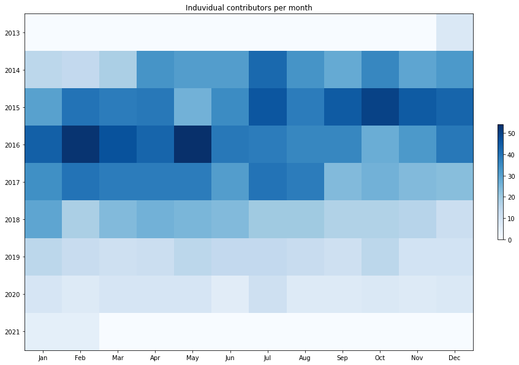

Latest record from the dataset:

<table border="1" class="dataframe">
  <thead>
    <tr style="text-align: right;">
      <th></th>
      <th>org</th>
      <th>repo</th>
      <th>type</th>
      <th>identifier</th>
      <th>subidentifier</th>
      <th>date</th>
      <th>author</th>
      <th>owner</th>
      <th>project</th>
    </tr>
  </thead>
  <tbody>
    <tr>
      <th>20412</th>
      <td>apache</td>
      <td>storm</td>
      <td>PR_COMMENTED</td>
      <td>3377</td>
      <td>NaN</td>
      <td>2021-02-09 08:19:44+00:00</td>
      <td>wxy929629</td>
      <td>wxy929629</td>
      <td>storm</td>
    </tr>
  </tbody>
</table>

# Github Contributions per user

<table border="1" class="dataframe">
  <thead>
    <tr style="text-align: right;">
      <th></th>
      <th>contributions</th>
    </tr>
    <tr>
      <th>author</th>
      <th></th>
    </tr>
  </thead>
  <tbody>
    <tr>
      <th>HeartSaVioR</th>
      <td>2584</td>
    </tr>
    <tr>
      <th>asfgit</th>
      <td>2271</td>
    </tr>
    <tr>
      <th>revans2</th>
      <td>2187</td>
    </tr>
    <tr>
      <th>srdo</th>
      <td>1189</td>
    </tr>
    <tr>
      <th>harshach</th>
      <td>888</td>
    </tr>
    <tr>
      <th>Ethanlm</th>
      <td>881</td>
    </tr>
    <tr>
      <th>ptgoetz</th>
      <td>700</td>
    </tr>
    <tr>
      <th>d2r</th>
      <td>478</td>
    </tr>
    <tr>
      <th>kishorvpatil</th>
      <td>438</td>
    </tr>
    <tr>
      <th>hmcl</th>
      <td>279</td>
    </tr>
  </tbody>
</table>

## Contributors per participations in PRs which are not created by self (helping PRs)

<table border="1" class="dataframe">
  <thead>
    <tr style="text-align: right;">
      <th></th>
      <th>identifier</th>
    </tr>
    <tr>
      <th>author</th>
      <th></th>
    </tr>
  </thead>
  <tbody>
    <tr>
      <th>asfgit</th>
      <td>2269</td>
    </tr>
    <tr>
      <th>HeartSaVioR</th>
      <td>1174</td>
    </tr>
    <tr>
      <th>revans2</th>
      <td>1093</td>
    </tr>
    <tr>
      <th>harshach</th>
      <td>538</td>
    </tr>
    <tr>
      <th>ptgoetz</th>
      <td>476</td>
    </tr>
    <tr>
      <th>srdo</th>
      <td>352</td>
    </tr>
    <tr>
      <th>kishorvpatil</th>
      <td>326</td>
    </tr>
    <tr>
      <th>Ethanlm</th>
      <td>297</td>
    </tr>
    <tr>
      <th>d2r</th>
      <td>256</td>
    </tr>
    <tr>
      <th>knusbaum</th>
      <td>195</td>
    </tr>
    <tr>
      <th>agresch</th>
      <td>156</td>
    </tr>
    <tr>
      <th>arunmahadevan</th>
      <td>120</td>
    </tr>
    <tr>
      <th>satishd</th>
      <td>113</td>
    </tr>
    <tr>
      <th>hmcl</th>
      <td>104</td>
    </tr>
    <tr>
      <th>vesense</th>
      <td>103</td>
    </tr>
    <tr>
      <th>Parth-Brahmbhatt</th>
      <td>96</td>
    </tr>
    <tr>
      <th>abhishekagarwal87</th>
      <td>69</td>
    </tr>
    <tr>
      <th>danny0405</th>
      <td>65</td>
    </tr>
    <tr>
      <th>hustfxj</th>
      <td>62</td>
    </tr>
    <tr>
      <th>jerrypeng</th>
      <td>60</td>
    </tr>
  </tbody>
</table>

## Contributors per participations in any PRs

<table border="1" class="dataframe">
  <thead>
    <tr style="text-align: right;">
      <th></th>
      <th>identifier</th>
    </tr>
    <tr>
      <th>author</th>
      <th></th>
    </tr>
  </thead>
  <tbody>
    <tr>
      <th>asfgit</th>
      <td>2269</td>
    </tr>
    <tr>
      <th>HeartSaVioR</th>
      <td>1466</td>
    </tr>
    <tr>
      <th>revans2</th>
      <td>1309</td>
    </tr>
    <tr>
      <th>srdo</th>
      <td>609</td>
    </tr>
    <tr>
      <th>harshach</th>
      <td>606</td>
    </tr>
    <tr>
      <th>ptgoetz</th>
      <td>532</td>
    </tr>
    <tr>
      <th>Ethanlm</th>
      <td>437</td>
    </tr>
    <tr>
      <th>kishorvpatil</th>
      <td>421</td>
    </tr>
    <tr>
      <th>d2r</th>
      <td>324</td>
    </tr>
    <tr>
      <th>agresch</th>
      <td>260</td>
    </tr>
    <tr>
      <th>knusbaum</th>
      <td>256</td>
    </tr>
    <tr>
      <th>vesense</th>
      <td>222</td>
    </tr>
    <tr>
      <th>arunmahadevan</th>
      <td>212</td>
    </tr>
    <tr>
      <th>hmcl</th>
      <td>162</td>
    </tr>
    <tr>
      <th>satishd</th>
      <td>158</td>
    </tr>
    <tr>
      <th>Parth-Brahmbhatt</th>
      <td>138</td>
    </tr>
    <tr>
      <th>abhishekagarwal87</th>
      <td>111</td>
    </tr>
    <tr>
      <th>zhuoliu</th>
      <td>100</td>
    </tr>
    <tr>
      <th>jerrypeng</th>
      <td>95</td>
    </tr>
    <tr>
      <th>govind-menon</th>
      <td>87</td>
    </tr>
  </tbody>
</table>

# Bus factor (number of contributors responsible for the 50% of the prs) from last half year

## Contributors until the half of the all contributions

<table border="1" class="dataframe">
  <thead>
    <tr style="text-align: right;">
      <th></th>
      <th>author</th>
      <th>identifier</th>
      <th>cs</th>
      <th>ratio</th>
    </tr>
  </thead>
  <tbody>
    <tr>
      <th>0</th>
      <td>agresch</td>
      <td>14</td>
      <td>14</td>
      <td>25.925926</td>
    </tr>
    <tr>
      <th>1</th>
      <td>bipinprasad</td>
      <td>12</td>
      <td>26</td>
      <td>22.222222</td>
    </tr>
  </tbody>
</table>

## Pony number (bus factor)

    3

## Dev power (All the contributions in the ration of the top contributor)

    3.857142857142858

    

    

## People with created PRs > reviewed/commented PRS

    

    

## Same graph with focusing to the last 6 month

Only contributors with both created pr and helped pr visible

    

    

# Number of individual contributors per month

Number of different Github users who either created PR, commented PR, added review to a PR

Note: only events from apache/hadoop-ozone repository are included. Earlier PRs/comments are not here.

    

    

# Number of PRs closed/created per month

    /usr/lib/python3.9/site-packages/pandas/core/arrays/datetimes.py:1101: UserWarning: Converting to PeriodArray/Index representation will drop timezone information.
      warnings.warn(

    

    

# PR activity heatmap

    

    

