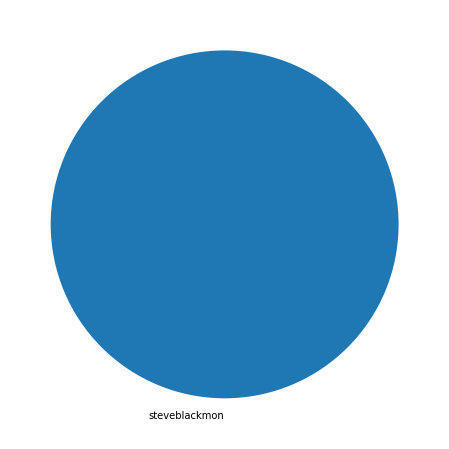
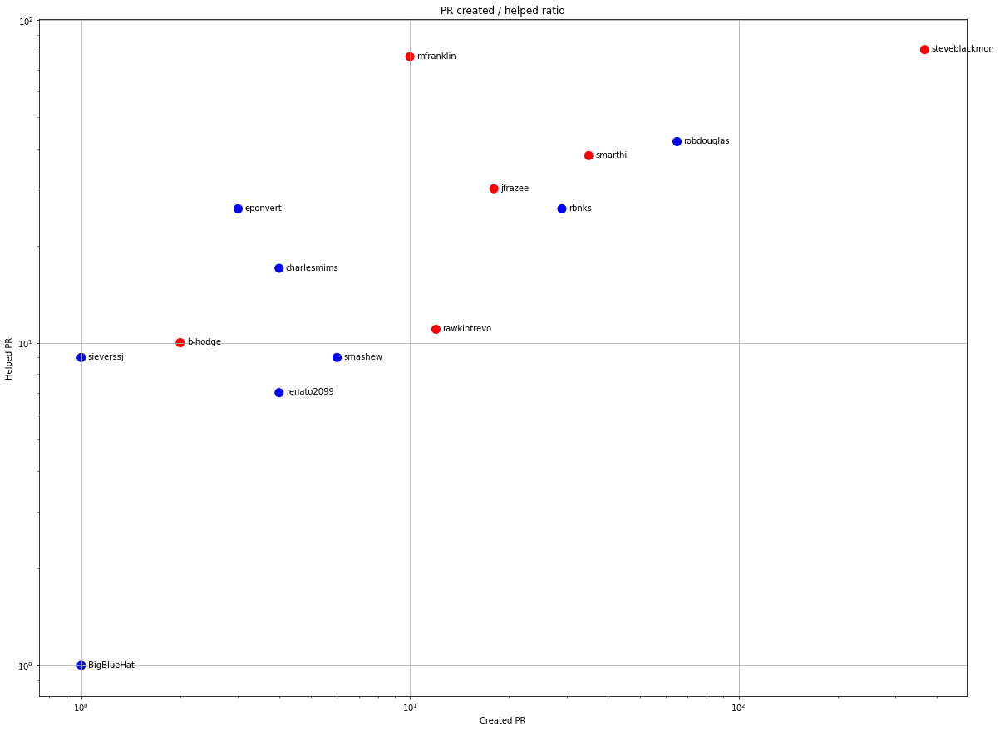
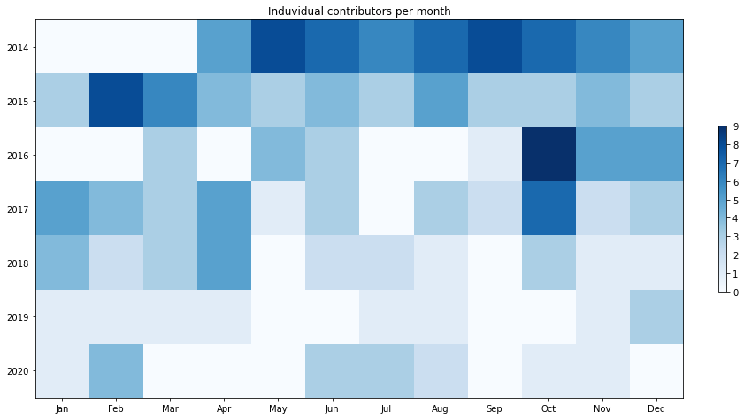
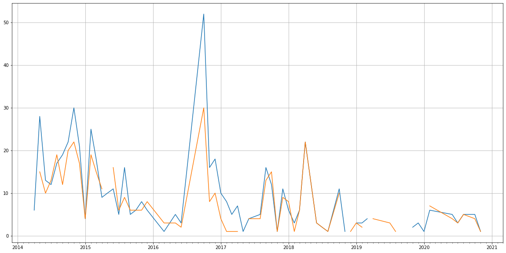
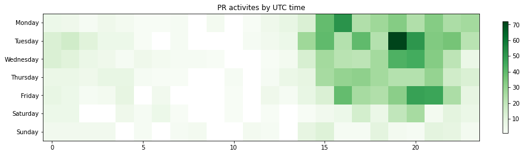

Latest record from the dataset:

<table border="1" class="dataframe">
  <thead>
    <tr style="text-align: right;">
      <th></th>
      <th>org</th>
      <th>repo</th>
      <th>type</th>
      <th>identifier</th>
      <th>subidentifier</th>
      <th>date</th>
      <th>author</th>
      <th>owner</th>
      <th>project</th>
    </tr>
  </thead>
  <tbody>
    <tr>
      <th>1528</th>
      <td>apache</td>
      <td>streams</td>
      <td>PR_MERGED</td>
      <td>517</td>
      <td>NaN</td>
      <td>2020-11-11 20:44:26+00:00</td>
      <td>steveblackmon</td>
      <td>steveblackmon</td>
      <td>streams</td>
    </tr>
  </tbody>
</table>

# Github Contributions per user

<table border="1" class="dataframe">
  <thead>
    <tr style="text-align: right;">
      <th></th>
      <th>contributions</th>
    </tr>
    <tr>
      <th>author</th>
      <th></th>
    </tr>
  </thead>
  <tbody>
    <tr>
      <th>asfgit</th>
      <td>300</td>
    </tr>
    <tr>
      <th>steveblackmon</th>
      <td>127</td>
    </tr>
    <tr>
      <th>mfranklin</th>
      <td>109</td>
    </tr>
    <tr>
      <th>smarthi</th>
      <td>65</td>
    </tr>
    <tr>
      <th>jfrazee</th>
      <td>58</td>
    </tr>
    <tr>
      <th>robdouglas</th>
      <td>52</td>
    </tr>
    <tr>
      <th>rbnks</th>
      <td>32</td>
    </tr>
    <tr>
      <th>eponvert</th>
      <td>29</td>
    </tr>
    <tr>
      <th>charlesmims</th>
      <td>18</td>
    </tr>
    <tr>
      <th>smashew</th>
      <td>18</td>
    </tr>
  </tbody>
</table>

## Contributors per participations in PRs which are not created by self (helping PRs)

<table border="1" class="dataframe">
  <thead>
    <tr style="text-align: right;">
      <th></th>
      <th>identifier</th>
    </tr>
    <tr>
      <th>author</th>
      <th></th>
    </tr>
  </thead>
  <tbody>
    <tr>
      <th>asfgit</th>
      <td>288</td>
    </tr>
    <tr>
      <th>steveblackmon</th>
      <td>81</td>
    </tr>
    <tr>
      <th>mfranklin</th>
      <td>77</td>
    </tr>
    <tr>
      <th>robdouglas</th>
      <td>42</td>
    </tr>
    <tr>
      <th>smarthi</th>
      <td>38</td>
    </tr>
    <tr>
      <th>jfrazee</th>
      <td>30</td>
    </tr>
    <tr>
      <th>eponvert</th>
      <td>26</td>
    </tr>
    <tr>
      <th>rbnks</th>
      <td>26</td>
    </tr>
    <tr>
      <th>charlesmims</th>
      <td>17</td>
    </tr>
    <tr>
      <th>rawkintrevo</th>
      <td>11</td>
    </tr>
    <tr>
      <th>b-hodge</th>
      <td>10</td>
    </tr>
    <tr>
      <th>smashew</th>
      <td>9</td>
    </tr>
    <tr>
      <th>sieverssj</th>
      <td>9</td>
    </tr>
    <tr>
      <th>renato2099</th>
      <td>7</td>
    </tr>
    <tr>
      <th>johnnytomcat</th>
      <td>2</td>
    </tr>
    <tr>
      <th>BigBlueHat</th>
      <td>1</td>
    </tr>
    <tr>
      <th>lewismc</th>
      <td>1</td>
    </tr>
    <tr>
      <th>abd-hasan85</th>
      <td>1</td>
    </tr>
    <tr>
      <th>jamesbognar</th>
      <td>1</td>
    </tr>
    <tr>
      <th>hubot</th>
      <td>1</td>
    </tr>
  </tbody>
</table>

## Contributors per participations in any PRs

<table border="1" class="dataframe">
  <thead>
    <tr style="text-align: right;">
      <th></th>
      <th>identifier</th>
    </tr>
    <tr>
      <th>author</th>
      <th></th>
    </tr>
  </thead>
  <tbody>
    <tr>
      <th>steveblackmon</th>
      <td>424</td>
    </tr>
    <tr>
      <th>asfgit</th>
      <td>288</td>
    </tr>
    <tr>
      <th>robdouglas</th>
      <td>107</td>
    </tr>
    <tr>
      <th>mfranklin</th>
      <td>86</td>
    </tr>
    <tr>
      <th>smarthi</th>
      <td>73</td>
    </tr>
    <tr>
      <th>rbnks</th>
      <td>55</td>
    </tr>
    <tr>
      <th>jfrazee</th>
      <td>48</td>
    </tr>
    <tr>
      <th>eponvert</th>
      <td>29</td>
    </tr>
    <tr>
      <th>rawkintrevo</th>
      <td>23</td>
    </tr>
    <tr>
      <th>charlesmims</th>
      <td>21</td>
    </tr>
    <tr>
      <th>smashew</th>
      <td>15</td>
    </tr>
    <tr>
      <th>b-hodge</th>
      <td>12</td>
    </tr>
    <tr>
      <th>renato2099</th>
      <td>11</td>
    </tr>
    <tr>
      <th>sieverssj</th>
      <td>10</td>
    </tr>
    <tr>
      <th>dependabot</th>
      <td>3</td>
    </tr>
    <tr>
      <th>BigBlueHat</th>
      <td>2</td>
    </tr>
    <tr>
      <th>johnnytomcat</th>
      <td>2</td>
    </tr>
    <tr>
      <th>lewismc</th>
      <td>1</td>
    </tr>
    <tr>
      <th>justinmclean</th>
      <td>1</td>
    </tr>
    <tr>
      <th>JLLeitschuh</th>
      <td>1</td>
    </tr>
  </tbody>
</table>

# Bus factor (number of contributors responsible for the 50% of the prs) from last half year

## Contributors until the half of the all contributions

<table border="1" class="dataframe">
  <thead>
    <tr style="text-align: right;">
      <th></th>
      <th>author</th>
      <th>identifier</th>
      <th>cs</th>
      <th>ratio</th>
    </tr>
  </thead>
  <tbody>
  </tbody>
</table>

## Pony number (bus factor)

    1

## Dev power (All the contributions in the ration of the top contributor)

    1.0

    

    

## People with created PRs > reviewed/commented PRS

    

    

## Same graph with focusing to the last 6 month

Only contributors with both created pr and helped pr visible

    

    

# Number of individual contributors per month

Number of different Github users who either created PR, commented PR, added review to a PR

Note: only events from apache/hadoop-ozone repository are included. Earlier PRs/comments are not here.

    

    

# Number of PRs closed/created per month

    /usr/lib/python3.9/site-packages/pandas/core/arrays/datetimes.py:1101: UserWarning: Converting to PeriodArray/Index representation will drop timezone information.
      warnings.warn(

    

    

# PR activity heatmap

    

    

