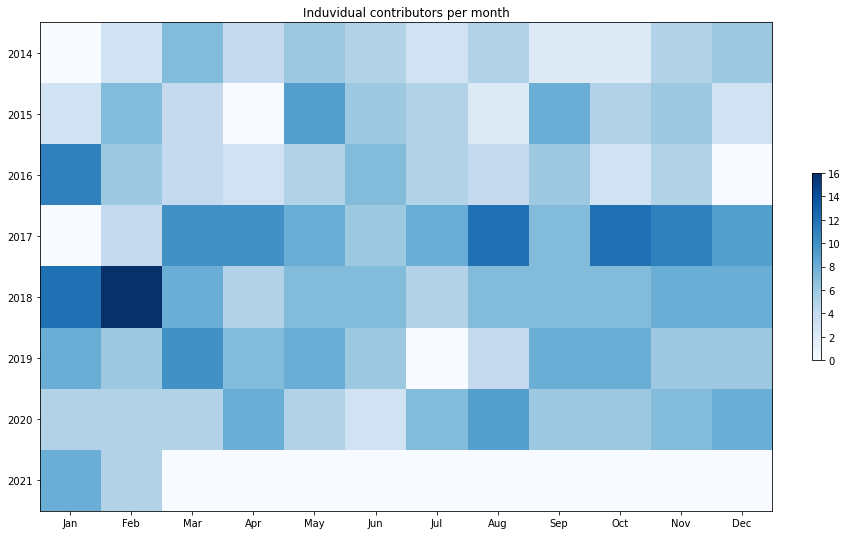

Latest record from the dataset:

<table border="1" class="dataframe">
  <thead>
    <tr style="text-align: right;">
      <th></th>
      <th>org</th>
      <th>repo</th>
      <th>type</th>
      <th>identifier</th>
      <th>subidentifier</th>
      <th>date</th>
      <th>author</th>
      <th>owner</th>
      <th>project</th>
    </tr>
  </thead>
  <tbody>
    <tr>
      <th>3301</th>
      <td>apache</td>
      <td>struts</td>
      <td>PR_MERGED</td>
      <td>472</td>
      <td>NaN</td>
      <td>2021-02-08 19:06:28+00:00</td>
      <td>lukaszlenart</td>
      <td>Marcono1234</td>
      <td>struts</td>
    </tr>
  </tbody>
</table>

# Github Contributions per user

<table border="1" class="dataframe">
  <thead>
    <tr style="text-align: right;">
      <th></th>
      <th>contributions</th>
    </tr>
    <tr>
      <th>author</th>
      <th></th>
    </tr>
  </thead>
  <tbody>
    <tr>
      <th>lukaszlenart</th>
      <td>1206</td>
    </tr>
    <tr>
      <th>yasserzamani</th>
      <td>419</td>
    </tr>
    <tr>
      <th>coveralls</th>
      <td>301</td>
    </tr>
    <tr>
      <th>aleksandr-m</th>
      <td>180</td>
    </tr>
    <tr>
      <th>asfgit</th>
      <td>136</td>
    </tr>
    <tr>
      <th>JCgH4164838Gh792C124B5</th>
      <td>104</td>
    </tr>
    <tr>
      <th>asfbot</th>
      <td>92</td>
    </tr>
    <tr>
      <th>sepe81</th>
      <td>63</td>
    </tr>
    <tr>
      <th>cnenning</th>
      <td>54</td>
    </tr>
    <tr>
      <th>sdutry</th>
      <td>18</td>
    </tr>
  </tbody>
</table>

## Contributors per participations in PRs which are not created by self (helping PRs)

<table border="1" class="dataframe">
  <thead>
    <tr style="text-align: right;">
      <th></th>
      <th>identifier</th>
    </tr>
    <tr>
      <th>author</th>
      <th></th>
    </tr>
  </thead>
  <tbody>
    <tr>
      <th>lukaszlenart</th>
      <td>342</td>
    </tr>
    <tr>
      <th>coveralls</th>
      <td>258</td>
    </tr>
    <tr>
      <th>yasserzamani</th>
      <td>140</td>
    </tr>
    <tr>
      <th>asfgit</th>
      <td>127</td>
    </tr>
    <tr>
      <th>aleksandr-m</th>
      <td>63</td>
    </tr>
    <tr>
      <th>JCgH4164838Gh792C124B5</th>
      <td>40</td>
    </tr>
    <tr>
      <th>sepe81</th>
      <td>34</td>
    </tr>
    <tr>
      <th>asfbot</th>
      <td>33</td>
    </tr>
    <tr>
      <th>cnenning</th>
      <td>29</td>
    </tr>
    <tr>
      <th>sdutry</th>
      <td>11</td>
    </tr>
    <tr>
      <th>rgielen</th>
      <td>8</td>
    </tr>
    <tr>
      <th>davelnewton</th>
      <td>4</td>
    </tr>
    <tr>
      <th>gregh3269</th>
      <td>4</td>
    </tr>
    <tr>
      <th>wolpi</th>
      <td>4</td>
    </tr>
    <tr>
      <th>jogep</th>
      <td>3</td>
    </tr>
    <tr>
      <th>tiztm</th>
      <td>2</td>
    </tr>
    <tr>
      <th>salcho</th>
      <td>2</td>
    </tr>
    <tr>
      <th>ke4qqq</th>
      <td>2</td>
    </tr>
    <tr>
      <th>kwin</th>
      <td>1</td>
    </tr>
    <tr>
      <th>rhollencamp</th>
      <td>1</td>
    </tr>
  </tbody>
</table>

## Contributors per participations in any PRs

<table border="1" class="dataframe">
  <thead>
    <tr style="text-align: right;">
      <th></th>
      <th>identifier</th>
    </tr>
    <tr>
      <th>author</th>
      <th></th>
    </tr>
  </thead>
  <tbody>
    <tr>
      <th>lukaszlenart</th>
      <td>435</td>
    </tr>
    <tr>
      <th>coveralls</th>
      <td>258</td>
    </tr>
    <tr>
      <th>yasserzamani</th>
      <td>218</td>
    </tr>
    <tr>
      <th>asfgit</th>
      <td>127</td>
    </tr>
    <tr>
      <th>JCgH4164838Gh792C124B5</th>
      <td>122</td>
    </tr>
    <tr>
      <th>aleksandr-m</th>
      <td>97</td>
    </tr>
    <tr>
      <th>sepe81</th>
      <td>59</td>
    </tr>
    <tr>
      <th>sdutry</th>
      <td>49</td>
    </tr>
    <tr>
      <th>dependabot</th>
      <td>43</td>
    </tr>
    <tr>
      <th>paulvi</th>
      <td>39</td>
    </tr>
    <tr>
      <th>asfbot</th>
      <td>33</td>
    </tr>
    <tr>
      <th>victorsosa</th>
      <td>31</td>
    </tr>
    <tr>
      <th>cnenning</th>
      <td>31</td>
    </tr>
    <tr>
      <th>fanofxiaofeng</th>
      <td>26</td>
    </tr>
    <tr>
      <th>sullis</th>
      <td>11</td>
    </tr>
    <tr>
      <th>gregh3269</th>
      <td>10</td>
    </tr>
    <tr>
      <th>rgielen</th>
      <td>9</td>
    </tr>
    <tr>
      <th>salcho</th>
      <td>6</td>
    </tr>
    <tr>
      <th>pbruski</th>
      <td>6</td>
    </tr>
    <tr>
      <th>quaff</th>
      <td>6</td>
    </tr>
  </tbody>
</table>

# Bus factor (number of contributors responsible for the 50% of the prs) from last half year

## Contributors until the half of the all contributions

<table border="1" class="dataframe">
  <thead>
    <tr style="text-align: right;">
      <th></th>
      <th>author</th>
      <th>identifier</th>
      <th>cs</th>
      <th>ratio</th>
    </tr>
  </thead>
  <tbody>
    <tr>
      <th>0</th>
      <td>dependabot</td>
      <td>37</td>
      <td>37</td>
      <td>44.578313</td>
    </tr>
  </tbody>
</table>

## Pony number (bus factor)

    2

## Dev power (All the contributions in the ration of the top contributor)

    2.243243243243244

    

    

## People with created PRs > reviewed/commented PRS

    

    

## Same graph with focusing to the last 6 month

Only contributors with both created pr and helped pr visible

    

    

# Number of individual contributors per month

Number of different Github users who either created PR, commented PR, added review to a PR

Note: only events from apache/hadoop-ozone repository are included. Earlier PRs/comments are not here.

    

    

# Number of PRs closed/created per month

    /usr/lib/python3.9/site-packages/pandas/core/arrays/datetimes.py:1101: UserWarning: Converting to PeriodArray/Index representation will drop timezone information.
      warnings.warn(

    

    

# PR activity heatmap

    

    

