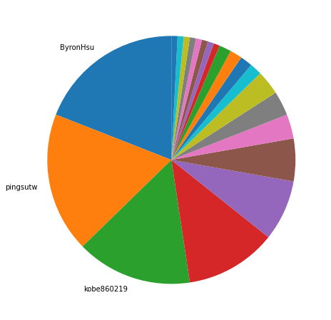
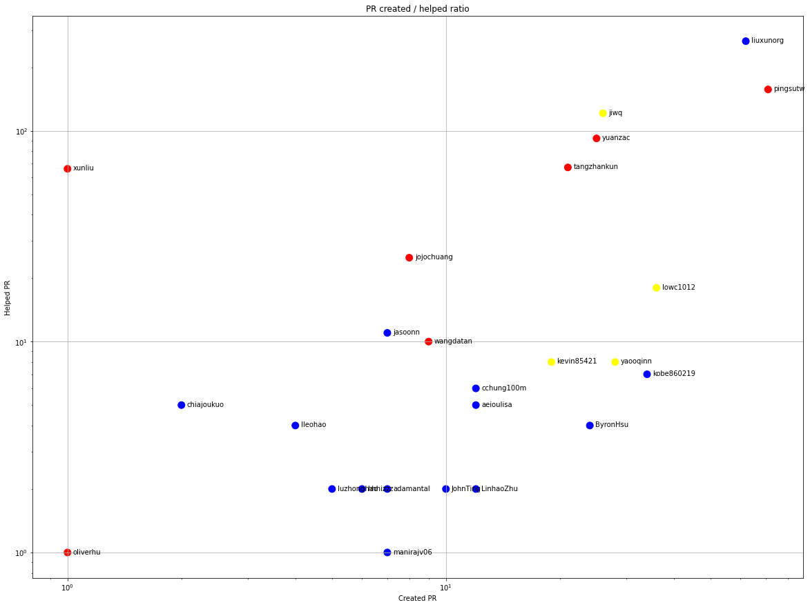
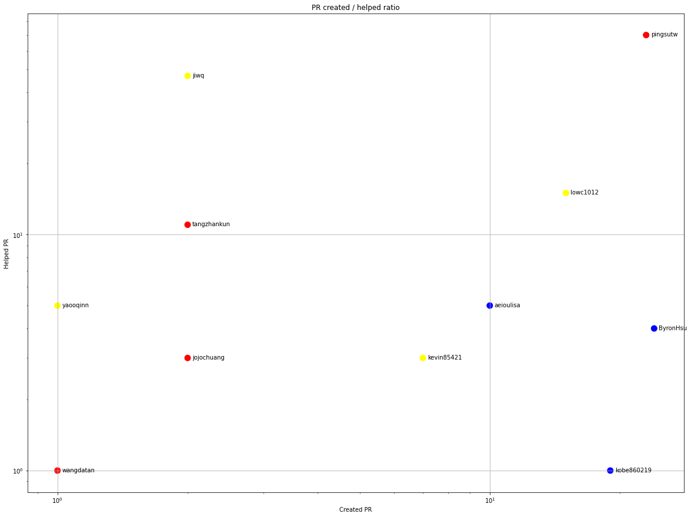
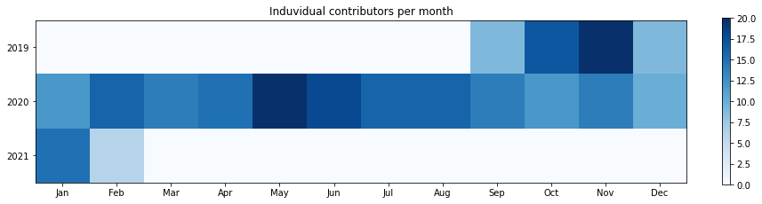
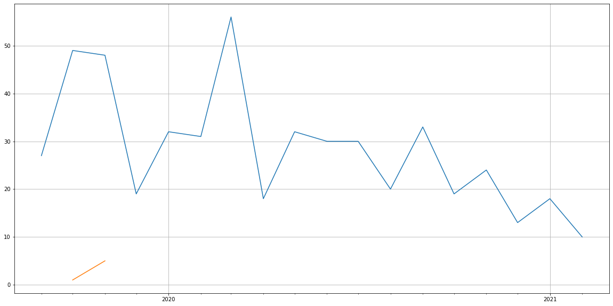
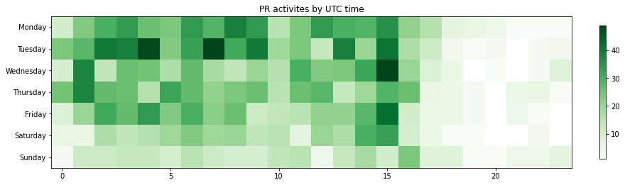

Latest record from the dataset:

<table border="1" class="dataframe">
  <thead>
    <tr style="text-align: right;">
      <th></th>
      <th>org</th>
      <th>repo</th>
      <th>type</th>
      <th>identifier</th>
      <th>subidentifier</th>
      <th>date</th>
      <th>author</th>
      <th>owner</th>
      <th>project</th>
    </tr>
  </thead>
  <tbody>
    <tr>
      <th>2504</th>
      <td>apache</td>
      <td>submarine</td>
      <td>PR_COMMENTED</td>
      <td>513</td>
      <td>NaN</td>
      <td>2021-02-14 07:07:59+00:00</td>
      <td>kobe860219</td>
      <td>kobe860219</td>
      <td>submarine</td>
    </tr>
  </tbody>
</table>

# Github Contributions per user

<table border="1" class="dataframe">
  <thead>
    <tr style="text-align: right;">
      <th></th>
      <th>contributions</th>
    </tr>
    <tr>
      <th>author</th>
      <th></th>
    </tr>
  </thead>
  <tbody>
    <tr>
      <th>liuxunorg</th>
      <td>492</td>
    </tr>
    <tr>
      <th>pingsutw</th>
      <td>235</td>
    </tr>
    <tr>
      <th>jiwq</th>
      <td>171</td>
    </tr>
    <tr>
      <th>tangzhankun</th>
      <td>130</td>
    </tr>
    <tr>
      <th>yuanzac</th>
      <td>117</td>
    </tr>
    <tr>
      <th>xunliu</th>
      <td>89</td>
    </tr>
    <tr>
      <th>jojochuang</th>
      <td>45</td>
    </tr>
    <tr>
      <th>wangdatan</th>
      <td>32</td>
    </tr>
    <tr>
      <th>lowc1012</th>
      <td>29</td>
    </tr>
    <tr>
      <th>yaooqinn</th>
      <td>27</td>
    </tr>
  </tbody>
</table>

## Contributors per participations in PRs which are not created by self (helping PRs)

<table border="1" class="dataframe">
  <thead>
    <tr style="text-align: right;">
      <th></th>
      <th>identifier</th>
    </tr>
    <tr>
      <th>author</th>
      <th></th>
    </tr>
  </thead>
  <tbody>
    <tr>
      <th>liuxunorg</th>
      <td>266</td>
    </tr>
    <tr>
      <th>pingsutw</th>
      <td>157</td>
    </tr>
    <tr>
      <th>jiwq</th>
      <td>121</td>
    </tr>
    <tr>
      <th>yuanzac</th>
      <td>92</td>
    </tr>
    <tr>
      <th>tangzhankun</th>
      <td>67</td>
    </tr>
    <tr>
      <th>xunliu</th>
      <td>66</td>
    </tr>
    <tr>
      <th>jojochuang</th>
      <td>25</td>
    </tr>
    <tr>
      <th>lowc1012</th>
      <td>18</td>
    </tr>
    <tr>
      <th>jasoonn</th>
      <td>11</td>
    </tr>
    <tr>
      <th>wangdatan</th>
      <td>10</td>
    </tr>
    <tr>
      <th>kevin85421</th>
      <td>8</td>
    </tr>
    <tr>
      <th>yaooqinn</th>
      <td>8</td>
    </tr>
    <tr>
      <th>kobe860219</th>
      <td>7</td>
    </tr>
    <tr>
      <th>cchung100m</th>
      <td>6</td>
    </tr>
    <tr>
      <th>chiajoukuo</th>
      <td>5</td>
    </tr>
    <tr>
      <th>aeioulisa</th>
      <td>5</td>
    </tr>
    <tr>
      <th>lleohao</th>
      <td>4</td>
    </tr>
    <tr>
      <th>ByronHsu</th>
      <td>4</td>
    </tr>
    <tr>
      <th>JohnTing</th>
      <td>2</td>
    </tr>
    <tr>
      <th>luzhonghao</th>
      <td>2</td>
    </tr>
  </tbody>
</table>

## Contributors per participations in any PRs

<table border="1" class="dataframe">
  <thead>
    <tr style="text-align: right;">
      <th></th>
      <th>identifier</th>
    </tr>
    <tr>
      <th>author</th>
      <th></th>
    </tr>
  </thead>
  <tbody>
    <tr>
      <th>liuxunorg</th>
      <td>325</td>
    </tr>
    <tr>
      <th>pingsutw</th>
      <td>228</td>
    </tr>
    <tr>
      <th>jiwq</th>
      <td>147</td>
    </tr>
    <tr>
      <th>yuanzac</th>
      <td>117</td>
    </tr>
    <tr>
      <th>tangzhankun</th>
      <td>85</td>
    </tr>
    <tr>
      <th>xunliu</th>
      <td>67</td>
    </tr>
    <tr>
      <th>lowc1012</th>
      <td>54</td>
    </tr>
    <tr>
      <th>kobe860219</th>
      <td>41</td>
    </tr>
    <tr>
      <th>yaooqinn</th>
      <td>36</td>
    </tr>
    <tr>
      <th>jojochuang</th>
      <td>33</td>
    </tr>
    <tr>
      <th>ByronHsu</th>
      <td>28</td>
    </tr>
    <tr>
      <th>kevin85421</th>
      <td>27</td>
    </tr>
    <tr>
      <th>wangdatan</th>
      <td>19</td>
    </tr>
    <tr>
      <th>cchung100m</th>
      <td>18</td>
    </tr>
    <tr>
      <th>jasoonn</th>
      <td>18</td>
    </tr>
    <tr>
      <th>aeioulisa</th>
      <td>17</td>
    </tr>
    <tr>
      <th>LinhaoZhu</th>
      <td>14</td>
    </tr>
    <tr>
      <th>JohnTing</th>
      <td>12</td>
    </tr>
    <tr>
      <th>Eroschang</th>
      <td>12</td>
    </tr>
    <tr>
      <th>adamantal</th>
      <td>9</td>
    </tr>
  </tbody>
</table>

# Bus factor (number of contributors responsible for the 50% of the prs) from last half year

## Contributors until the half of the all contributions

<table border="1" class="dataframe">
  <thead>
    <tr style="text-align: right;">
      <th></th>
      <th>author</th>
      <th>identifier</th>
      <th>cs</th>
      <th>ratio</th>
    </tr>
  </thead>
  <tbody>
    <tr>
      <th>0</th>
      <td>ByronHsu</td>
      <td>24</td>
      <td>24</td>
      <td>19.047619</td>
    </tr>
    <tr>
      <th>1</th>
      <td>pingsutw</td>
      <td>23</td>
      <td>47</td>
      <td>18.253968</td>
    </tr>
  </tbody>
</table>

## Pony number (bus factor)

    3

## Dev power (All the contributions in the ration of the top contributor)

    5.250000000000002

    

    

## People with created PRs > reviewed/commented PRS

    

    

## Same graph with focusing to the last 6 month

Only contributors with both created pr and helped pr visible

    

    

# Number of individual contributors per month

Number of different Github users who either created PR, commented PR, added review to a PR

Note: only events from apache/hadoop-ozone repository are included. Earlier PRs/comments are not here.

    

    

# Number of PRs closed/created per month

    /usr/lib/python3.9/site-packages/pandas/core/arrays/datetimes.py:1101: UserWarning: Converting to PeriodArray/Index representation will drop timezone information.
      warnings.warn(

    

    

# PR activity heatmap

    

    

