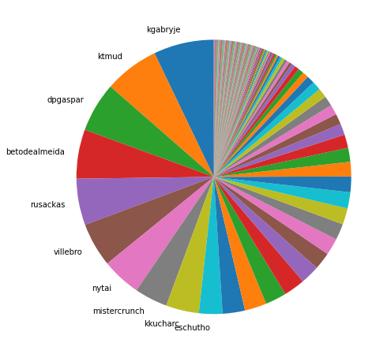
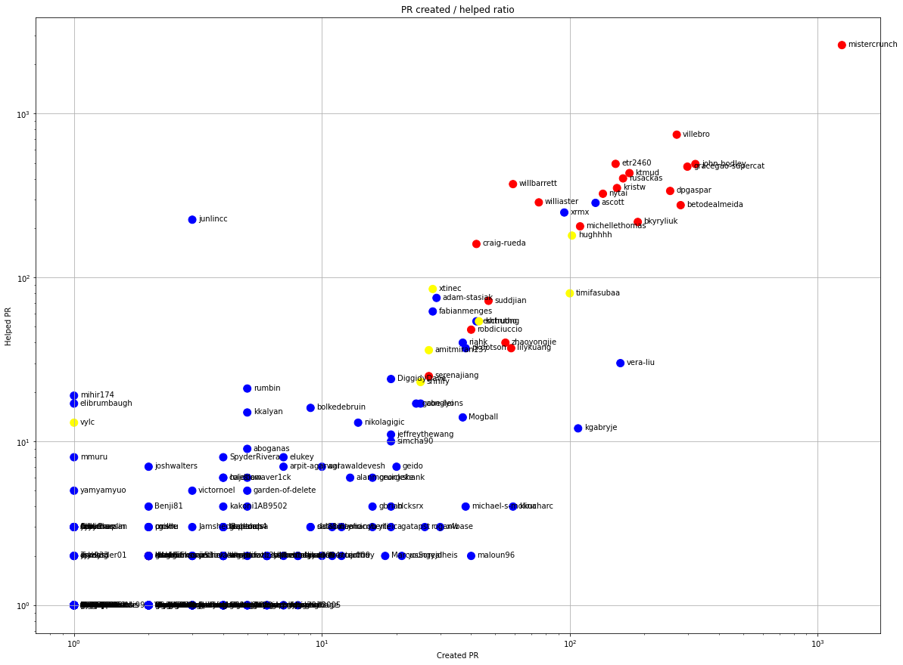
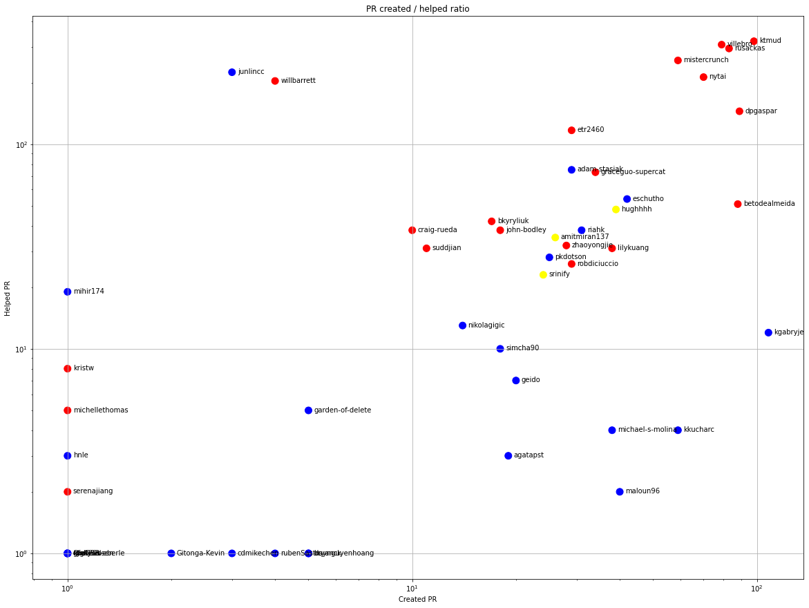
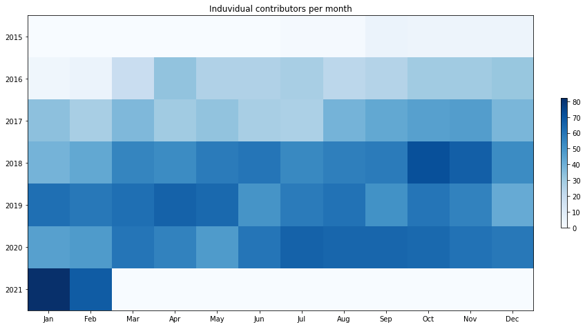
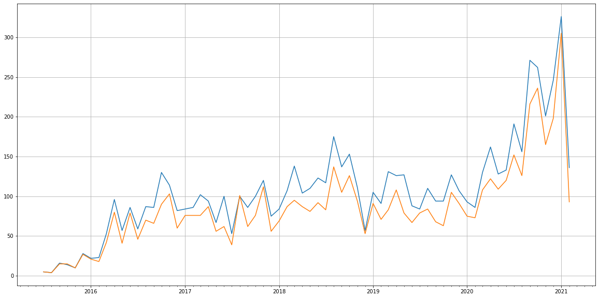
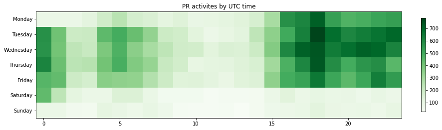

Latest record from the dataset:

<table border="1" class="dataframe">
  <thead>
    <tr style="text-align: right;">
      <th></th>
      <th>org</th>
      <th>repo</th>
      <th>type</th>
      <th>identifier</th>
      <th>subidentifier</th>
      <th>date</th>
      <th>author</th>
      <th>owner</th>
      <th>project</th>
    </tr>
  </thead>
  <tbody>
    <tr>
      <th>15214</th>
      <td>apache</td>
      <td>superset</td>
      <td>PR_REVIEW_COMMENTED</td>
      <td>13108</td>
      <td>NaN</td>
      <td>2021-02-14 09:23:22+00:00</td>
      <td>amitmiran137</td>
      <td>amitmiran137</td>
      <td>superset</td>
    </tr>
  </tbody>
</table>

# Github Contributions per user

<table border="1" class="dataframe">
  <thead>
    <tr style="text-align: right;">
      <th></th>
      <th>contributions</th>
    </tr>
    <tr>
      <th>author</th>
      <th></th>
    </tr>
  </thead>
  <tbody>
    <tr>
      <th>mistercrunch</th>
      <td>5030</td>
    </tr>
    <tr>
      <th>codecov-io</th>
      <td>3386</td>
    </tr>
    <tr>
      <th>coveralls</th>
      <td>2061</td>
    </tr>
    <tr>
      <th>villebro</th>
      <td>1529</td>
    </tr>
    <tr>
      <th>rusackas</th>
      <td>1248</td>
    </tr>
    <tr>
      <th>ktmud</th>
      <td>997</td>
    </tr>
    <tr>
      <th>etr2460</th>
      <td>916</td>
    </tr>
    <tr>
      <th>john-bodley</th>
      <td>873</td>
    </tr>
    <tr>
      <th>ascott</th>
      <td>815</td>
    </tr>
    <tr>
      <th>graceguo-supercat</th>
      <td>786</td>
    </tr>
  </tbody>
</table>

## Contributors per participations in PRs which are not created by self (helping PRs)

<table border="1" class="dataframe">
  <thead>
    <tr style="text-align: right;">
      <th></th>
      <th>identifier</th>
    </tr>
    <tr>
      <th>author</th>
      <th></th>
    </tr>
  </thead>
  <tbody>
    <tr>
      <th>codecov-io</th>
      <td>3314</td>
    </tr>
    <tr>
      <th>mistercrunch</th>
      <td>2615</td>
    </tr>
    <tr>
      <th>villebro</th>
      <td>743</td>
    </tr>
    <tr>
      <th>coveralls</th>
      <td>700</td>
    </tr>
    <tr>
      <th>etr2460</th>
      <td>493</td>
    </tr>
    <tr>
      <th>john-bodley</th>
      <td>492</td>
    </tr>
    <tr>
      <th>graceguo-supercat</th>
      <td>474</td>
    </tr>
    <tr>
      <th>ktmud</th>
      <td>433</td>
    </tr>
    <tr>
      <th>rusackas</th>
      <td>402</td>
    </tr>
    <tr>
      <th>codecov-commenter</th>
      <td>399</td>
    </tr>
    <tr>
      <th>willbarrett</th>
      <td>371</td>
    </tr>
    <tr>
      <th>kristw</th>
      <td>351</td>
    </tr>
    <tr>
      <th>dpgaspar</th>
      <td>337</td>
    </tr>
    <tr>
      <th>nytai</th>
      <td>324</td>
    </tr>
    <tr>
      <th>williaster</th>
      <td>287</td>
    </tr>
    <tr>
      <th>ascott</th>
      <td>285</td>
    </tr>
    <tr>
      <th>betodealmeida</th>
      <td>276</td>
    </tr>
    <tr>
      <th>xrmx</th>
      <td>249</td>
    </tr>
    <tr>
      <th>stale</th>
      <td>249</td>
    </tr>
    <tr>
      <th>junlincc</th>
      <td>225</td>
    </tr>
  </tbody>
</table>

## Contributors per participations in any PRs

<table border="1" class="dataframe">
  <thead>
    <tr style="text-align: right;">
      <th></th>
      <th>identifier</th>
    </tr>
    <tr>
      <th>author</th>
      <th></th>
    </tr>
  </thead>
  <tbody>
    <tr>
      <th>mistercrunch</th>
      <td>3867</td>
    </tr>
    <tr>
      <th>codecov-io</th>
      <td>3314</td>
    </tr>
    <tr>
      <th>villebro</th>
      <td>1013</td>
    </tr>
    <tr>
      <th>john-bodley</th>
      <td>813</td>
    </tr>
    <tr>
      <th>graceguo-supercat</th>
      <td>772</td>
    </tr>
    <tr>
      <th>coveralls</th>
      <td>700</td>
    </tr>
    <tr>
      <th>etr2460</th>
      <td>646</td>
    </tr>
    <tr>
      <th>ktmud</th>
      <td>607</td>
    </tr>
    <tr>
      <th>dpgaspar</th>
      <td>591</td>
    </tr>
    <tr>
      <th>rusackas</th>
      <td>566</td>
    </tr>
    <tr>
      <th>betodealmeida</th>
      <td>556</td>
    </tr>
    <tr>
      <th>kristw</th>
      <td>506</td>
    </tr>
    <tr>
      <th>nytai</th>
      <td>460</td>
    </tr>
    <tr>
      <th>willbarrett</th>
      <td>430</td>
    </tr>
    <tr>
      <th>ascott</th>
      <td>412</td>
    </tr>
    <tr>
      <th>bkyryliuk</th>
      <td>406</td>
    </tr>
    <tr>
      <th>codecov-commenter</th>
      <td>399</td>
    </tr>
    <tr>
      <th>williaster</th>
      <td>362</td>
    </tr>
    <tr>
      <th>xrmx</th>
      <td>344</td>
    </tr>
    <tr>
      <th>michellethomas</th>
      <td>315</td>
    </tr>
  </tbody>
</table>

# Bus factor (number of contributors responsible for the 50% of the prs) from last half year

## Contributors until the half of the all contributions

<table border="1" class="dataframe">
  <thead>
    <tr style="text-align: right;">
      <th></th>
      <th>author</th>
      <th>identifier</th>
      <th>cs</th>
      <th>ratio</th>
    </tr>
  </thead>
  <tbody>
    <tr>
      <th>0</th>
      <td>kgabryje</td>
      <td>108</td>
      <td>108</td>
      <td>7.109941</td>
    </tr>
    <tr>
      <th>1</th>
      <td>ktmud</td>
      <td>98</td>
      <td>206</td>
      <td>6.451613</td>
    </tr>
    <tr>
      <th>2</th>
      <td>dpgaspar</td>
      <td>89</td>
      <td>295</td>
      <td>5.859118</td>
    </tr>
    <tr>
      <th>3</th>
      <td>betodealmeida</td>
      <td>88</td>
      <td>383</td>
      <td>5.793285</td>
    </tr>
    <tr>
      <th>4</th>
      <td>rusackas</td>
      <td>83</td>
      <td>466</td>
      <td>5.464121</td>
    </tr>
    <tr>
      <th>5</th>
      <td>villebro</td>
      <td>79</td>
      <td>545</td>
      <td>5.200790</td>
    </tr>
    <tr>
      <th>6</th>
      <td>nytai</td>
      <td>70</td>
      <td>615</td>
      <td>4.608295</td>
    </tr>
    <tr>
      <th>7</th>
      <td>mistercrunch</td>
      <td>59</td>
      <td>674</td>
      <td>3.884134</td>
    </tr>
    <tr>
      <th>8</th>
      <td>kkucharc</td>
      <td>59</td>
      <td>733</td>
      <td>3.884134</td>
    </tr>
  </tbody>
</table>

## Pony number (bus factor)

    10

## Dev power (All the contributions in the ration of the top contributor)

    14.064814814814815

    

    

## People with created PRs > reviewed/commented PRS

    

    

## Same graph with focusing to the last 6 month

Only contributors with both created pr and helped pr visible

    

    

# Number of individual contributors per month

Number of different Github users who either created PR, commented PR, added review to a PR

Note: only events from apache/hadoop-ozone repository are included. Earlier PRs/comments are not here.

    

    

# Number of PRs closed/created per month

    /usr/lib/python3.9/site-packages/pandas/core/arrays/datetimes.py:1101: UserWarning: Converting to PeriodArray/Index representation will drop timezone information.
      warnings.warn(

    

    

# PR activity heatmap

    

    

