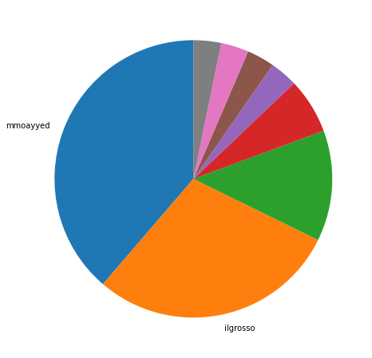
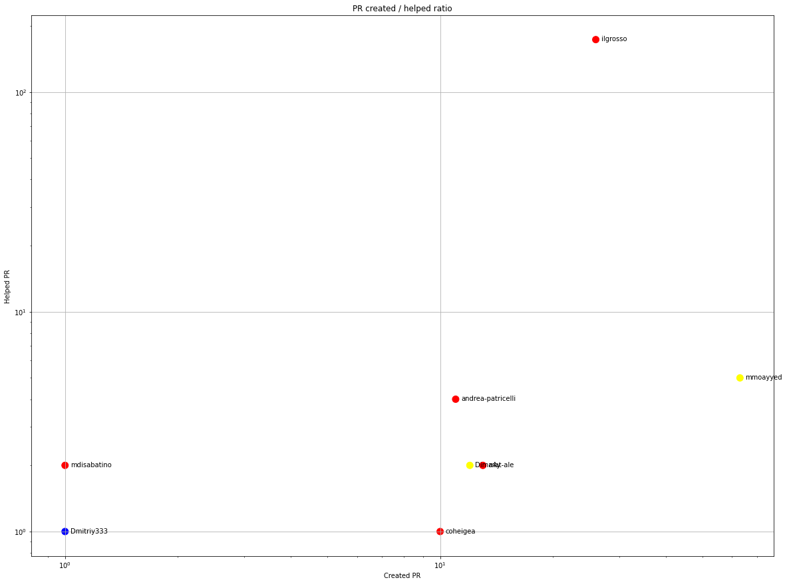
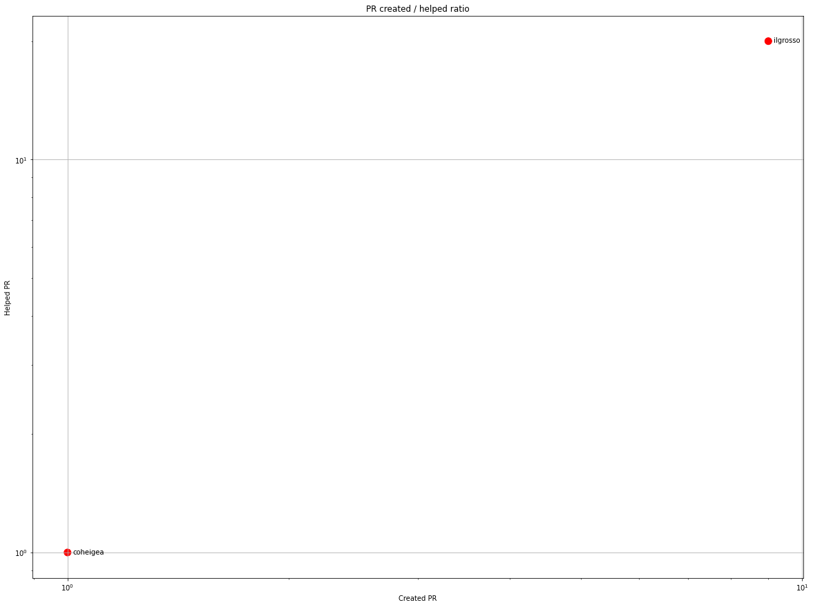
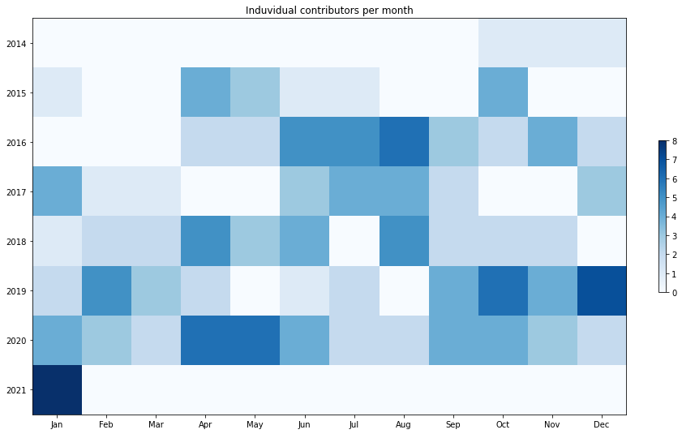
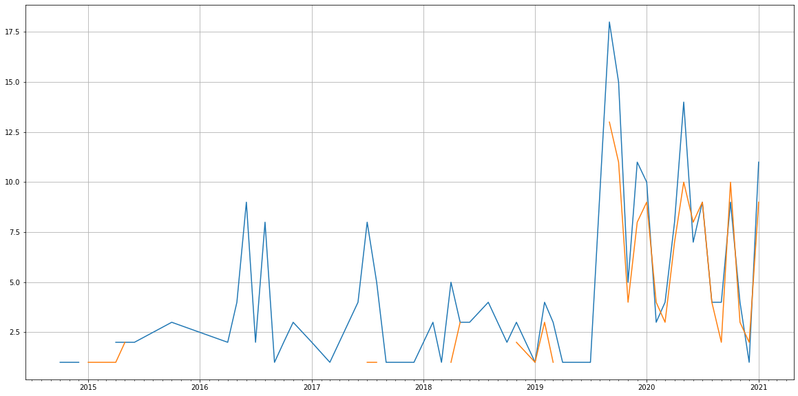
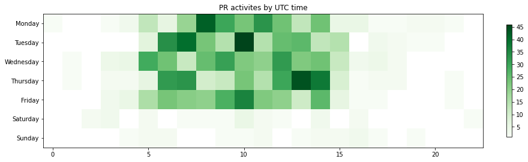

Latest record from the dataset:

<table border="1" class="dataframe">
  <thead>
    <tr style="text-align: right;">
      <th></th>
      <th>org</th>
      <th>repo</th>
      <th>type</th>
      <th>identifier</th>
      <th>subidentifier</th>
      <th>date</th>
      <th>author</th>
      <th>owner</th>
      <th>project</th>
    </tr>
  </thead>
  <tbody>
    <tr>
      <th>892</th>
      <td>apache</td>
      <td>syncope</td>
      <td>PR_MERGED</td>
      <td>241</td>
      <td>NaN</td>
      <td>2021-01-29 11:27:54+00:00</td>
      <td>DimaAy</td>
      <td>DimaAy</td>
      <td>syncope</td>
    </tr>
  </tbody>
</table>

# Github Contributions per user

<table border="1" class="dataframe">
  <thead>
    <tr style="text-align: right;">
      <th></th>
      <th>contributions</th>
    </tr>
    <tr>
      <th>author</th>
      <th></th>
    </tr>
  </thead>
  <tbody>
    <tr>
      <th>ilgrosso</th>
      <td>674</td>
    </tr>
    <tr>
      <th>asfgit</th>
      <td>14</td>
    </tr>
    <tr>
      <th>mat-ale</th>
      <td>13</td>
    </tr>
    <tr>
      <th>andrea-patricelli</th>
      <td>11</td>
    </tr>
    <tr>
      <th>mmoayyed</th>
      <td>11</td>
    </tr>
    <tr>
      <th>DimaAy</th>
      <td>2</td>
    </tr>
    <tr>
      <th>Dmitriy333</th>
      <td>2</td>
    </tr>
    <tr>
      <th>asfbot</th>
      <td>2</td>
    </tr>
    <tr>
      <th>mdisabatino</th>
      <td>2</td>
    </tr>
    <tr>
      <th>coheigea</th>
      <td>1</td>
    </tr>
  </tbody>
</table>

## Contributors per participations in PRs which are not created by self (helping PRs)

<table border="1" class="dataframe">
  <thead>
    <tr style="text-align: right;">
      <th></th>
      <th>identifier</th>
    </tr>
    <tr>
      <th>author</th>
      <th></th>
    </tr>
  </thead>
  <tbody>
    <tr>
      <th>ilgrosso</th>
      <td>173</td>
    </tr>
    <tr>
      <th>asfgit</th>
      <td>14</td>
    </tr>
    <tr>
      <th>mmoayyed</th>
      <td>5</td>
    </tr>
    <tr>
      <th>andrea-patricelli</th>
      <td>4</td>
    </tr>
    <tr>
      <th>DimaAy</th>
      <td>2</td>
    </tr>
    <tr>
      <th>mat-ale</th>
      <td>2</td>
    </tr>
    <tr>
      <th>mdisabatino</th>
      <td>2</td>
    </tr>
    <tr>
      <th>Dmitriy333</th>
      <td>1</td>
    </tr>
    <tr>
      <th>asfbot</th>
      <td>1</td>
    </tr>
    <tr>
      <th>coheigea</th>
      <td>1</td>
    </tr>
    <tr>
      <th>sberyozkin</th>
      <td>1</td>
    </tr>
  </tbody>
</table>

## Contributors per participations in any PRs

<table border="1" class="dataframe">
  <thead>
    <tr style="text-align: right;">
      <th></th>
      <th>identifier</th>
    </tr>
    <tr>
      <th>author</th>
      <th></th>
    </tr>
  </thead>
  <tbody>
    <tr>
      <th>ilgrosso</th>
      <td>199</td>
    </tr>
    <tr>
      <th>mmoayyed</th>
      <td>68</td>
    </tr>
    <tr>
      <th>andrea-patricelli</th>
      <td>15</td>
    </tr>
    <tr>
      <th>mat-ale</th>
      <td>15</td>
    </tr>
    <tr>
      <th>DimaAy</th>
      <td>14</td>
    </tr>
    <tr>
      <th>asfgit</th>
      <td>14</td>
    </tr>
    <tr>
      <th>coheigea</th>
      <td>11</td>
    </tr>
    <tr>
      <th>tmess567</th>
      <td>11</td>
    </tr>
    <tr>
      <th>suinfreedom</th>
      <td>11</td>
    </tr>
    <tr>
      <th>DmitriyBrashevets</th>
      <td>8</td>
    </tr>
    <tr>
      <th>giacomolm</th>
      <td>7</td>
    </tr>
    <tr>
      <th>FedericoPalmitesta</th>
      <td>7</td>
    </tr>
    <tr>
      <th>loredicola</th>
      <td>6</td>
    </tr>
    <tr>
      <th>rohanjulka19</th>
      <td>6</td>
    </tr>
    <tr>
      <th>AlexTsvetkov</th>
      <td>5</td>
    </tr>
    <tr>
      <th>Dodoveloper</th>
      <td>5</td>
    </tr>
    <tr>
      <th>naofum</th>
      <td>4</td>
    </tr>
    <tr>
      <th>gonzalad</th>
      <td>4</td>
    </tr>
    <tr>
      <th>mdisabatino</th>
      <td>3</td>
    </tr>
    <tr>
      <th>securny</th>
      <td>3</td>
    </tr>
  </tbody>
</table>

# Bus factor (number of contributors responsible for the 50% of the prs) from last half year

## Contributors until the half of the all contributions

<table border="1" class="dataframe">
  <thead>
    <tr style="text-align: right;">
      <th></th>
      <th>author</th>
      <th>identifier</th>
      <th>cs</th>
      <th>ratio</th>
    </tr>
  </thead>
  <tbody>
    <tr>
      <th>0</th>
      <td>mmoayyed</td>
      <td>12</td>
      <td>12</td>
      <td>38.709677</td>
    </tr>
  </tbody>
</table>

## Pony number (bus factor)

    2

## Dev power (All the contributions in the ration of the top contributor)

    2.5833333333333335

    

    

## People with created PRs > reviewed/commented PRS

    

    

## Same graph with focusing to the last 6 month

Only contributors with both created pr and helped pr visible

    

    

# Number of individual contributors per month

Number of different Github users who either created PR, commented PR, added review to a PR

Note: only events from apache/hadoop-ozone repository are included. Earlier PRs/comments are not here.

    

    

# Number of PRs closed/created per month

    /usr/lib/python3.9/site-packages/pandas/core/arrays/datetimes.py:1101: UserWarning: Converting to PeriodArray/Index representation will drop timezone information.
      warnings.warn(

    

    

# PR activity heatmap

    

    

