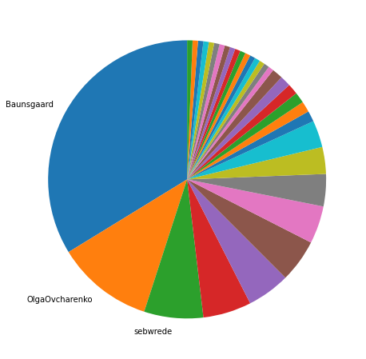
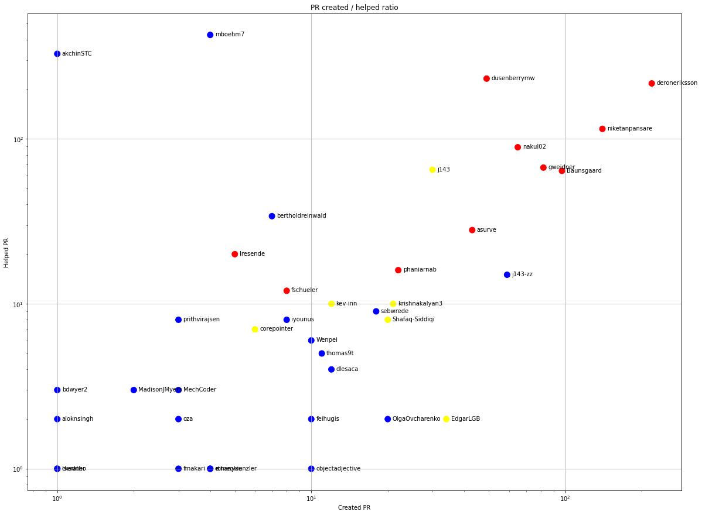
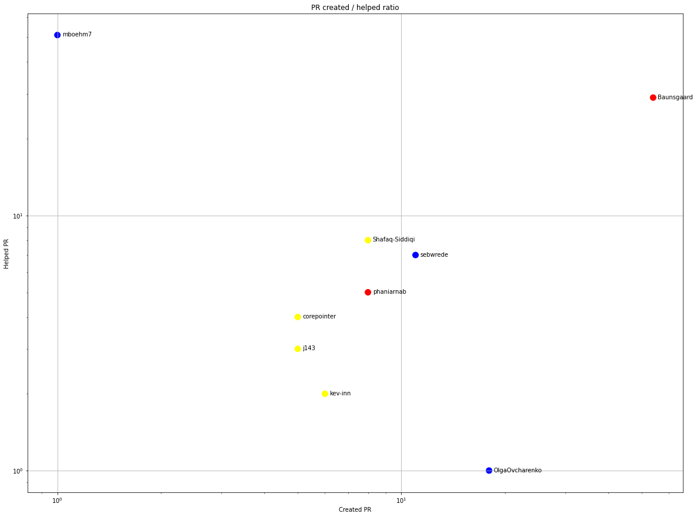
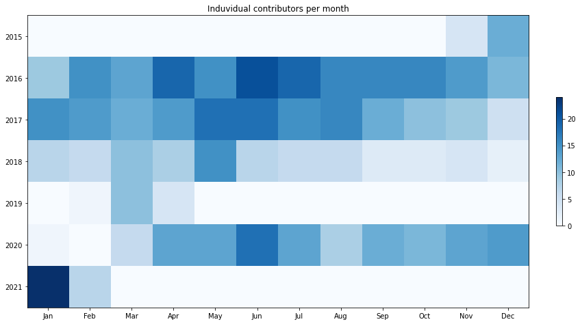
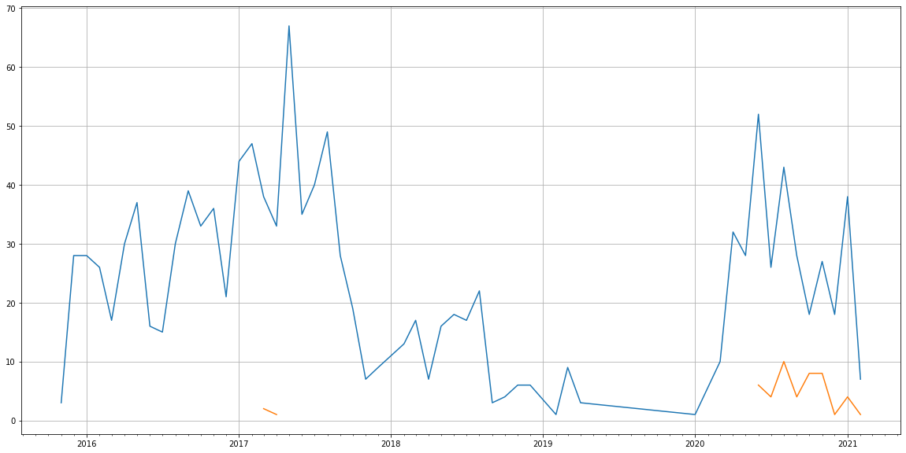
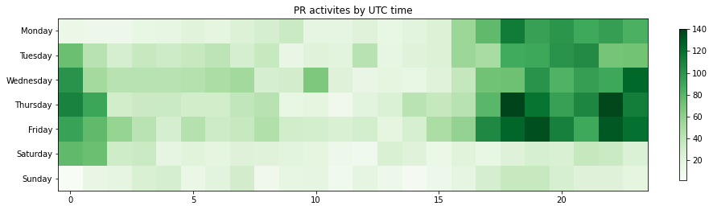

Latest record from the dataset:

<table border="1" class="dataframe">
  <thead>
    <tr style="text-align: right;">
      <th></th>
      <th>org</th>
      <th>repo</th>
      <th>type</th>
      <th>identifier</th>
      <th>subidentifier</th>
      <th>date</th>
      <th>author</th>
      <th>owner</th>
      <th>project</th>
    </tr>
  </thead>
  <tbody>
    <tr>
      <th>731</th>
      <td>apache</td>
      <td>systemds</td>
      <td>PR_CREATED</td>
      <td>1182</td>
      <td>NaN</td>
      <td>2021-02-11 16:24:08+00:00</td>
      <td>ywcb00</td>
      <td>ywcb00</td>
      <td>systemds</td>
    </tr>
  </tbody>
</table>

# Github Contributions per user

<table border="1" class="dataframe">
  <thead>
    <tr style="text-align: right;">
      <th></th>
      <th>contributions</th>
    </tr>
    <tr>
      <th>author</th>
      <th></th>
    </tr>
  </thead>
  <tbody>
    <tr>
      <th>akchinSTC</th>
      <td>835</td>
    </tr>
    <tr>
      <th>mboehm7</th>
      <td>829</td>
    </tr>
    <tr>
      <th>deroneriksson</th>
      <td>467</td>
    </tr>
    <tr>
      <th>dusenberrymw</th>
      <td>463</td>
    </tr>
    <tr>
      <th>niketanpansare</th>
      <td>232</td>
    </tr>
    <tr>
      <th>nakul02</th>
      <td>180</td>
    </tr>
    <tr>
      <th>j143</th>
      <td>155</td>
    </tr>
    <tr>
      <th>Baunsgaard</th>
      <td>148</td>
    </tr>
    <tr>
      <th>gweidner</th>
      <td>104</td>
    </tr>
    <tr>
      <th>bertholdreinwald</th>
      <td>51</td>
    </tr>
  </tbody>
</table>

## Contributors per participations in PRs which are not created by self (helping PRs)

<table border="1" class="dataframe">
  <thead>
    <tr style="text-align: right;">
      <th></th>
      <th>identifier</th>
    </tr>
    <tr>
      <th>author</th>
      <th></th>
    </tr>
  </thead>
  <tbody>
    <tr>
      <th>mboehm7</th>
      <td>427</td>
    </tr>
    <tr>
      <th>akchinSTC</th>
      <td>328</td>
    </tr>
    <tr>
      <th>dusenberrymw</th>
      <td>232</td>
    </tr>
    <tr>
      <th>deroneriksson</th>
      <td>217</td>
    </tr>
    <tr>
      <th>niketanpansare</th>
      <td>115</td>
    </tr>
    <tr>
      <th>nakul02</th>
      <td>89</td>
    </tr>
    <tr>
      <th>gweidner</th>
      <td>67</td>
    </tr>
    <tr>
      <th>j143</th>
      <td>65</td>
    </tr>
    <tr>
      <th>Baunsgaard</th>
      <td>64</td>
    </tr>
    <tr>
      <th>bertholdreinwald</th>
      <td>34</td>
    </tr>
    <tr>
      <th>asurve</th>
      <td>28</td>
    </tr>
    <tr>
      <th>shirisht</th>
      <td>26</td>
    </tr>
    <tr>
      <th>lresende</th>
      <td>20</td>
    </tr>
    <tr>
      <th>phaniarnab</th>
      <td>16</td>
    </tr>
    <tr>
      <th>j143-zz</th>
      <td>15</td>
    </tr>
    <tr>
      <th>frreiss</th>
      <td>13</td>
    </tr>
    <tr>
      <th>fschueler</th>
      <td>12</td>
    </tr>
    <tr>
      <th>krishnakalyan3</th>
      <td>10</td>
    </tr>
    <tr>
      <th>kev-inn</th>
      <td>10</td>
    </tr>
    <tr>
      <th>sebwrede</th>
      <td>9</td>
    </tr>
  </tbody>
</table>

## Contributors per participations in any PRs

<table border="1" class="dataframe">
  <thead>
    <tr style="text-align: right;">
      <th></th>
      <th>identifier</th>
    </tr>
    <tr>
      <th>author</th>
      <th></th>
    </tr>
  </thead>
  <tbody>
    <tr>
      <th>mboehm7</th>
      <td>431</td>
    </tr>
    <tr>
      <th>deroneriksson</th>
      <td>414</td>
    </tr>
    <tr>
      <th>akchinSTC</th>
      <td>329</td>
    </tr>
    <tr>
      <th>dusenberrymw</th>
      <td>281</td>
    </tr>
    <tr>
      <th>niketanpansare</th>
      <td>255</td>
    </tr>
    <tr>
      <th>Baunsgaard</th>
      <td>161</td>
    </tr>
    <tr>
      <th>nakul02</th>
      <td>154</td>
    </tr>
    <tr>
      <th>gweidner</th>
      <td>149</td>
    </tr>
    <tr>
      <th>j143</th>
      <td>95</td>
    </tr>
    <tr>
      <th>j143-zz</th>
      <td>74</td>
    </tr>
    <tr>
      <th>asurve</th>
      <td>71</td>
    </tr>
    <tr>
      <th>bertholdreinwald</th>
      <td>41</td>
    </tr>
    <tr>
      <th>phaniarnab</th>
      <td>38</td>
    </tr>
    <tr>
      <th>EdgarLGB</th>
      <td>36</td>
    </tr>
    <tr>
      <th>krishnakalyan3</th>
      <td>31</td>
    </tr>
    <tr>
      <th>Shafaq-Siddiqi</th>
      <td>28</td>
    </tr>
    <tr>
      <th>sebwrede</th>
      <td>27</td>
    </tr>
    <tr>
      <th>shirisht</th>
      <td>26</td>
    </tr>
    <tr>
      <th>jazares</th>
      <td>24</td>
    </tr>
    <tr>
      <th>lresende</th>
      <td>24</td>
    </tr>
  </tbody>
</table>

# Bus factor (number of contributors responsible for the 50% of the prs) from last half year

## Contributors until the half of the all contributions

<table border="1" class="dataframe">
  <thead>
    <tr style="text-align: right;">
      <th></th>
      <th>author</th>
      <th>identifier</th>
      <th>cs</th>
      <th>ratio</th>
    </tr>
  </thead>
  <tbody>
    <tr>
      <th>0</th>
      <td>Baunsgaard</td>
      <td>54</td>
      <td>54</td>
      <td>33.75</td>
    </tr>
    <tr>
      <th>1</th>
      <td>OlgaOvcharenko</td>
      <td>18</td>
      <td>72</td>
      <td>11.25</td>
    </tr>
  </tbody>
</table>

## Pony number (bus factor)

    3

## Dev power (All the contributions in the ration of the top contributor)

    2.9629629629629632

    

    

## People with created PRs > reviewed/commented PRS

    

    

## Same graph with focusing to the last 6 month

Only contributors with both created pr and helped pr visible

    

    

# Number of individual contributors per month

Number of different Github users who either created PR, commented PR, added review to a PR

Note: only events from apache/hadoop-ozone repository are included. Earlier PRs/comments are not here.

    

    

# Number of PRs closed/created per month

    /usr/lib/python3.9/site-packages/pandas/core/arrays/datetimes.py:1101: UserWarning: Converting to PeriodArray/Index representation will drop timezone information.
      warnings.warn(

    

    

# PR activity heatmap

    

    

