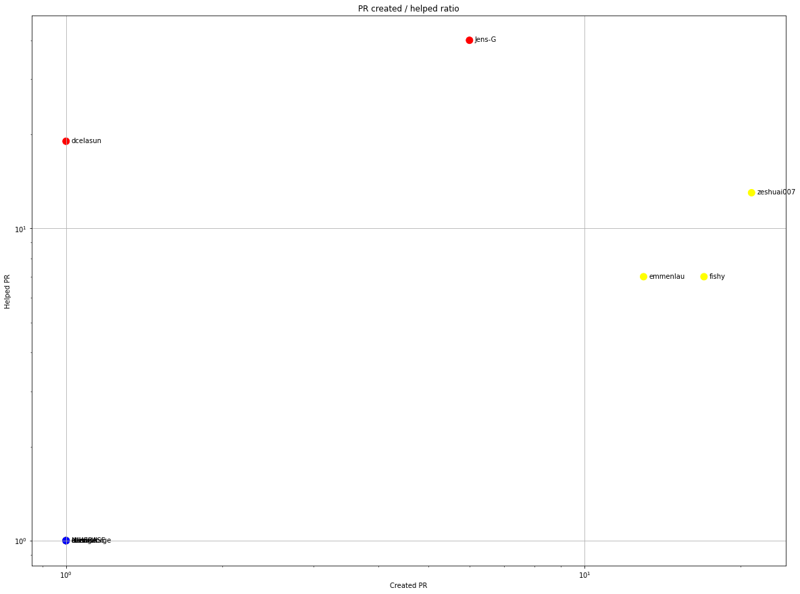

Latest record from the dataset:

<table border="1" class="dataframe">
  <thead>
    <tr style="text-align: right;">
      <th></th>
      <th>org</th>
      <th>repo</th>
      <th>type</th>
      <th>identifier</th>
      <th>subidentifier</th>
      <th>date</th>
      <th>author</th>
      <th>owner</th>
      <th>project</th>
    </tr>
  </thead>
  <tbody>
    <tr>
      <th>7179</th>
      <td>apache</td>
      <td>thrift</td>
      <td>PR_COMMENTED</td>
      <td>2318</td>
      <td>NaN</td>
      <td>2021-02-13 16:12:47+00:00</td>
      <td>kashirin-alex</td>
      <td>kashirin-alex</td>
      <td>thrift</td>
    </tr>
  </tbody>
</table>

# Github Contributions per user

<table border="1" class="dataframe">
  <thead>
    <tr style="text-align: right;">
      <th></th>
      <th>contributions</th>
    </tr>
    <tr>
      <th>author</th>
      <th></th>
    </tr>
  </thead>
  <tbody>
    <tr>
      <th>jeking3</th>
      <td>1707</td>
    </tr>
    <tr>
      <th>Jens-G</th>
      <td>544</td>
    </tr>
    <tr>
      <th>dcelasun</th>
      <td>376</td>
    </tr>
    <tr>
      <th>stale</th>
      <td>229</td>
    </tr>
    <tr>
      <th>nsuke</th>
      <td>178</td>
    </tr>
    <tr>
      <th>jfarrell</th>
      <td>155</td>
    </tr>
    <tr>
      <th>bufferoverflow</th>
      <td>92</td>
    </tr>
    <tr>
      <th>allengeorge</th>
      <td>77</td>
    </tr>
    <tr>
      <th>asfbot</th>
      <td>65</td>
    </tr>
    <tr>
      <th>emmenlau</th>
      <td>62</td>
    </tr>
  </tbody>
</table>

## Contributors per participations in PRs which are not created by self (helping PRs)

<table border="1" class="dataframe">
  <thead>
    <tr style="text-align: right;">
      <th></th>
      <th>identifier</th>
    </tr>
    <tr>
      <th>author</th>
      <th></th>
    </tr>
  </thead>
  <tbody>
    <tr>
      <th>jeking3</th>
      <td>525</td>
    </tr>
    <tr>
      <th>Jens-G</th>
      <td>307</td>
    </tr>
    <tr>
      <th>dcelasun</th>
      <td>149</td>
    </tr>
    <tr>
      <th>jfarrell</th>
      <td>133</td>
    </tr>
    <tr>
      <th>nsuke</th>
      <td>90</td>
    </tr>
    <tr>
      <th>stale</th>
      <td>80</td>
    </tr>
    <tr>
      <th>bufferoverflow</th>
      <td>77</td>
    </tr>
    <tr>
      <th>asfbot</th>
      <td>51</td>
    </tr>
    <tr>
      <th>emmenlau</th>
      <td>27</td>
    </tr>
    <tr>
      <th>allengeorge</th>
      <td>24</td>
    </tr>
    <tr>
      <th>hcorg</th>
      <td>24</td>
    </tr>
    <tr>
      <th>ulidtko</th>
      <td>23</td>
    </tr>
    <tr>
      <th>asfgit</th>
      <td>20</td>
    </tr>
    <tr>
      <th>janosvitok</th>
      <td>19</td>
    </tr>
    <tr>
      <th>zeshuai007</th>
      <td>19</td>
    </tr>
    <tr>
      <th>kainjow</th>
      <td>15</td>
    </tr>
    <tr>
      <th>henrique</th>
      <td>15</td>
    </tr>
    <tr>
      <th>markerickson-wf</th>
      <td>12</td>
    </tr>
    <tr>
      <th>ben-craig</th>
      <td>10</td>
    </tr>
    <tr>
      <th>fishy</th>
      <td>9</td>
    </tr>
  </tbody>
</table>

## Contributors per participations in any PRs

<table border="1" class="dataframe">
  <thead>
    <tr style="text-align: right;">
      <th></th>
      <th>identifier</th>
    </tr>
    <tr>
      <th>author</th>
      <th></th>
    </tr>
  </thead>
  <tbody>
    <tr>
      <th>jeking3</th>
      <td>738</td>
    </tr>
    <tr>
      <th>Jens-G</th>
      <td>482</td>
    </tr>
    <tr>
      <th>nsuke</th>
      <td>314</td>
    </tr>
    <tr>
      <th>dcelasun</th>
      <td>164</td>
    </tr>
    <tr>
      <th>jfarrell</th>
      <td>138</td>
    </tr>
    <tr>
      <th>bufferoverflow</th>
      <td>93</td>
    </tr>
    <tr>
      <th>zeshuai007</th>
      <td>82</td>
    </tr>
    <tr>
      <th>stale</th>
      <td>80</td>
    </tr>
    <tr>
      <th>emmenlau</th>
      <td>79</td>
    </tr>
    <tr>
      <th>fishy</th>
      <td>52</td>
    </tr>
    <tr>
      <th>asfbot</th>
      <td>51</td>
    </tr>
    <tr>
      <th>allengeorge</th>
      <td>45</td>
    </tr>
    <tr>
      <th>hcorg</th>
      <td>37</td>
    </tr>
    <tr>
      <th>belugabehr</th>
      <td>33</td>
    </tr>
    <tr>
      <th>janosvitok</th>
      <td>30</td>
    </tr>
    <tr>
      <th>kainjow</th>
      <td>30</td>
    </tr>
    <tr>
      <th>sekikn</th>
      <td>29</td>
    </tr>
    <tr>
      <th>markerickson-wf</th>
      <td>27</td>
    </tr>
    <tr>
      <th>RobberPhex</th>
      <td>27</td>
    </tr>
    <tr>
      <th>ulidtko</th>
      <td>25</td>
    </tr>
  </tbody>
</table>

# Bus factor (number of contributors responsible for the 50% of the prs) from last half year

## Contributors until the half of the all contributions

<table border="1" class="dataframe">
  <thead>
    <tr style="text-align: right;">
      <th></th>
      <th>author</th>
      <th>identifier</th>
      <th>cs</th>
      <th>ratio</th>
    </tr>
  </thead>
  <tbody>
    <tr>
      <th>0</th>
      <td>zeshuai007</td>
      <td>21</td>
      <td>21</td>
      <td>18.750000</td>
    </tr>
    <tr>
      <th>1</th>
      <td>fishy</td>
      <td>17</td>
      <td>38</td>
      <td>15.178571</td>
    </tr>
    <tr>
      <th>2</th>
      <td>emmenlau</td>
      <td>13</td>
      <td>51</td>
      <td>11.607143</td>
    </tr>
  </tbody>
</table>

## Pony number (bus factor)

    4

## Dev power (All the contributions in the ration of the top contributor)

    5.333333333333332

    

    

## People with created PRs > reviewed/commented PRS

    

    

## Same graph with focusing to the last 6 month

Only contributors with both created pr and helped pr visible

    

    

# Number of individual contributors per month

Number of different Github users who either created PR, commented PR, added review to a PR

Note: only events from apache/hadoop-ozone repository are included. Earlier PRs/comments are not here.

    

    

# Number of PRs closed/created per month

    /usr/lib/python3.9/site-packages/pandas/core/arrays/datetimes.py:1101: UserWarning: Converting to PeriodArray/Index representation will drop timezone information.
      warnings.warn(

    

    

# PR activity heatmap

    

    

