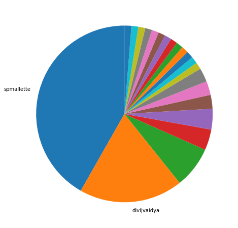
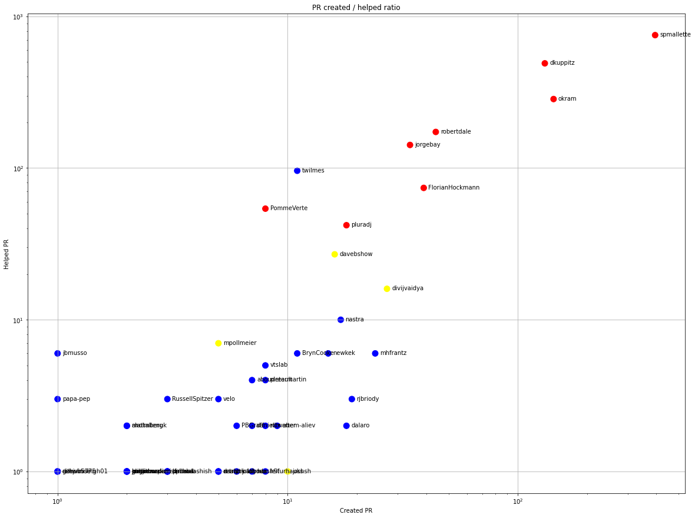
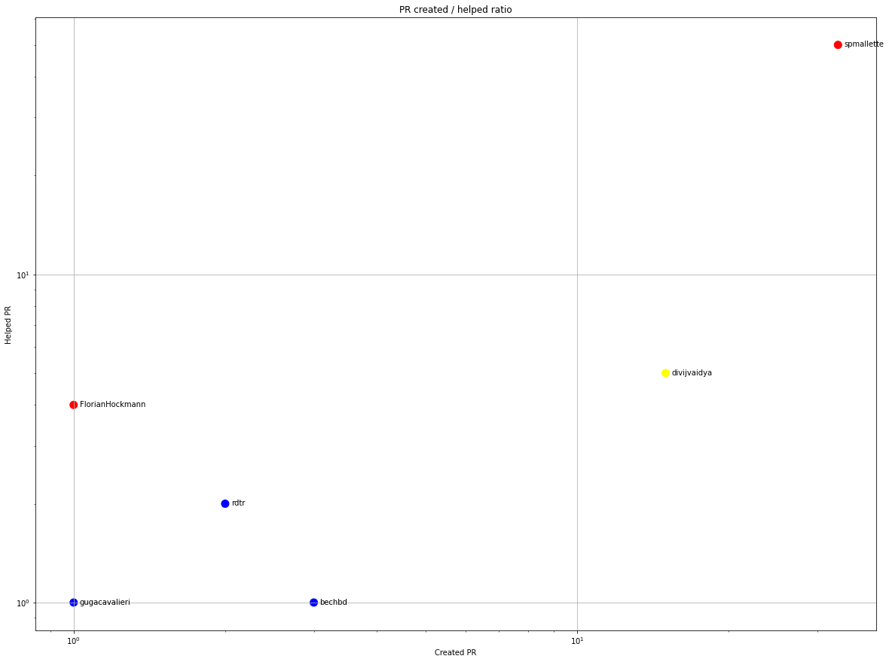
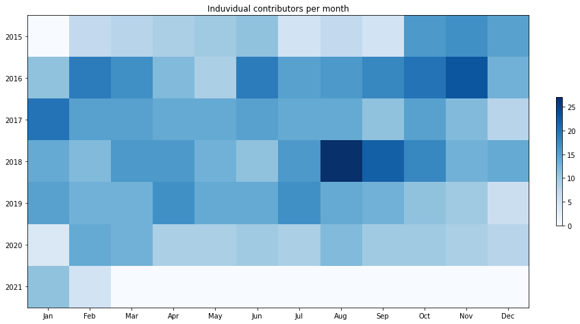
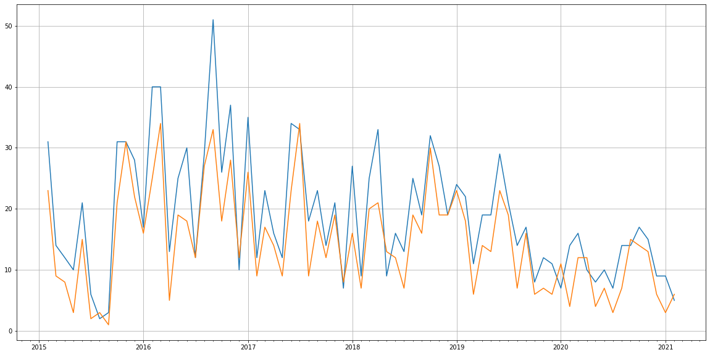
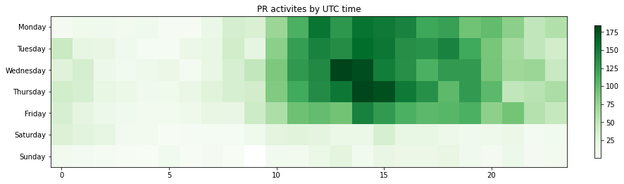

Latest record from the dataset:

<table border="1" class="dataframe">
  <thead>
    <tr style="text-align: right;">
      <th></th>
      <th>org</th>
      <th>repo</th>
      <th>type</th>
      <th>identifier</th>
      <th>subidentifier</th>
      <th>date</th>
      <th>author</th>
      <th>owner</th>
      <th>project</th>
    </tr>
  </thead>
  <tbody>
    <tr>
      <th>2632</th>
      <td>apache</td>
      <td>tinkerpop</td>
      <td>PR_COMMENTED</td>
      <td>1390</td>
      <td>NaN</td>
      <td>2021-02-12 22:15:37+00:00</td>
      <td>spmallette</td>
      <td>sergsalo</td>
      <td>tinkerpop</td>
    </tr>
  </tbody>
</table>

# Github Contributions per user

<table border="1" class="dataframe">
  <thead>
    <tr style="text-align: right;">
      <th></th>
      <th>contributions</th>
    </tr>
    <tr>
      <th>author</th>
      <th></th>
    </tr>
  </thead>
  <tbody>
    <tr>
      <th>spmallette</th>
      <td>2072</td>
    </tr>
    <tr>
      <th>asfgit</th>
      <td>735</td>
    </tr>
    <tr>
      <th>dkuppitz</th>
      <td>654</td>
    </tr>
    <tr>
      <th>okram</th>
      <td>486</td>
    </tr>
    <tr>
      <th>jorgebay</th>
      <td>335</td>
    </tr>
    <tr>
      <th>robertdale</th>
      <td>305</td>
    </tr>
    <tr>
      <th>FlorianHockmann</th>
      <td>197</td>
    </tr>
    <tr>
      <th>twilmes</th>
      <td>108</td>
    </tr>
    <tr>
      <th>pluradj</th>
      <td>89</td>
    </tr>
    <tr>
      <th>PommeVerte</th>
      <td>68</td>
    </tr>
  </tbody>
</table>

## Contributors per participations in PRs which are not created by self (helping PRs)

<table border="1" class="dataframe">
  <thead>
    <tr style="text-align: right;">
      <th></th>
      <th>identifier</th>
    </tr>
    <tr>
      <th>author</th>
      <th></th>
    </tr>
  </thead>
  <tbody>
    <tr>
      <th>spmallette</th>
      <td>752</td>
    </tr>
    <tr>
      <th>asfgit</th>
      <td>735</td>
    </tr>
    <tr>
      <th>dkuppitz</th>
      <td>490</td>
    </tr>
    <tr>
      <th>okram</th>
      <td>285</td>
    </tr>
    <tr>
      <th>robertdale</th>
      <td>173</td>
    </tr>
    <tr>
      <th>jorgebay</th>
      <td>142</td>
    </tr>
    <tr>
      <th>twilmes</th>
      <td>96</td>
    </tr>
    <tr>
      <th>FlorianHockmann</th>
      <td>74</td>
    </tr>
    <tr>
      <th>PommeVerte</th>
      <td>54</td>
    </tr>
    <tr>
      <th>pluradj</th>
      <td>42</td>
    </tr>
    <tr>
      <th>davebshow</th>
      <td>27</td>
    </tr>
    <tr>
      <th>divijvaidya</th>
      <td>16</td>
    </tr>
    <tr>
      <th>nastra</th>
      <td>10</td>
    </tr>
    <tr>
      <th>mpollmeier</th>
      <td>7</td>
    </tr>
    <tr>
      <th>BrynCooke</th>
      <td>6</td>
    </tr>
    <tr>
      <th>mhfrantz</th>
      <td>6</td>
    </tr>
    <tr>
      <th>krlawrence</th>
      <td>6</td>
    </tr>
    <tr>
      <th>jbmusso</th>
      <td>6</td>
    </tr>
    <tr>
      <th>newkek</th>
      <td>6</td>
    </tr>
    <tr>
      <th>vtslab</th>
      <td>5</td>
    </tr>
  </tbody>
</table>

## Contributors per participations in any PRs

<table border="1" class="dataframe">
  <thead>
    <tr style="text-align: right;">
      <th></th>
      <th>identifier</th>
    </tr>
    <tr>
      <th>author</th>
      <th></th>
    </tr>
  </thead>
  <tbody>
    <tr>
      <th>spmallette</th>
      <td>1147</td>
    </tr>
    <tr>
      <th>asfgit</th>
      <td>735</td>
    </tr>
    <tr>
      <th>dkuppitz</th>
      <td>621</td>
    </tr>
    <tr>
      <th>okram</th>
      <td>428</td>
    </tr>
    <tr>
      <th>robertdale</th>
      <td>217</td>
    </tr>
    <tr>
      <th>jorgebay</th>
      <td>176</td>
    </tr>
    <tr>
      <th>FlorianHockmann</th>
      <td>113</td>
    </tr>
    <tr>
      <th>twilmes</th>
      <td>107</td>
    </tr>
    <tr>
      <th>PommeVerte</th>
      <td>62</td>
    </tr>
    <tr>
      <th>pluradj</th>
      <td>60</td>
    </tr>
    <tr>
      <th>davebshow</th>
      <td>43</td>
    </tr>
    <tr>
      <th>divijvaidya</th>
      <td>43</td>
    </tr>
    <tr>
      <th>mhfrantz</th>
      <td>30</td>
    </tr>
    <tr>
      <th>nastra</th>
      <td>27</td>
    </tr>
    <tr>
      <th>rjbriody</th>
      <td>22</td>
    </tr>
    <tr>
      <th>newkek</th>
      <td>21</td>
    </tr>
    <tr>
      <th>dalaro</th>
      <td>20</td>
    </tr>
    <tr>
      <th>BrynCooke</th>
      <td>17</td>
    </tr>
    <tr>
      <th>justinchuch</th>
      <td>16</td>
    </tr>
    <tr>
      <th>vtslab</th>
      <td>13</td>
    </tr>
  </tbody>
</table>

# Bus factor (number of contributors responsible for the 50% of the prs) from last half year

## Contributors until the half of the all contributions

<table border="1" class="dataframe">
  <thead>
    <tr style="text-align: right;">
      <th></th>
      <th>author</th>
      <th>identifier</th>
      <th>cs</th>
      <th>ratio</th>
    </tr>
  </thead>
  <tbody>
    <tr>
      <th>0</th>
      <td>spmallette</td>
      <td>33</td>
      <td>33</td>
      <td>41.772152</td>
    </tr>
  </tbody>
</table>

## Pony number (bus factor)

    2

## Dev power (All the contributions in the ration of the top contributor)

    2.393939393939394

    

    

## People with created PRs > reviewed/commented PRS

    

    

## Same graph with focusing to the last 6 month

Only contributors with both created pr and helped pr visible

    

    

# Number of individual contributors per month

Number of different Github users who either created PR, commented PR, added review to a PR

Note: only events from apache/hadoop-ozone repository are included. Earlier PRs/comments are not here.

    

    

# Number of PRs closed/created per month

    /usr/lib/python3.9/site-packages/pandas/core/arrays/datetimes.py:1101: UserWarning: Converting to PeriodArray/Index representation will drop timezone information.
      warnings.warn(

    

    

# PR activity heatmap

    

    

