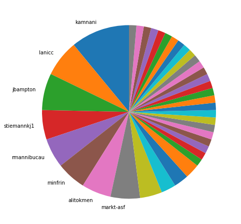
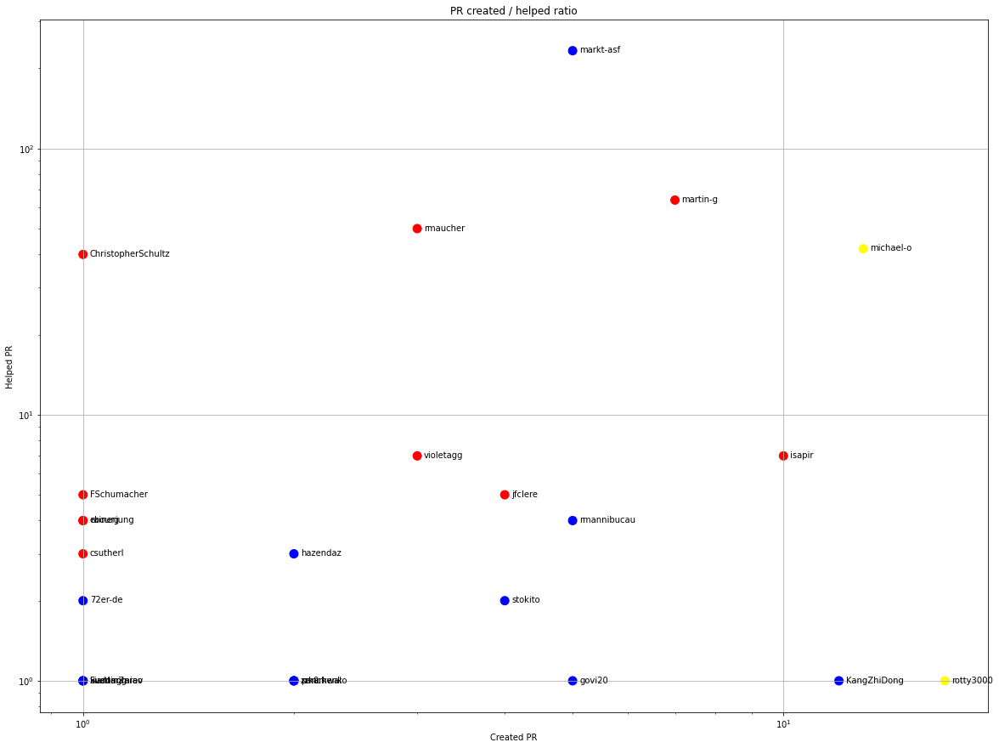
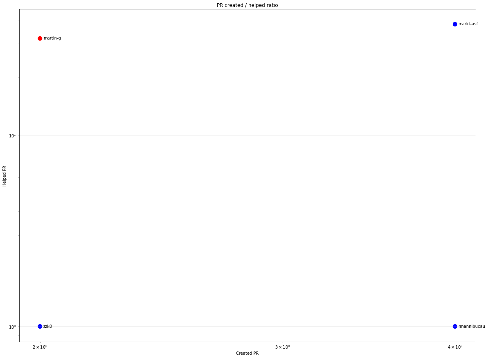
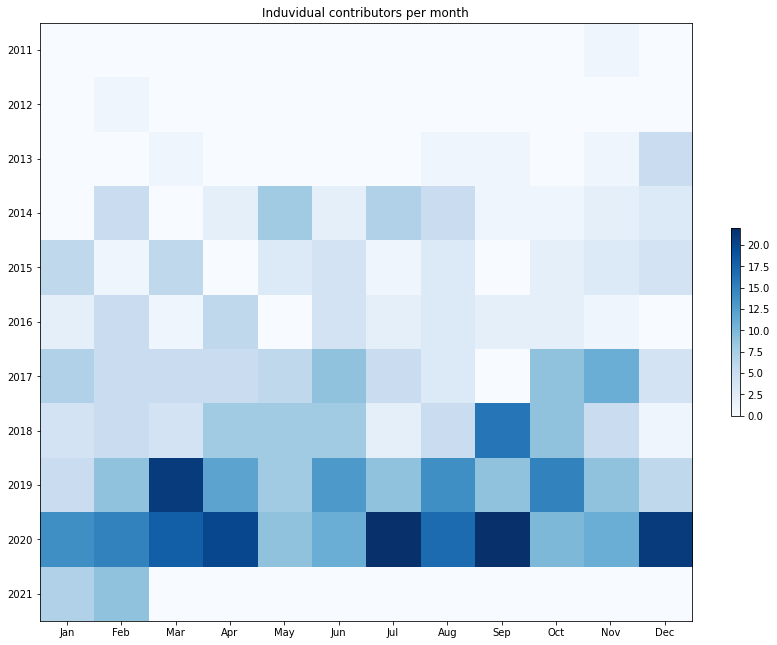
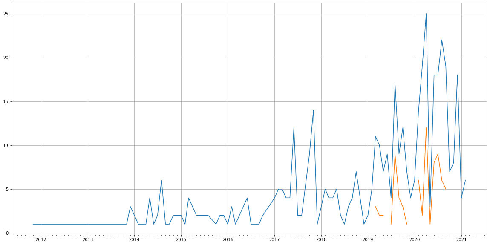
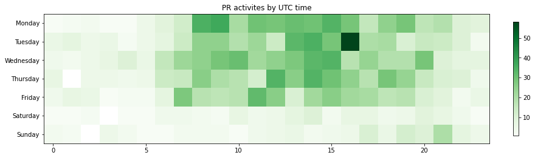

Latest record from the dataset:

<table border="1" class="dataframe">
  <thead>
    <tr style="text-align: right;">
      <th></th>
      <th>org</th>
      <th>repo</th>
      <th>type</th>
      <th>identifier</th>
      <th>subidentifier</th>
      <th>date</th>
      <th>author</th>
      <th>owner</th>
      <th>project</th>
    </tr>
  </thead>
  <tbody>
    <tr>
      <th>1785</th>
      <td>apache</td>
      <td>tomcat</td>
      <td>PR_CREATED</td>
      <td>405</td>
      <td>NaN</td>
      <td>2021-02-12 02:46:27+00:00</td>
      <td>jbampton</td>
      <td>jbampton</td>
      <td>tomcat</td>
    </tr>
  </tbody>
</table>

# Github Contributions per user

<table border="1" class="dataframe">
  <thead>
    <tr style="text-align: right;">
      <th></th>
      <th>contributions</th>
    </tr>
    <tr>
      <th>author</th>
      <th></th>
    </tr>
  </thead>
  <tbody>
    <tr>
      <th>markt-asf</th>
      <td>435</td>
    </tr>
    <tr>
      <th>martin-g</th>
      <td>154</td>
    </tr>
    <tr>
      <th>michael-o</th>
      <td>132</td>
    </tr>
    <tr>
      <th>rmaucher</th>
      <td>93</td>
    </tr>
    <tr>
      <th>ChristopherSchultz</th>
      <td>75</td>
    </tr>
    <tr>
      <th>violetagg</th>
      <td>26</td>
    </tr>
    <tr>
      <th>olamy</th>
      <td>19</td>
    </tr>
    <tr>
      <th>kkolinko</th>
      <td>16</td>
    </tr>
    <tr>
      <th>isapir</th>
      <td>11</td>
    </tr>
    <tr>
      <th>rmannibucau</th>
      <td>11</td>
    </tr>
  </tbody>
</table>

## Contributors per participations in PRs which are not created by self (helping PRs)

<table border="1" class="dataframe">
  <thead>
    <tr style="text-align: right;">
      <th></th>
      <th>identifier</th>
    </tr>
    <tr>
      <th>author</th>
      <th></th>
    </tr>
  </thead>
  <tbody>
    <tr>
      <th>markt-asf</th>
      <td>233</td>
    </tr>
    <tr>
      <th>martin-g</th>
      <td>64</td>
    </tr>
    <tr>
      <th>rmaucher</th>
      <td>50</td>
    </tr>
    <tr>
      <th>michael-o</th>
      <td>42</td>
    </tr>
    <tr>
      <th>ChristopherSchultz</th>
      <td>40</td>
    </tr>
    <tr>
      <th>kkolinko</th>
      <td>13</td>
    </tr>
    <tr>
      <th>olamy</th>
      <td>12</td>
    </tr>
    <tr>
      <th>violetagg</th>
      <td>7</td>
    </tr>
    <tr>
      <th>isapir</th>
      <td>7</td>
    </tr>
    <tr>
      <th>FSchumacher</th>
      <td>5</td>
    </tr>
    <tr>
      <th>jfclere</th>
      <td>5</td>
    </tr>
    <tr>
      <th>asfgit</th>
      <td>5</td>
    </tr>
    <tr>
      <th>rainerjung</th>
      <td>4</td>
    </tr>
    <tr>
      <th>rmannibucau</th>
      <td>4</td>
    </tr>
    <tr>
      <th>ebourg</th>
      <td>4</td>
    </tr>
    <tr>
      <th>asfbot</th>
      <td>4</td>
    </tr>
    <tr>
      <th>csutherl</th>
      <td>3</td>
    </tr>
    <tr>
      <th>hazendaz</th>
      <td>3</td>
    </tr>
    <tr>
      <th>stokito</th>
      <td>2</td>
    </tr>
    <tr>
      <th>gmshake</th>
      <td>2</td>
    </tr>
  </tbody>
</table>

## Contributors per participations in any PRs

<table border="1" class="dataframe">
  <thead>
    <tr style="text-align: right;">
      <th></th>
      <th>identifier</th>
    </tr>
    <tr>
      <th>author</th>
      <th></th>
    </tr>
  </thead>
  <tbody>
    <tr>
      <th>markt-asf</th>
      <td>238</td>
    </tr>
    <tr>
      <th>martin-g</th>
      <td>71</td>
    </tr>
    <tr>
      <th>michael-o</th>
      <td>55</td>
    </tr>
    <tr>
      <th>rmaucher</th>
      <td>53</td>
    </tr>
    <tr>
      <th>ChristopherSchultz</th>
      <td>41</td>
    </tr>
    <tr>
      <th>rotty3000</th>
      <td>18</td>
    </tr>
    <tr>
      <th>isapir</th>
      <td>17</td>
    </tr>
    <tr>
      <th>KangZhiDong</th>
      <td>13</td>
    </tr>
    <tr>
      <th>kkolinko</th>
      <td>13</td>
    </tr>
    <tr>
      <th>olamy</th>
      <td>12</td>
    </tr>
    <tr>
      <th>lkirchev</th>
      <td>11</td>
    </tr>
    <tr>
      <th>violetagg</th>
      <td>10</td>
    </tr>
    <tr>
      <th>jbampton</th>
      <td>10</td>
    </tr>
    <tr>
      <th>kamnani</th>
      <td>9</td>
    </tr>
    <tr>
      <th>larsgrefer</th>
      <td>9</td>
    </tr>
    <tr>
      <th>jfclere</th>
      <td>9</td>
    </tr>
    <tr>
      <th>rmannibucau</th>
      <td>9</td>
    </tr>
    <tr>
      <th>govi20</th>
      <td>6</td>
    </tr>
    <tr>
      <th>katya-stoycheva</th>
      <td>6</td>
    </tr>
    <tr>
      <th>zhanhb</th>
      <td>6</td>
    </tr>
  </tbody>
</table>

# Bus factor (number of contributors responsible for the 50% of the prs) from last half year

## Contributors until the half of the all contributions

<table border="1" class="dataframe">
  <thead>
    <tr style="text-align: right;">
      <th></th>
      <th>author</th>
      <th>identifier</th>
      <th>cs</th>
      <th>ratio</th>
    </tr>
  </thead>
  <tbody>
    <tr>
      <th>0</th>
      <td>kamnani</td>
      <td>8</td>
      <td>8</td>
      <td>10.958904</td>
    </tr>
    <tr>
      <th>1</th>
      <td>lanicc</td>
      <td>5</td>
      <td>13</td>
      <td>6.849315</td>
    </tr>
    <tr>
      <th>2</th>
      <td>jbampton</td>
      <td>5</td>
      <td>18</td>
      <td>6.849315</td>
    </tr>
    <tr>
      <th>3</th>
      <td>stiemannkj1</td>
      <td>4</td>
      <td>22</td>
      <td>5.479452</td>
    </tr>
    <tr>
      <th>4</th>
      <td>rmannibucau</td>
      <td>4</td>
      <td>26</td>
      <td>5.479452</td>
    </tr>
    <tr>
      <th>5</th>
      <td>minfrin</td>
      <td>4</td>
      <td>30</td>
      <td>5.479452</td>
    </tr>
    <tr>
      <th>6</th>
      <td>alitokmen</td>
      <td>4</td>
      <td>34</td>
      <td>5.479452</td>
    </tr>
  </tbody>
</table>

## Pony number (bus factor)

    8

## Dev power (All the contributions in the ration of the top contributor)

    9.125

    

    

## People with created PRs > reviewed/commented PRS

    

    

## Same graph with focusing to the last 6 month

Only contributors with both created pr and helped pr visible

    

    

# Number of individual contributors per month

Number of different Github users who either created PR, commented PR, added review to a PR

Note: only events from apache/hadoop-ozone repository are included. Earlier PRs/comments are not here.

    

    

# Number of PRs closed/created per month

    /usr/lib/python3.9/site-packages/pandas/core/arrays/datetimes.py:1101: UserWarning: Converting to PeriodArray/Index representation will drop timezone information.
      warnings.warn(

    

    

# PR activity heatmap

    

    

