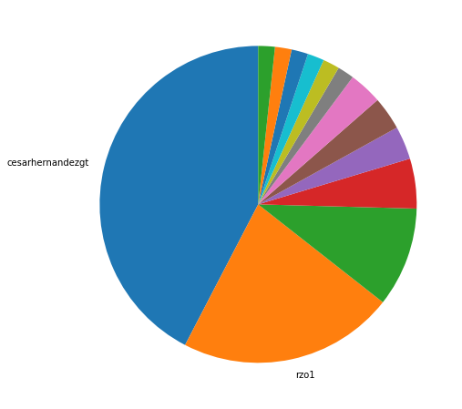
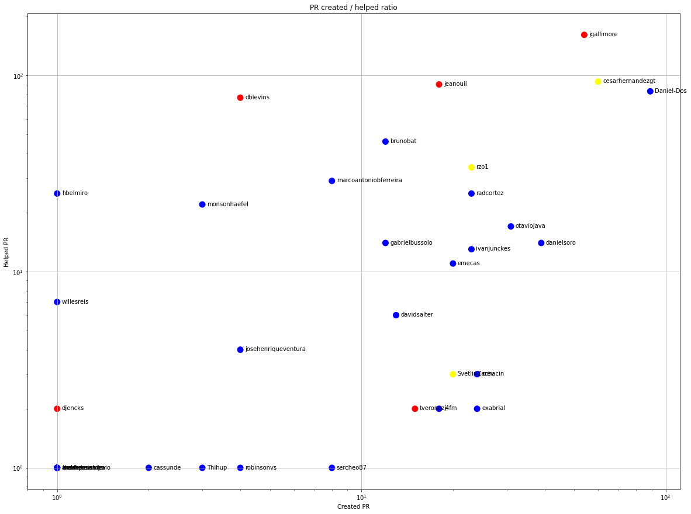
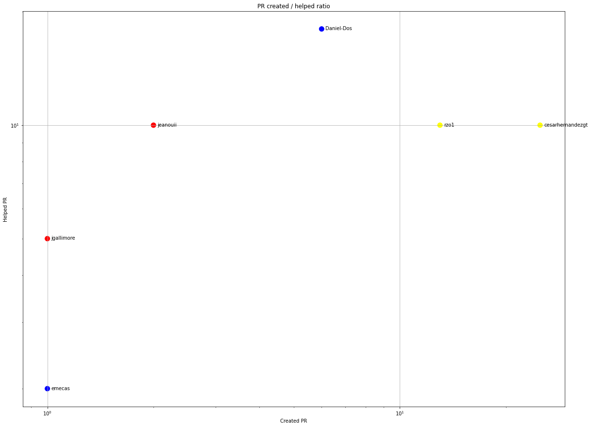
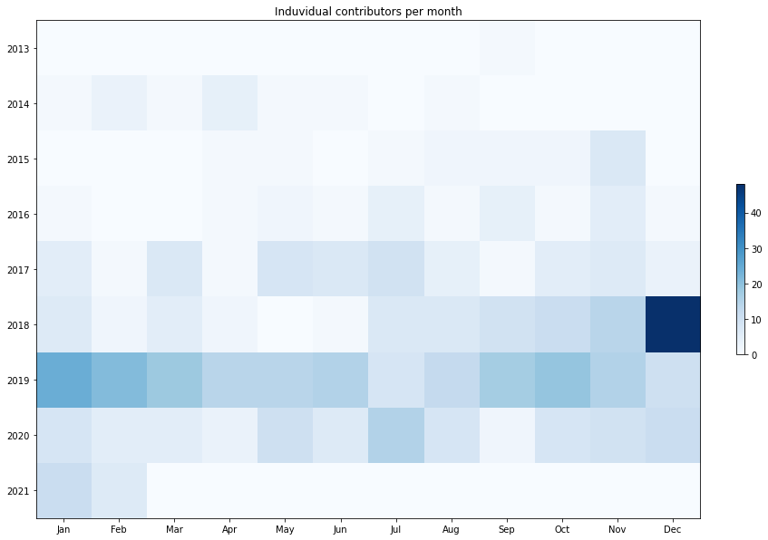
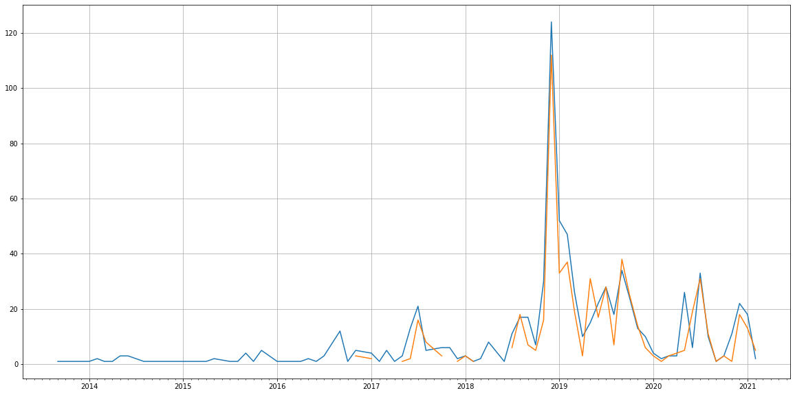
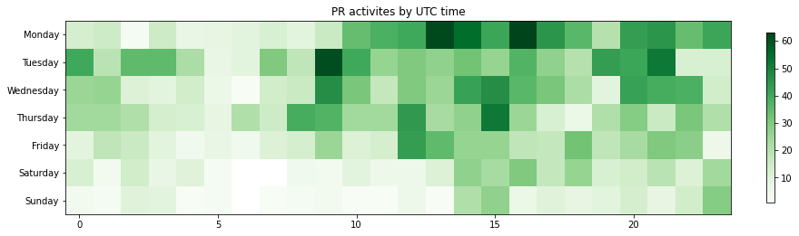

Latest record from the dataset:

<table border="1" class="dataframe">
  <thead>
    <tr style="text-align: right;">
      <th></th>
      <th>org</th>
      <th>repo</th>
      <th>type</th>
      <th>identifier</th>
      <th>subidentifier</th>
      <th>date</th>
      <th>author</th>
      <th>owner</th>
      <th>project</th>
    </tr>
  </thead>
  <tbody>
    <tr>
      <th>3278</th>
      <td>apache</td>
      <td>tomee</td>
      <td>PR_MERGED</td>
      <td>762</td>
      <td>NaN</td>
      <td>2021-02-12 12:21:28+00:00</td>
      <td>rzo1</td>
      <td>rzo1</td>
      <td>tomee</td>
    </tr>
  </tbody>
</table>

# Github Contributions per user

<table border="1" class="dataframe">
  <thead>
    <tr style="text-align: right;">
      <th></th>
      <th>contributions</th>
    </tr>
    <tr>
      <th>author</th>
      <th></th>
    </tr>
  </thead>
  <tbody>
    <tr>
      <th>asf-ci</th>
      <td>328</td>
    </tr>
    <tr>
      <th>asfgit</th>
      <td>239</td>
    </tr>
    <tr>
      <th>jgallimore</th>
      <td>208</td>
    </tr>
    <tr>
      <th>Daniel-Dos</th>
      <td>153</td>
    </tr>
    <tr>
      <th>cesarhernandezgt</th>
      <td>152</td>
    </tr>
    <tr>
      <th>jeanouii</th>
      <td>115</td>
    </tr>
    <tr>
      <th>dblevins</th>
      <td>98</td>
    </tr>
    <tr>
      <th>rmannibucau</th>
      <td>86</td>
    </tr>
    <tr>
      <th>brunobat</th>
      <td>86</td>
    </tr>
    <tr>
      <th>AndyGee</th>
      <td>66</td>
    </tr>
  </tbody>
</table>

## Contributors per participations in PRs which are not created by self (helping PRs)

<table border="1" class="dataframe">
  <thead>
    <tr style="text-align: right;">
      <th></th>
      <th>identifier</th>
    </tr>
    <tr>
      <th>author</th>
      <th></th>
    </tr>
  </thead>
  <tbody>
    <tr>
      <th>asfgit</th>
      <td>239</td>
    </tr>
    <tr>
      <th>jgallimore</th>
      <td>161</td>
    </tr>
    <tr>
      <th>cesarhernandezgt</th>
      <td>93</td>
    </tr>
    <tr>
      <th>asf-ci</th>
      <td>91</td>
    </tr>
    <tr>
      <th>jeanouii</th>
      <td>90</td>
    </tr>
    <tr>
      <th>Daniel-Dos</th>
      <td>83</td>
    </tr>
    <tr>
      <th>dblevins</th>
      <td>77</td>
    </tr>
    <tr>
      <th>brunobat</th>
      <td>46</td>
    </tr>
    <tr>
      <th>rmannibucau</th>
      <td>44</td>
    </tr>
    <tr>
      <th>rzo1</th>
      <td>34</td>
    </tr>
    <tr>
      <th>marcoantoniobferreira</th>
      <td>29</td>
    </tr>
    <tr>
      <th>hbelmiro</th>
      <td>25</td>
    </tr>
    <tr>
      <th>radcortez</th>
      <td>25</td>
    </tr>
    <tr>
      <th>monsonhaefel</th>
      <td>22</td>
    </tr>
    <tr>
      <th>otaviojava</th>
      <td>17</td>
    </tr>
    <tr>
      <th>AndyGee</th>
      <td>15</td>
    </tr>
    <tr>
      <th>danielsoro</th>
      <td>14</td>
    </tr>
    <tr>
      <th>gabrielbussolo</th>
      <td>14</td>
    </tr>
    <tr>
      <th>ivanjunckes</th>
      <td>13</td>
    </tr>
    <tr>
      <th>emecas</th>
      <td>11</td>
    </tr>
  </tbody>
</table>

## Contributors per participations in any PRs

<table border="1" class="dataframe">
  <thead>
    <tr style="text-align: right;">
      <th></th>
      <th>identifier</th>
    </tr>
    <tr>
      <th>author</th>
      <th></th>
    </tr>
  </thead>
  <tbody>
    <tr>
      <th>asfgit</th>
      <td>239</td>
    </tr>
    <tr>
      <th>jgallimore</th>
      <td>213</td>
    </tr>
    <tr>
      <th>Daniel-Dos</th>
      <td>172</td>
    </tr>
    <tr>
      <th>cesarhernandezgt</th>
      <td>151</td>
    </tr>
    <tr>
      <th>jeanouii</th>
      <td>108</td>
    </tr>
    <tr>
      <th>asf-ci</th>
      <td>91</td>
    </tr>
    <tr>
      <th>dblevins</th>
      <td>81</td>
    </tr>
    <tr>
      <th>brunobat</th>
      <td>58</td>
    </tr>
    <tr>
      <th>rzo1</th>
      <td>57</td>
    </tr>
    <tr>
      <th>danielsoro</th>
      <td>53</td>
    </tr>
    <tr>
      <th>radcortez</th>
      <td>48</td>
    </tr>
    <tr>
      <th>otaviojava</th>
      <td>48</td>
    </tr>
    <tr>
      <th>rmannibucau</th>
      <td>44</td>
    </tr>
    <tr>
      <th>marcoantoniobferreira</th>
      <td>37</td>
    </tr>
    <tr>
      <th>ivanjunckes</th>
      <td>36</td>
    </tr>
    <tr>
      <th>emecas</th>
      <td>31</td>
    </tr>
    <tr>
      <th>cchacin</th>
      <td>27</td>
    </tr>
    <tr>
      <th>gabrielbussolo</th>
      <td>26</td>
    </tr>
    <tr>
      <th>exabrial</th>
      <td>26</td>
    </tr>
    <tr>
      <th>doychin</th>
      <td>26</td>
    </tr>
  </tbody>
</table>

# Bus factor (number of contributors responsible for the 50% of the prs) from last half year

## Contributors until the half of the all contributions

<table border="1" class="dataframe">
  <thead>
    <tr style="text-align: right;">
      <th></th>
      <th>author</th>
      <th>identifier</th>
      <th>cs</th>
      <th>ratio</th>
    </tr>
  </thead>
  <tbody>
    <tr>
      <th>0</th>
      <td>cesarhernandezgt</td>
      <td>25</td>
      <td>25</td>
      <td>42.372881</td>
    </tr>
  </tbody>
</table>

## Pony number (bus factor)

    2

## Dev power (All the contributions in the ration of the top contributor)

    2.3600000000000003

    

    

## People with created PRs > reviewed/commented PRS

    

    

## Same graph with focusing to the last 6 month

Only contributors with both created pr and helped pr visible

    

    

# Number of individual contributors per month

Number of different Github users who either created PR, commented PR, added review to a PR

Note: only events from apache/hadoop-ozone repository are included. Earlier PRs/comments are not here.

    

    

# Number of PRs closed/created per month

    /usr/lib/python3.9/site-packages/pandas/core/arrays/datetimes.py:1101: UserWarning: Converting to PeriodArray/Index representation will drop timezone information.
      warnings.warn(

    

    

# PR activity heatmap

    

    

