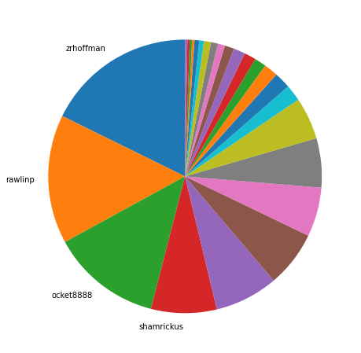
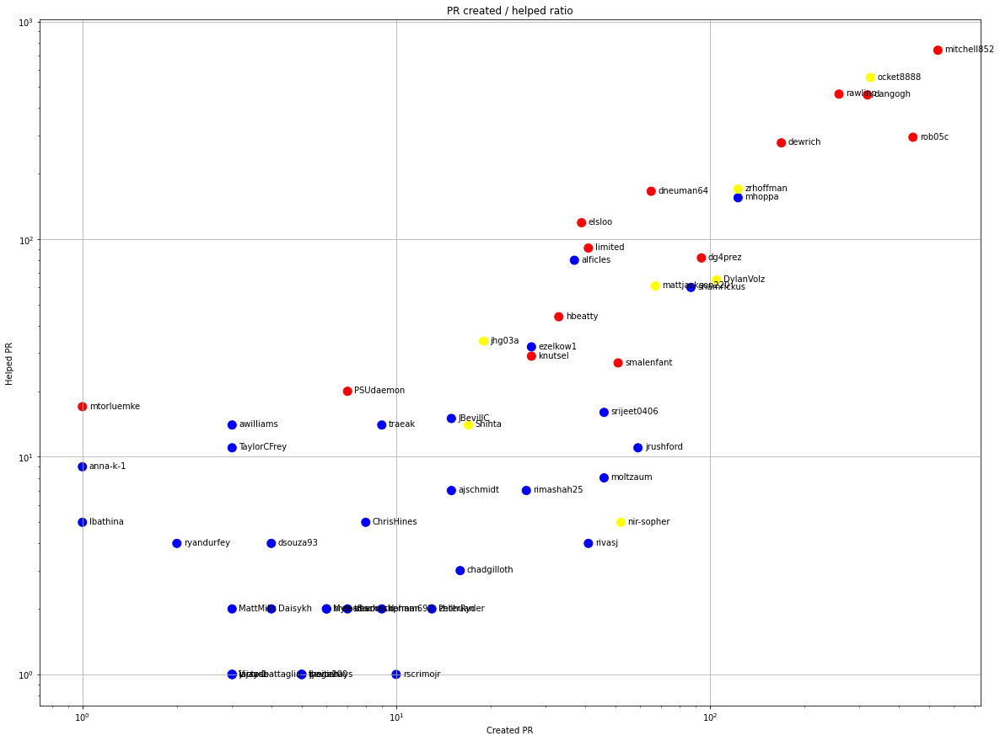
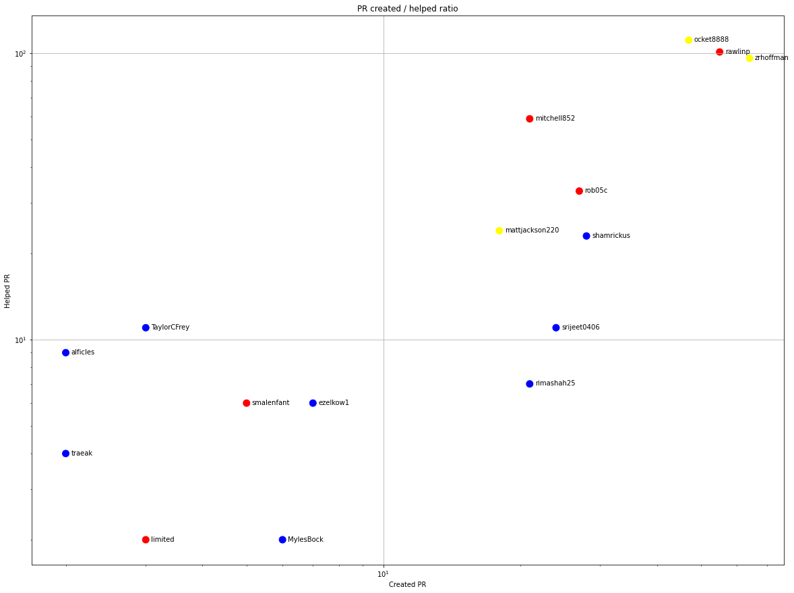
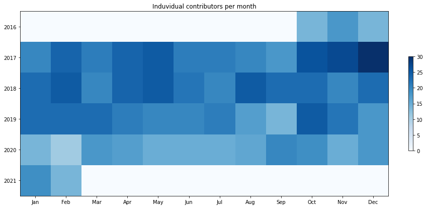
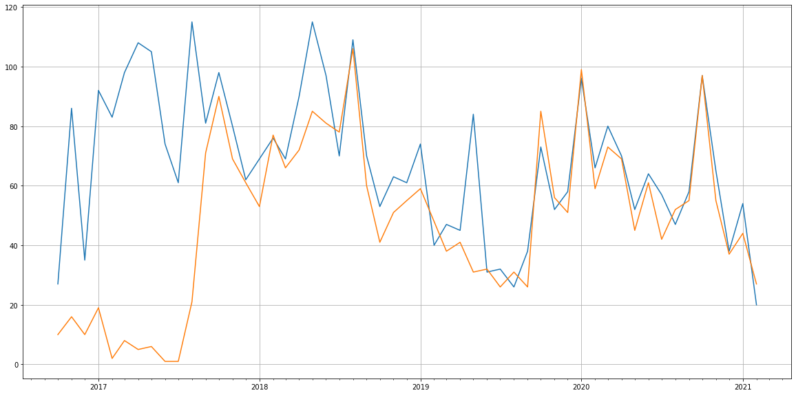
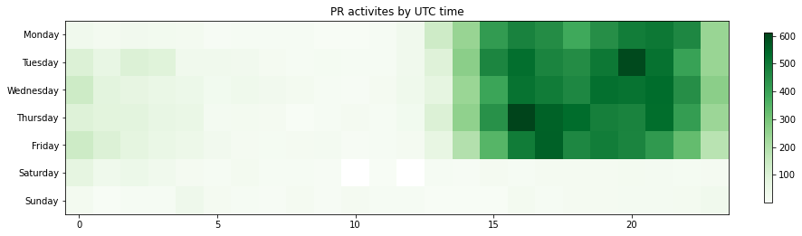

Latest record from the dataset:

<table border="1" class="dataframe">
  <thead>
    <tr style="text-align: right;">
      <th></th>
      <th>org</th>
      <th>repo</th>
      <th>type</th>
      <th>identifier</th>
      <th>subidentifier</th>
      <th>date</th>
      <th>author</th>
      <th>owner</th>
      <th>project</th>
    </tr>
  </thead>
  <tbody>
    <tr>
      <th>21976</th>
      <td>apache</td>
      <td>trafficcontrol</td>
      <td>PR_COMMENTED</td>
      <td>5209</td>
      <td>NaN</td>
      <td>2021-02-12 22:59:20+00:00</td>
      <td>ocket8888</td>
      <td>ocket8888</td>
      <td>trafficcontrol</td>
    </tr>
  </tbody>
</table>

# Github Contributions per user

<table border="1" class="dataframe">
  <thead>
    <tr style="text-align: right;">
      <th></th>
      <th>contributions</th>
    </tr>
    <tr>
      <th>author</th>
      <th></th>
    </tr>
  </thead>
  <tbody>
    <tr>
      <th>asfgit</th>
      <td>5413</td>
    </tr>
    <tr>
      <th>mitchell852</th>
      <td>1851</td>
    </tr>
    <tr>
      <th>ocket8888</th>
      <td>1824</td>
    </tr>
    <tr>
      <th>rawlinp</th>
      <td>1348</td>
    </tr>
    <tr>
      <th>dangogh</th>
      <td>884</td>
    </tr>
    <tr>
      <th>asf-ci</th>
      <td>846</td>
    </tr>
    <tr>
      <th>rob05c</th>
      <td>785</td>
    </tr>
    <tr>
      <th>zrhoffman</th>
      <td>493</td>
    </tr>
    <tr>
      <th>mhoppa</th>
      <td>415</td>
    </tr>
    <tr>
      <th>dewrich</th>
      <td>414</td>
    </tr>
  </tbody>
</table>

## Contributors per participations in PRs which are not created by self (helping PRs)

<table border="1" class="dataframe">
  <thead>
    <tr style="text-align: right;">
      <th></th>
      <th>identifier</th>
    </tr>
    <tr>
      <th>author</th>
      <th></th>
    </tr>
  </thead>
  <tbody>
    <tr>
      <th>asfgit</th>
      <td>1742</td>
    </tr>
    <tr>
      <th>mitchell852</th>
      <td>738</td>
    </tr>
    <tr>
      <th>ocket8888</th>
      <td>553</td>
    </tr>
    <tr>
      <th>rawlinp</th>
      <td>464</td>
    </tr>
    <tr>
      <th>dangogh</th>
      <td>460</td>
    </tr>
    <tr>
      <th>rob05c</th>
      <td>294</td>
    </tr>
    <tr>
      <th>dewrich</th>
      <td>277</td>
    </tr>
    <tr>
      <th>asf-ci</th>
      <td>266</td>
    </tr>
    <tr>
      <th>zrhoffman</th>
      <td>170</td>
    </tr>
    <tr>
      <th>dneuman64</th>
      <td>166</td>
    </tr>
    <tr>
      <th>mhoppa</th>
      <td>155</td>
    </tr>
    <tr>
      <th>elsloo</th>
      <td>119</td>
    </tr>
    <tr>
      <th>limited</th>
      <td>91</td>
    </tr>
    <tr>
      <th>dg4prez</th>
      <td>82</td>
    </tr>
    <tr>
      <th>alficles</th>
      <td>80</td>
    </tr>
    <tr>
      <th>DylanVolz</th>
      <td>65</td>
    </tr>
    <tr>
      <th>mattjackson220</th>
      <td>61</td>
    </tr>
    <tr>
      <th>shamrickus</th>
      <td>60</td>
    </tr>
    <tr>
      <th>hbeatty</th>
      <td>44</td>
    </tr>
    <tr>
      <th>jhg03a</th>
      <td>34</td>
    </tr>
  </tbody>
</table>

## Contributors per participations in any PRs

<table border="1" class="dataframe">
  <thead>
    <tr style="text-align: right;">
      <th></th>
      <th>identifier</th>
    </tr>
    <tr>
      <th>author</th>
      <th></th>
    </tr>
  </thead>
  <tbody>
    <tr>
      <th>asfgit</th>
      <td>1742</td>
    </tr>
    <tr>
      <th>mitchell852</th>
      <td>1271</td>
    </tr>
    <tr>
      <th>ocket8888</th>
      <td>878</td>
    </tr>
    <tr>
      <th>dangogh</th>
      <td>778</td>
    </tr>
    <tr>
      <th>rob05c</th>
      <td>738</td>
    </tr>
    <tr>
      <th>rawlinp</th>
      <td>722</td>
    </tr>
    <tr>
      <th>dewrich</th>
      <td>446</td>
    </tr>
    <tr>
      <th>zrhoffman</th>
      <td>293</td>
    </tr>
    <tr>
      <th>mhoppa</th>
      <td>278</td>
    </tr>
    <tr>
      <th>asf-ci</th>
      <td>266</td>
    </tr>
    <tr>
      <th>dneuman64</th>
      <td>231</td>
    </tr>
    <tr>
      <th>dg4prez</th>
      <td>176</td>
    </tr>
    <tr>
      <th>DylanVolz</th>
      <td>170</td>
    </tr>
    <tr>
      <th>elsloo</th>
      <td>158</td>
    </tr>
    <tr>
      <th>shamrickus</th>
      <td>147</td>
    </tr>
    <tr>
      <th>limited</th>
      <td>132</td>
    </tr>
    <tr>
      <th>mattjackson220</th>
      <td>128</td>
    </tr>
    <tr>
      <th>alficles</th>
      <td>117</td>
    </tr>
    <tr>
      <th>smalenfant</th>
      <td>78</td>
    </tr>
    <tr>
      <th>hbeatty</th>
      <td>77</td>
    </tr>
  </tbody>
</table>

# Bus factor (number of contributors responsible for the 50% of the prs) from last half year

## Contributors until the half of the all contributions

<table border="1" class="dataframe">
  <thead>
    <tr style="text-align: right;">
      <th></th>
      <th>author</th>
      <th>identifier</th>
      <th>cs</th>
      <th>ratio</th>
    </tr>
  </thead>
  <tbody>
    <tr>
      <th>0</th>
      <td>zrhoffman</td>
      <td>64</td>
      <td>64</td>
      <td>17.728532</td>
    </tr>
    <tr>
      <th>1</th>
      <td>rawlinp</td>
      <td>55</td>
      <td>119</td>
      <td>15.235457</td>
    </tr>
    <tr>
      <th>2</th>
      <td>ocket8888</td>
      <td>47</td>
      <td>166</td>
      <td>13.019391</td>
    </tr>
  </tbody>
</table>

## Pony number (bus factor)

    4

## Dev power (All the contributions in the ration of the top contributor)

    5.640625

    

    

## People with created PRs > reviewed/commented PRS

    

    

## Same graph with focusing to the last 6 month

Only contributors with both created pr and helped pr visible

    

    

# Number of individual contributors per month

Number of different Github users who either created PR, commented PR, added review to a PR

Note: only events from apache/hadoop-ozone repository are included. Earlier PRs/comments are not here.

    

    

# Number of PRs closed/created per month

    /usr/lib/python3.9/site-packages/pandas/core/arrays/datetimes.py:1101: UserWarning: Converting to PeriodArray/Index representation will drop timezone information.
      warnings.warn(

    

    

# PR activity heatmap

    

    

