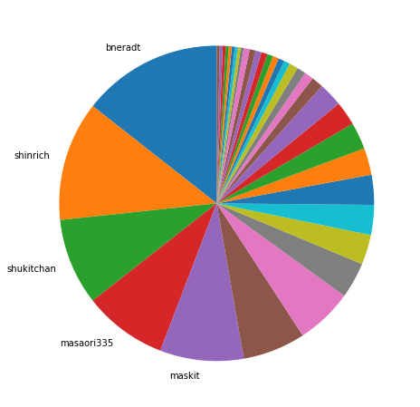
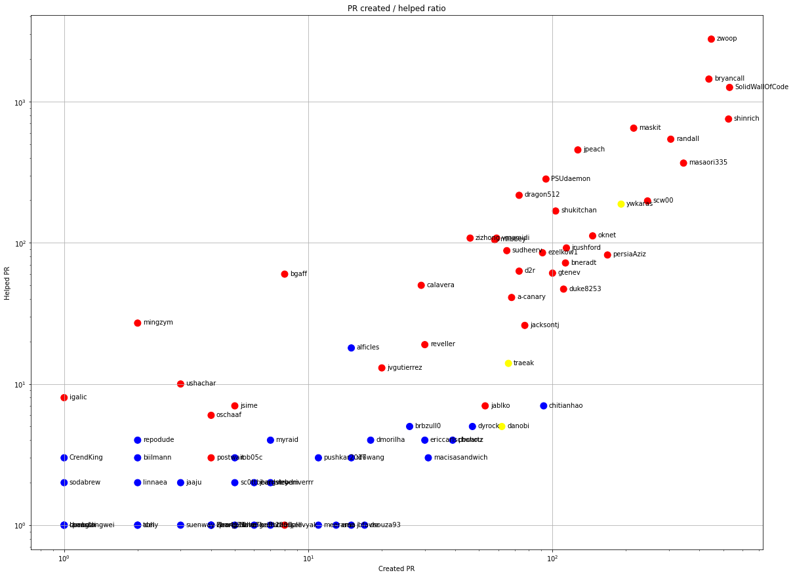
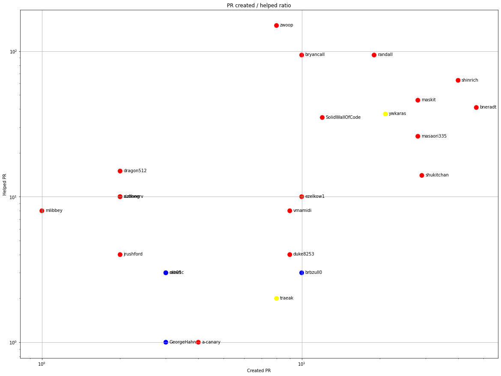
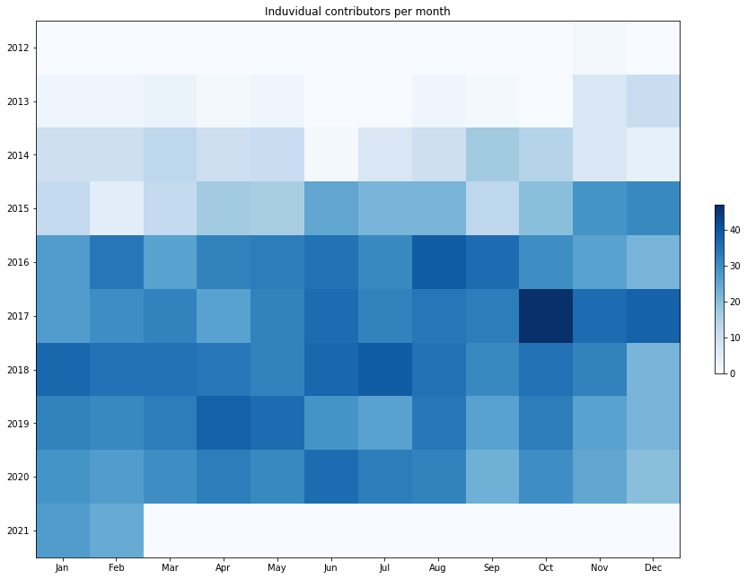
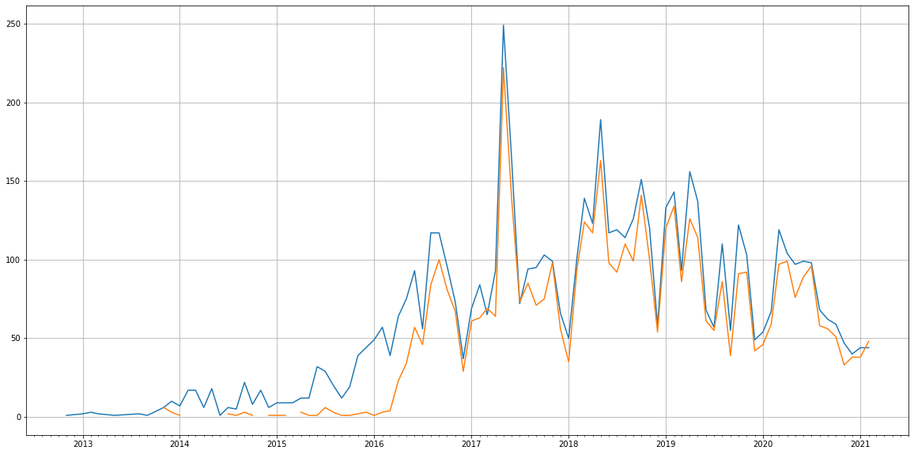
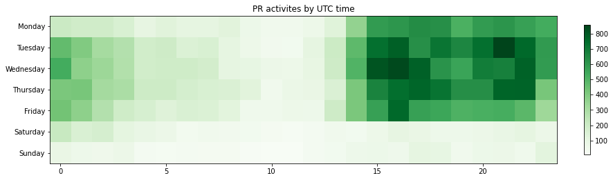

Latest record from the dataset:

<table border="1" class="dataframe">
  <thead>
    <tr style="text-align: right;">
      <th></th>
      <th>org</th>
      <th>repo</th>
      <th>type</th>
      <th>identifier</th>
      <th>subidentifier</th>
      <th>date</th>
      <th>author</th>
      <th>owner</th>
      <th>project</th>
    </tr>
  </thead>
  <tbody>
    <tr>
      <th>44705</th>
      <td>apache</td>
      <td>trafficserver</td>
      <td>PR_REVIEW_APPROVED</td>
      <td>7522</td>
      <td>NaN</td>
      <td>2021-02-14 00:47:07+00:00</td>
      <td>ezelkow1</td>
      <td>zwoop</td>
      <td>trafficserver</td>
    </tr>
  </tbody>
</table>

# Github Contributions per user

<table border="1" class="dataframe">
  <thead>
    <tr style="text-align: right;">
      <th></th>
      <th>contributions</th>
    </tr>
    <tr>
      <th>author</th>
      <th></th>
    </tr>
  </thead>
  <tbody>
    <tr>
      <th>atsci</th>
      <td>6710</td>
    </tr>
    <tr>
      <th>zwoop</th>
      <td>5289</td>
    </tr>
    <tr>
      <th>SolidWallOfCode</th>
      <td>2997</td>
    </tr>
    <tr>
      <th>bryancall</th>
      <td>2647</td>
    </tr>
    <tr>
      <th>maskit</th>
      <td>1829</td>
    </tr>
    <tr>
      <th>shinrich</th>
      <td>1282</td>
    </tr>
    <tr>
      <th>jpeach</th>
      <td>835</td>
    </tr>
    <tr>
      <th>masaori335</th>
      <td>802</td>
    </tr>
    <tr>
      <th>randall</th>
      <td>791</td>
    </tr>
    <tr>
      <th>dragon512</th>
      <td>580</td>
    </tr>
  </tbody>
</table>

## Contributors per participations in PRs which are not created by self (helping PRs)

<table border="1" class="dataframe">
  <thead>
    <tr style="text-align: right;">
      <th></th>
      <th>identifier</th>
    </tr>
    <tr>
      <th>author</th>
      <th></th>
    </tr>
  </thead>
  <tbody>
    <tr>
      <th>zwoop</th>
      <td>2772</td>
    </tr>
    <tr>
      <th>bryancall</th>
      <td>1445</td>
    </tr>
    <tr>
      <th>SolidWallOfCode</th>
      <td>1261</td>
    </tr>
    <tr>
      <th>atsci</th>
      <td>929</td>
    </tr>
    <tr>
      <th>shinrich</th>
      <td>753</td>
    </tr>
    <tr>
      <th>maskit</th>
      <td>649</td>
    </tr>
    <tr>
      <th>randall</th>
      <td>542</td>
    </tr>
    <tr>
      <th>jpeach</th>
      <td>455</td>
    </tr>
    <tr>
      <th>masaori335</th>
      <td>367</td>
    </tr>
    <tr>
      <th>PSUdaemon</th>
      <td>283</td>
    </tr>
    <tr>
      <th>dragon512</th>
      <td>217</td>
    </tr>
    <tr>
      <th>scw00</th>
      <td>198</td>
    </tr>
    <tr>
      <th>ywkaras</th>
      <td>188</td>
    </tr>
    <tr>
      <th>shukitchan</th>
      <td>168</td>
    </tr>
    <tr>
      <th>oknet</th>
      <td>112</td>
    </tr>
    <tr>
      <th>vmamidi</th>
      <td>108</td>
    </tr>
    <tr>
      <th>zizhong</th>
      <td>108</td>
    </tr>
    <tr>
      <th>mlibbey</th>
      <td>105</td>
    </tr>
    <tr>
      <th>jrushford</th>
      <td>92</td>
    </tr>
    <tr>
      <th>sudheerv</th>
      <td>88</td>
    </tr>
  </tbody>
</table>

## Contributors per participations in any PRs

<table border="1" class="dataframe">
  <thead>
    <tr style="text-align: right;">
      <th></th>
      <th>identifier</th>
    </tr>
    <tr>
      <th>author</th>
      <th></th>
    </tr>
  </thead>
  <tbody>
    <tr>
      <th>zwoop</th>
      <td>3219</td>
    </tr>
    <tr>
      <th>bryancall</th>
      <td>1882</td>
    </tr>
    <tr>
      <th>SolidWallOfCode</th>
      <td>1792</td>
    </tr>
    <tr>
      <th>shinrich</th>
      <td>1279</td>
    </tr>
    <tr>
      <th>atsci</th>
      <td>929</td>
    </tr>
    <tr>
      <th>maskit</th>
      <td>864</td>
    </tr>
    <tr>
      <th>randall</th>
      <td>847</td>
    </tr>
    <tr>
      <th>masaori335</th>
      <td>711</td>
    </tr>
    <tr>
      <th>jpeach</th>
      <td>582</td>
    </tr>
    <tr>
      <th>scw00</th>
      <td>443</td>
    </tr>
    <tr>
      <th>ywkaras</th>
      <td>379</td>
    </tr>
    <tr>
      <th>PSUdaemon</th>
      <td>377</td>
    </tr>
    <tr>
      <th>dragon512</th>
      <td>290</td>
    </tr>
    <tr>
      <th>shukitchan</th>
      <td>267</td>
    </tr>
    <tr>
      <th>oknet</th>
      <td>258</td>
    </tr>
    <tr>
      <th>persiaAziz</th>
      <td>250</td>
    </tr>
    <tr>
      <th>jrushford</th>
      <td>206</td>
    </tr>
    <tr>
      <th>bneradt</th>
      <td>185</td>
    </tr>
    <tr>
      <th>ezelkow1</th>
      <td>176</td>
    </tr>
    <tr>
      <th>vmamidi</th>
      <td>167</td>
    </tr>
  </tbody>
</table>

# Bus factor (number of contributors responsible for the 50% of the prs) from last half year

## Contributors until the half of the all contributions

<table border="1" class="dataframe">
  <thead>
    <tr style="text-align: right;">
      <th></th>
      <th>author</th>
      <th>identifier</th>
      <th>cs</th>
      <th>ratio</th>
    </tr>
  </thead>
  <tbody>
    <tr>
      <th>0</th>
      <td>bneradt</td>
      <td>47</td>
      <td>47</td>
      <td>14.417178</td>
    </tr>
    <tr>
      <th>1</th>
      <td>shinrich</td>
      <td>40</td>
      <td>87</td>
      <td>12.269939</td>
    </tr>
    <tr>
      <th>2</th>
      <td>shukitchan</td>
      <td>29</td>
      <td>116</td>
      <td>8.895706</td>
    </tr>
    <tr>
      <th>3</th>
      <td>masaori335</td>
      <td>28</td>
      <td>144</td>
      <td>8.588957</td>
    </tr>
  </tbody>
</table>

## Pony number (bus factor)

    5

## Dev power (All the contributions in the ration of the top contributor)

    6.936170212765956

    

    

## People with created PRs > reviewed/commented PRS

    

    

## Same graph with focusing to the last 6 month

Only contributors with both created pr and helped pr visible

    

    

# Number of individual contributors per month

Number of different Github users who either created PR, commented PR, added review to a PR

Note: only events from apache/hadoop-ozone repository are included. Earlier PRs/comments are not here.

    

    

# Number of PRs closed/created per month

    /usr/lib/python3.9/site-packages/pandas/core/arrays/datetimes.py:1101: UserWarning: Converting to PeriodArray/Index representation will drop timezone information.
      warnings.warn(

    

    

# PR activity heatmap

    

    

