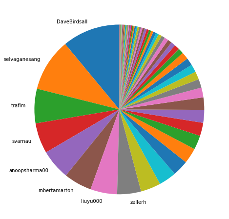
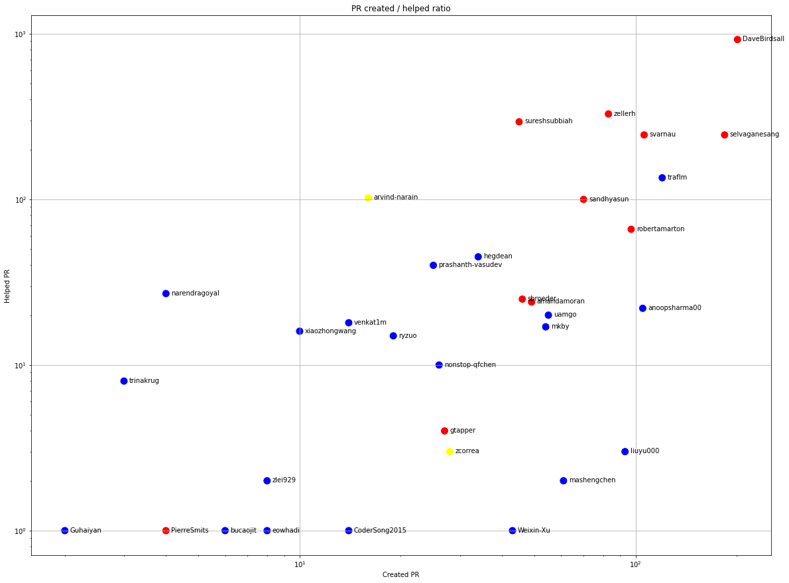
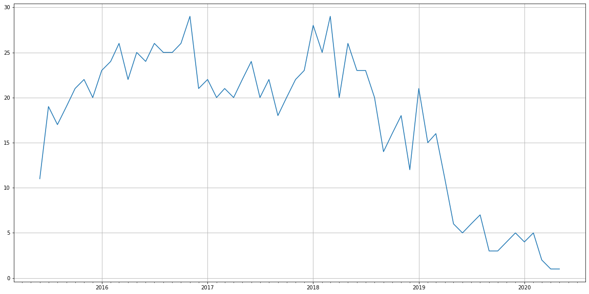
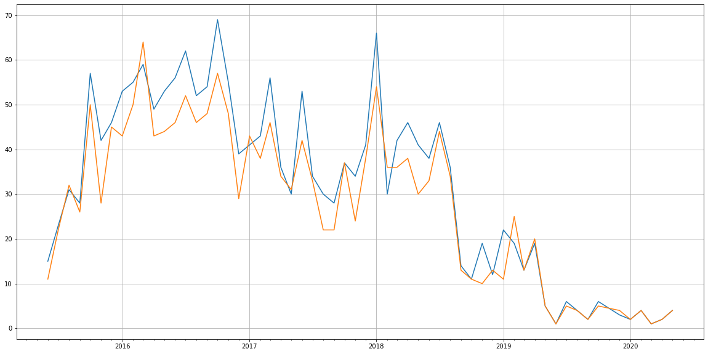
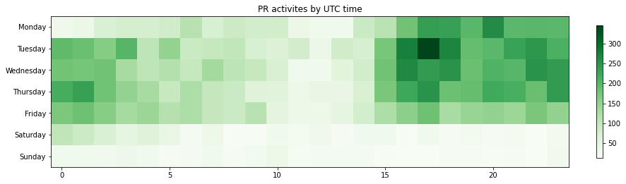

Latest record from the dataset:

<table border="1" class="dataframe">
  <thead>
    <tr style="text-align: right;">
      <th></th>
      <th>org</th>
      <th>repo</th>
      <th>type</th>
      <th>identifier</th>
      <th>subidentifier</th>
      <th>date</th>
      <th>author</th>
      <th>owner</th>
      <th>project</th>
    </tr>
  </thead>
  <tbody>
    <tr>
      <th>9667</th>
      <td>apache</td>
      <td>trafodion</td>
      <td>PR_MERGED</td>
      <td>1878</td>
      <td>NaN</td>
      <td>2020-05-18 01:00:49+00:00</td>
      <td>selvaganesang</td>
      <td>selvaganesang</td>
      <td>trafodion</td>
    </tr>
  </tbody>
</table>

# Github Contributions per user

<table border="1" class="dataframe">
  <thead>
    <tr style="text-align: right;">
      <th></th>
      <th>contributions</th>
    </tr>
    <tr>
      <th>author</th>
      <th></th>
    </tr>
  </thead>
  <tbody>
    <tr>
      <th>Traf-Jenkins</th>
      <td>7460</td>
    </tr>
    <tr>
      <th>asfgit</th>
      <td>1521</td>
    </tr>
    <tr>
      <th>DaveBirdsall</th>
      <td>1435</td>
    </tr>
    <tr>
      <th>zellerh</th>
      <td>527</td>
    </tr>
    <tr>
      <th>selvaganesang</th>
      <td>461</td>
    </tr>
    <tr>
      <th>sureshsubbiah</th>
      <td>373</td>
    </tr>
    <tr>
      <th>svarnau</th>
      <td>368</td>
    </tr>
    <tr>
      <th>traflm</th>
      <td>212</td>
    </tr>
    <tr>
      <th>sandhyasun</th>
      <td>178</td>
    </tr>
    <tr>
      <th>arvind-narain</th>
      <td>159</td>
    </tr>
  </tbody>
</table>

## Contributors per participations in PRs which are not created by self (helping PRs)

<table border="1" class="dataframe">
  <thead>
    <tr style="text-align: right;">
      <th></th>
      <th>identifier</th>
    </tr>
    <tr>
      <th>author</th>
      <th></th>
    </tr>
  </thead>
  <tbody>
    <tr>
      <th>Traf-Jenkins</th>
      <td>1849</td>
    </tr>
    <tr>
      <th>asfgit</th>
      <td>1558</td>
    </tr>
    <tr>
      <th>DaveBirdsall</th>
      <td>923</td>
    </tr>
    <tr>
      <th>zellerh</th>
      <td>328</td>
    </tr>
    <tr>
      <th>sureshsubbiah</th>
      <td>294</td>
    </tr>
    <tr>
      <th>svarnau</th>
      <td>245</td>
    </tr>
    <tr>
      <th>selvaganesang</th>
      <td>245</td>
    </tr>
    <tr>
      <th>traflm</th>
      <td>135</td>
    </tr>
    <tr>
      <th>arvind-narain</th>
      <td>102</td>
    </tr>
    <tr>
      <th>sandhyasun</th>
      <td>100</td>
    </tr>
    <tr>
      <th>robertamarton</th>
      <td>66</td>
    </tr>
    <tr>
      <th>hegdean</th>
      <td>45</td>
    </tr>
    <tr>
      <th>prashanth-vasudev</th>
      <td>40</td>
    </tr>
    <tr>
      <th>narendragoyal</th>
      <td>27</td>
    </tr>
    <tr>
      <th>shangshengtung</th>
      <td>26</td>
    </tr>
    <tr>
      <th>sbroeder</th>
      <td>25</td>
    </tr>
    <tr>
      <th>amandamoran</th>
      <td>24</td>
    </tr>
    <tr>
      <th>anoopsharma00</th>
      <td>22</td>
    </tr>
    <tr>
      <th>uamgo</th>
      <td>20</td>
    </tr>
    <tr>
      <th>venkat1m</th>
      <td>18</td>
    </tr>
  </tbody>
</table>

## Contributors per participations in any PRs

<table border="1" class="dataframe">
  <thead>
    <tr style="text-align: right;">
      <th></th>
      <th>identifier</th>
    </tr>
    <tr>
      <th>author</th>
      <th></th>
    </tr>
  </thead>
  <tbody>
    <tr>
      <th>Traf-Jenkins</th>
      <td>1849</td>
    </tr>
    <tr>
      <th>asfgit</th>
      <td>1558</td>
    </tr>
    <tr>
      <th>DaveBirdsall</th>
      <td>1124</td>
    </tr>
    <tr>
      <th>selvaganesang</th>
      <td>429</td>
    </tr>
    <tr>
      <th>zellerh</th>
      <td>411</td>
    </tr>
    <tr>
      <th>svarnau</th>
      <td>351</td>
    </tr>
    <tr>
      <th>sureshsubbiah</th>
      <td>339</td>
    </tr>
    <tr>
      <th>traflm</th>
      <td>255</td>
    </tr>
    <tr>
      <th>sandhyasun</th>
      <td>170</td>
    </tr>
    <tr>
      <th>robertamarton</th>
      <td>163</td>
    </tr>
    <tr>
      <th>anoopsharma00</th>
      <td>127</td>
    </tr>
    <tr>
      <th>arvind-narain</th>
      <td>118</td>
    </tr>
    <tr>
      <th>liuyu000</th>
      <td>96</td>
    </tr>
    <tr>
      <th>hegdean</th>
      <td>79</td>
    </tr>
    <tr>
      <th>uamgo</th>
      <td>75</td>
    </tr>
    <tr>
      <th>amandamoran</th>
      <td>73</td>
    </tr>
    <tr>
      <th>mkby</th>
      <td>71</td>
    </tr>
    <tr>
      <th>sbroeder</th>
      <td>71</td>
    </tr>
    <tr>
      <th>prashanth-vasudev</th>
      <td>65</td>
    </tr>
    <tr>
      <th>mashengchen</th>
      <td>63</td>
    </tr>
  </tbody>
</table>

# Bus factor (number of contributors responsible for the 50% of the prs)

## Contributors until the half of the all contributions

<table border="1" class="dataframe">
  <thead>
    <tr style="text-align: right;">
      <th></th>
      <th>author</th>
      <th>identifier</th>
      <th>cs</th>
      <th>ratio</th>
    </tr>
  </thead>
  <tbody>
    <tr>
      <th>0</th>
      <td>DaveBirdsall</td>
      <td>201</td>
      <td>201</td>
      <td>11.001642</td>
    </tr>
    <tr>
      <th>1</th>
      <td>selvaganesang</td>
      <td>184</td>
      <td>385</td>
      <td>10.071155</td>
    </tr>
    <tr>
      <th>2</th>
      <td>traflm</td>
      <td>120</td>
      <td>505</td>
      <td>6.568144</td>
    </tr>
    <tr>
      <th>3</th>
      <td>svarnau</td>
      <td>106</td>
      <td>611</td>
      <td>5.801861</td>
    </tr>
    <tr>
      <th>4</th>
      <td>anoopsharma00</td>
      <td>105</td>
      <td>716</td>
      <td>5.747126</td>
    </tr>
    <tr>
      <th>5</th>
      <td>robertamarton</td>
      <td>97</td>
      <td>813</td>
      <td>5.309250</td>
    </tr>
    <tr>
      <th>6</th>
      <td>liuyu000</td>
      <td>93</td>
      <td>906</td>
      <td>5.090312</td>
    </tr>
  </tbody>
</table>

## Pony number (bus factor)

    8

## Dev power (All the contributions in the ration of the top contributor)

    9.08955223880597

    

    

## People with created PRs > reviewed/commented PRS

    

    

## Same graph with focusing to the last 6 month

Only contributors with both created pr and helped pr visible

    

    

# Number of individual contributors per month

Number of different Github users who either created PR, commented PR, added review to a PR

Note: only events from apache/hadoop-ozone repository are included. Earlier PRs/comments are not here.

    /usr/lib/python3.9/site-packages/pandas/core/arrays/datetimes.py:1101: UserWarning: Converting to PeriodArray/Index representation will drop timezone information.
      warnings.warn(

<table border="1" class="dataframe">
  <thead>
    <tr style="text-align: right;">
      <th></th>
      <th>date</th>
      <th>author</th>
    </tr>
  </thead>
  <tbody>
    <tr>
      <th>47</th>
      <td>2019-05</td>
      <td>6</td>
    </tr>
    <tr>
      <th>48</th>
      <td>2019-06</td>
      <td>5</td>
    </tr>
    <tr>
      <th>49</th>
      <td>2019-07</td>
      <td>6</td>
    </tr>
    <tr>
      <th>50</th>
      <td>2019-08</td>
      <td>7</td>
    </tr>
    <tr>
      <th>51</th>
      <td>2019-09</td>
      <td>3</td>
    </tr>
    <tr>
      <th>52</th>
      <td>2019-10</td>
      <td>3</td>
    </tr>
    <tr>
      <th>53</th>
      <td>2019-12</td>
      <td>5</td>
    </tr>
    <tr>
      <th>54</th>
      <td>2020-01</td>
      <td>4</td>
    </tr>
    <tr>
      <th>55</th>
      <td>2020-02</td>
      <td>5</td>
    </tr>
    <tr>
      <th>56</th>
      <td>2020-03</td>
      <td>2</td>
    </tr>
    <tr>
      <th>57</th>
      <td>2020-04</td>
      <td>1</td>
    </tr>
    <tr>
      <th>58</th>
      <td>2020-05</td>
      <td>1</td>
    </tr>
  </tbody>
</table>

    

    

# Number of PRs closed/created per month

    /usr/lib/python3.9/site-packages/pandas/core/arrays/datetimes.py:1101: UserWarning: Converting to PeriodArray/Index representation will drop timezone information.
      warnings.warn(

    

    

## Monthly comments

    /usr/lib/python3.9/site-packages/pandas/core/arrays/datetimes.py:1101: UserWarning: Converting to PeriodArray/Index representation will drop timezone information.
      warnings.warn(

<table border="1" class="dataframe">
  <thead>
    <tr style="text-align: right;">
      <th></th>
      <th>identifier</th>
    </tr>
    <tr>
      <th>date</th>
      <th></th>
    </tr>
  </thead>
  <tbody>
    <tr>
      <th>2015-06</th>
      <td>64</td>
    </tr>
    <tr>
      <th>2015-07</th>
      <td>151</td>
    </tr>
    <tr>
      <th>2015-08</th>
      <td>156</td>
    </tr>
    <tr>
      <th>2015-09</th>
      <td>156</td>
    </tr>
    <tr>
      <th>2015-10</th>
      <td>406</td>
    </tr>
    <tr>
      <th>2015-11</th>
      <td>315</td>
    </tr>
    <tr>
      <th>2015-12</th>
      <td>385</td>
    </tr>
    <tr>
      <th>2016-01</th>
      <td>570</td>
    </tr>
    <tr>
      <th>2016-02</th>
      <td>321</td>
    </tr>
    <tr>
      <th>2016-03</th>
      <td>464</td>
    </tr>
    <tr>
      <th>2016-04</th>
      <td>336</td>
    </tr>
    <tr>
      <th>2016-05</th>
      <td>331</td>
    </tr>
    <tr>
      <th>2016-06</th>
      <td>367</td>
    </tr>
    <tr>
      <th>2016-07</th>
      <td>600</td>
    </tr>
    <tr>
      <th>2016-08</th>
      <td>432</td>
    </tr>
    <tr>
      <th>2016-09</th>
      <td>322</td>
    </tr>
    <tr>
      <th>2016-10</th>
      <td>327</td>
    </tr>
    <tr>
      <th>2016-11</th>
      <td>412</td>
    </tr>
    <tr>
      <th>2016-12</th>
      <td>247</td>
    </tr>
    <tr>
      <th>2017-01</th>
      <td>233</td>
    </tr>
    <tr>
      <th>2017-02</th>
      <td>221</td>
    </tr>
    <tr>
      <th>2017-03</th>
      <td>303</td>
    </tr>
    <tr>
      <th>2017-04</th>
      <td>200</td>
    </tr>
    <tr>
      <th>2017-05</th>
      <td>240</td>
    </tr>
    <tr>
      <th>2017-06</th>
      <td>240</td>
    </tr>
    <tr>
      <th>2017-07</th>
      <td>199</td>
    </tr>
    <tr>
      <th>2017-08</th>
      <td>212</td>
    </tr>
    <tr>
      <th>2017-09</th>
      <td>210</td>
    </tr>
    <tr>
      <th>2017-10</th>
      <td>237</td>
    </tr>
    <tr>
      <th>2017-11</th>
      <td>196</td>
    </tr>
    <tr>
      <th>2017-12</th>
      <td>274</td>
    </tr>
    <tr>
      <th>2018-01</th>
      <td>362</td>
    </tr>
    <tr>
      <th>2018-02</th>
      <td>213</td>
    </tr>
    <tr>
      <th>2018-03</th>
      <td>238</td>
    </tr>
    <tr>
      <th>2018-04</th>
      <td>220</td>
    </tr>
    <tr>
      <th>2018-05</th>
      <td>339</td>
    </tr>
    <tr>
      <th>2018-06</th>
      <td>255</td>
    </tr>
    <tr>
      <th>2018-07</th>
      <td>307</td>
    </tr>
    <tr>
      <th>2018-08</th>
      <td>218</td>
    </tr>
    <tr>
      <th>2018-09</th>
      <td>74</td>
    </tr>
    <tr>
      <th>2018-10</th>
      <td>54</td>
    </tr>
    <tr>
      <th>2018-11</th>
      <td>86</td>
    </tr>
    <tr>
      <th>2018-12</th>
      <td>96</td>
    </tr>
    <tr>
      <th>2019-01</th>
      <td>155</td>
    </tr>
    <tr>
      <th>2019-02</th>
      <td>67</td>
    </tr>
    <tr>
      <th>2019-03</th>
      <td>68</td>
    </tr>
    <tr>
      <th>2019-04</th>
      <td>61</td>
    </tr>
    <tr>
      <th>2019-05</th>
      <td>88</td>
    </tr>
    <tr>
      <th>2019-06</th>
      <td>7</td>
    </tr>
    <tr>
      <th>2019-07</th>
      <td>18</td>
    </tr>
    <tr>
      <th>2019-08</th>
      <td>38</td>
    </tr>
    <tr>
      <th>2019-09</th>
      <td>9</td>
    </tr>
    <tr>
      <th>2019-10</th>
      <td>23</td>
    </tr>
    <tr>
      <th>2019-12</th>
      <td>21</td>
    </tr>
    <tr>
      <th>2020-01</th>
      <td>7</td>
    </tr>
    <tr>
      <th>2020-02</th>
      <td>37</td>
    </tr>
  </tbody>
</table>

# PR activity heatmap

    

    

