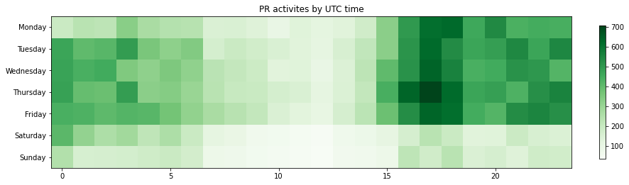

Latest record from the dataset:

<table border="1" class="dataframe">
  <thead>
    <tr style="text-align: right;">
      <th></th>
      <th>org</th>
      <th>repo</th>
      <th>type</th>
      <th>identifier</th>
      <th>subidentifier</th>
      <th>date</th>
      <th>author</th>
      <th>owner</th>
      <th>project</th>
    </tr>
  </thead>
  <tbody>
    <tr>
      <th>48194</th>
      <td>apache</td>
      <td>tvm</td>
      <td>PR_MERGED</td>
      <td>7409</td>
      <td>NaN</td>
      <td>2021-02-13 21:53:22+00:00</td>
      <td>junrushao1994</td>
      <td>trevor-m</td>
      <td>tvm</td>
    </tr>
  </tbody>
</table>

# Github Contributions per user

<table border="1" class="dataframe">
  <thead>
    <tr style="text-align: right;">
      <th></th>
      <th>contributions</th>
    </tr>
    <tr>
      <th>author</th>
      <th></th>
    </tr>
  </thead>
  <tbody>
    <tr>
      <th>tqchen</th>
      <td>9385</td>
    </tr>
    <tr>
      <th>masahi</th>
      <td>2020</td>
    </tr>
    <tr>
      <th>zhiics</th>
      <td>1667</td>
    </tr>
    <tr>
      <th>tmoreau89</th>
      <td>1102</td>
    </tr>
    <tr>
      <th>FrozenGene</th>
      <td>945</td>
    </tr>
    <tr>
      <th>comaniac</th>
      <td>940</td>
    </tr>
    <tr>
      <th>yzhliu</th>
      <td>843</td>
    </tr>
    <tr>
      <th>jroesch</th>
      <td>802</td>
    </tr>
    <tr>
      <th>kevinthesun</th>
      <td>710</td>
    </tr>
    <tr>
      <th>junrushao1994</th>
      <td>692</td>
    </tr>
  </tbody>
</table>

## Contributors per participations in PRs which are not created by self (helping PRs)

<table border="1" class="dataframe">
  <thead>
    <tr style="text-align: right;">
      <th></th>
      <th>identifier</th>
    </tr>
    <tr>
      <th>author</th>
      <th></th>
    </tr>
  </thead>
  <tbody>
    <tr>
      <th>tqchen</th>
      <td>2946</td>
    </tr>
    <tr>
      <th>zhiics</th>
      <td>666</td>
    </tr>
    <tr>
      <th>masahi</th>
      <td>422</td>
    </tr>
    <tr>
      <th>yzhliu</th>
      <td>353</td>
    </tr>
    <tr>
      <th>tmoreau89</th>
      <td>349</td>
    </tr>
    <tr>
      <th>junrushao1994</th>
      <td>344</td>
    </tr>
    <tr>
      <th>comaniac</th>
      <td>344</td>
    </tr>
    <tr>
      <th>jroesch</th>
      <td>342</td>
    </tr>
    <tr>
      <th>ZihengJiang</th>
      <td>282</td>
    </tr>
    <tr>
      <th>FrozenGene</th>
      <td>278</td>
    </tr>
    <tr>
      <th>icemelon9</th>
      <td>260</td>
    </tr>
    <tr>
      <th>kevinthesun</th>
      <td>244</td>
    </tr>
    <tr>
      <th>merrymercy</th>
      <td>209</td>
    </tr>
    <tr>
      <th>MarisaKirisame</th>
      <td>205</td>
    </tr>
    <tr>
      <th>vinx13</th>
      <td>183</td>
    </tr>
    <tr>
      <th>anijain2305</th>
      <td>171</td>
    </tr>
    <tr>
      <th>wweic</th>
      <td>133</td>
    </tr>
    <tr>
      <th>srkreddy1238</th>
      <td>126</td>
    </tr>
    <tr>
      <th>mbrookhart</th>
      <td>107</td>
    </tr>
    <tr>
      <th>jwfromm</th>
      <td>105</td>
    </tr>
  </tbody>
</table>

## Contributors per participations in any PRs

<table border="1" class="dataframe">
  <thead>
    <tr style="text-align: right;">
      <th></th>
      <th>identifier</th>
    </tr>
    <tr>
      <th>author</th>
      <th></th>
    </tr>
  </thead>
  <tbody>
    <tr>
      <th>tqchen</th>
      <td>3933</td>
    </tr>
    <tr>
      <th>zhiics</th>
      <td>808</td>
    </tr>
    <tr>
      <th>masahi</th>
      <td>573</td>
    </tr>
    <tr>
      <th>yzhliu</th>
      <td>480</td>
    </tr>
    <tr>
      <th>comaniac</th>
      <td>438</td>
    </tr>
    <tr>
      <th>jroesch</th>
      <td>422</td>
    </tr>
    <tr>
      <th>tmoreau89</th>
      <td>407</td>
    </tr>
    <tr>
      <th>junrushao1994</th>
      <td>388</td>
    </tr>
    <tr>
      <th>ZihengJiang</th>
      <td>387</td>
    </tr>
    <tr>
      <th>icemelon9</th>
      <td>385</td>
    </tr>
    <tr>
      <th>merrymercy</th>
      <td>364</td>
    </tr>
    <tr>
      <th>MarisaKirisame</th>
      <td>342</td>
    </tr>
    <tr>
      <th>FrozenGene</th>
      <td>325</td>
    </tr>
    <tr>
      <th>kevinthesun</th>
      <td>313</td>
    </tr>
    <tr>
      <th>anijain2305</th>
      <td>286</td>
    </tr>
    <tr>
      <th>vinx13</th>
      <td>265</td>
    </tr>
    <tr>
      <th>siju-samuel</th>
      <td>232</td>
    </tr>
    <tr>
      <th>srkreddy1238</th>
      <td>194</td>
    </tr>
    <tr>
      <th>wweic</th>
      <td>192</td>
    </tr>
    <tr>
      <th>mbrookhart</th>
      <td>181</td>
    </tr>
  </tbody>
</table>

# Bus factor (number of contributors responsible for the 50% of the prs) from last half year

## Contributors until the half of the all contributions

<table border="1" class="dataframe">
  <thead>
    <tr style="text-align: right;">
      <th></th>
      <th>author</th>
      <th>identifier</th>
      <th>cs</th>
      <th>ratio</th>
    </tr>
  </thead>
  <tbody>
    <tr>
      <th>0</th>
      <td>tqchen</td>
      <td>75</td>
      <td>75</td>
      <td>7.755946</td>
    </tr>
    <tr>
      <th>1</th>
      <td>masahi</td>
      <td>59</td>
      <td>134</td>
      <td>6.101344</td>
    </tr>
    <tr>
      <th>2</th>
      <td>areusch</td>
      <td>55</td>
      <td>189</td>
      <td>5.687694</td>
    </tr>
    <tr>
      <th>3</th>
      <td>merrymercy</td>
      <td>48</td>
      <td>237</td>
      <td>4.963806</td>
    </tr>
    <tr>
      <th>4</th>
      <td>comaniac</td>
      <td>43</td>
      <td>280</td>
      <td>4.446743</td>
    </tr>
    <tr>
      <th>5</th>
      <td>tkonolige</td>
      <td>43</td>
      <td>323</td>
      <td>4.446743</td>
    </tr>
    <tr>
      <th>6</th>
      <td>mbrookhart</td>
      <td>38</td>
      <td>361</td>
      <td>3.929679</td>
    </tr>
    <tr>
      <th>7</th>
      <td>codeislife99</td>
      <td>25</td>
      <td>386</td>
      <td>2.585315</td>
    </tr>
    <tr>
      <th>8</th>
      <td>jwfromm</td>
      <td>23</td>
      <td>409</td>
      <td>2.378490</td>
    </tr>
    <tr>
      <th>9</th>
      <td>trevor-m</td>
      <td>22</td>
      <td>431</td>
      <td>2.275078</td>
    </tr>
    <tr>
      <th>10</th>
      <td>leandron</td>
      <td>21</td>
      <td>452</td>
      <td>2.171665</td>
    </tr>
    <tr>
      <th>11</th>
      <td>rkimball</td>
      <td>21</td>
      <td>473</td>
      <td>2.171665</td>
    </tr>
  </tbody>
</table>

## Pony number (bus factor)

    13

## Dev power (All the contributions in the ration of the top contributor)

    12.893333333333333

    

    

## People with created PRs > reviewed/commented PRS

    

    

## Same graph with focusing to the last 6 month

Only contributors with both created pr and helped pr visible

    

    

# Number of individual contributors per month

Number of different Github users who either created PR, commented PR, added review to a PR

Note: only events from apache/hadoop-ozone repository are included. Earlier PRs/comments are not here.

    

    

# Number of PRs closed/created per month

    /usr/lib/python3.9/site-packages/pandas/core/arrays/datetimes.py:1101: UserWarning: Converting to PeriodArray/Index representation will drop timezone information.
      warnings.warn(

    

    

# PR activity heatmap

    

    

