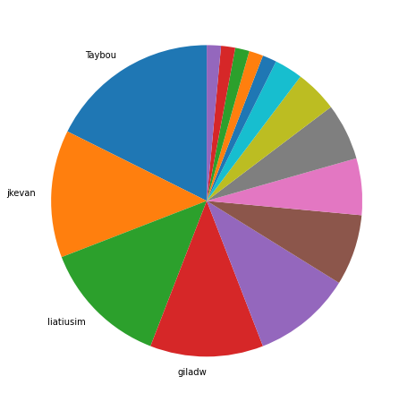
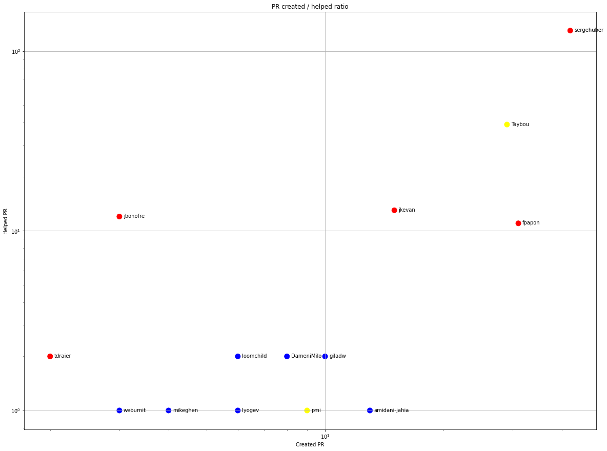
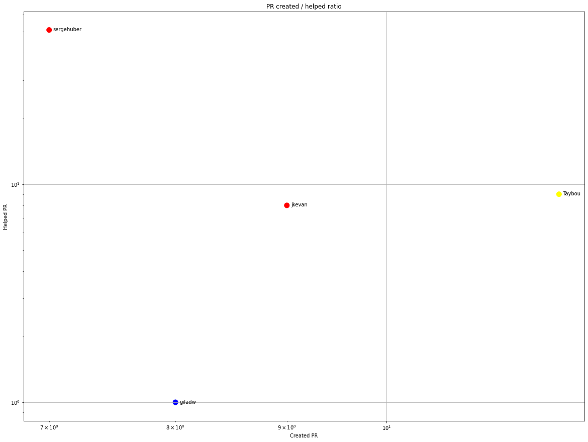
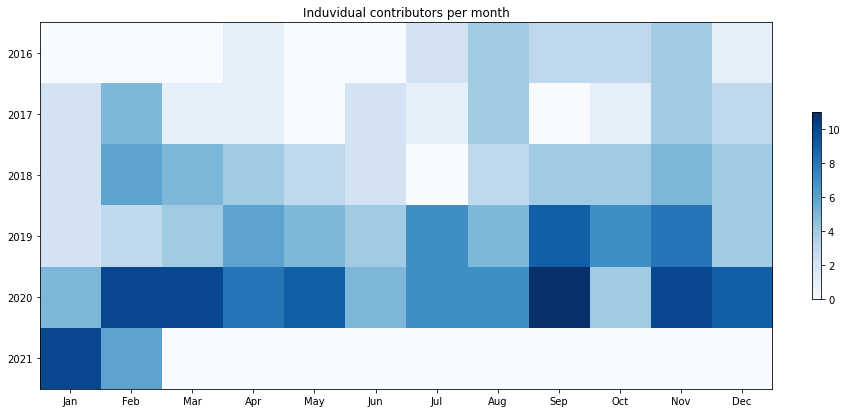
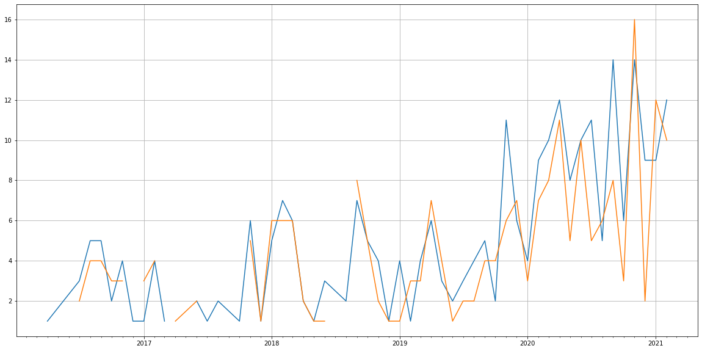
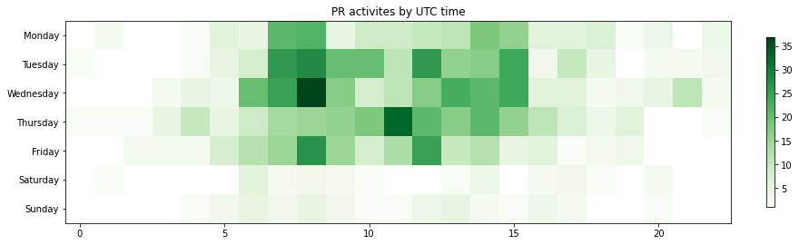

Latest record from the dataset:

<table border="1" class="dataframe">
  <thead>
    <tr style="text-align: right;">
      <th></th>
      <th>org</th>
      <th>repo</th>
      <th>type</th>
      <th>identifier</th>
      <th>subidentifier</th>
      <th>date</th>
      <th>author</th>
      <th>owner</th>
      <th>project</th>
    </tr>
  </thead>
  <tbody>
    <tr>
      <th>725</th>
      <td>apache</td>
      <td>unomi</td>
      <td>PR_COMMENTED</td>
      <td>247</td>
      <td>NaN</td>
      <td>2021-02-12 13:22:07+00:00</td>
      <td>sergehuber</td>
      <td>liatiusim</td>
      <td>unomi</td>
    </tr>
  </tbody>
</table>

# Github Contributions per user

<table border="1" class="dataframe">
  <thead>
    <tr style="text-align: right;">
      <th></th>
      <th>contributions</th>
    </tr>
    <tr>
      <th>author</th>
      <th></th>
    </tr>
  </thead>
  <tbody>
    <tr>
      <th>sergehuber</th>
      <td>335</td>
    </tr>
    <tr>
      <th>asfgit</th>
      <td>100</td>
    </tr>
    <tr>
      <th>asf-ci</th>
      <td>73</td>
    </tr>
    <tr>
      <th>Taybou</th>
      <td>64</td>
    </tr>
    <tr>
      <th>jbonofre</th>
      <td>24</td>
    </tr>
    <tr>
      <th>jkevan</th>
      <td>15</td>
    </tr>
    <tr>
      <th>fpapon</th>
      <td>15</td>
    </tr>
    <tr>
      <th>loomchild</th>
      <td>8</td>
    </tr>
    <tr>
      <th>dgriffon</th>
      <td>5</td>
    </tr>
    <tr>
      <th>tdraier</th>
      <td>4</td>
    </tr>
  </tbody>
</table>

## Contributors per participations in PRs which are not created by self (helping PRs)

<table border="1" class="dataframe">
  <thead>
    <tr style="text-align: right;">
      <th></th>
      <th>identifier</th>
    </tr>
    <tr>
      <th>author</th>
      <th></th>
    </tr>
  </thead>
  <tbody>
    <tr>
      <th>sergehuber</th>
      <td>130</td>
    </tr>
    <tr>
      <th>asfgit</th>
      <td>77</td>
    </tr>
    <tr>
      <th>Taybou</th>
      <td>39</td>
    </tr>
    <tr>
      <th>asf-ci</th>
      <td>31</td>
    </tr>
    <tr>
      <th>jkevan</th>
      <td>13</td>
    </tr>
    <tr>
      <th>jbonofre</th>
      <td>12</td>
    </tr>
    <tr>
      <th>fpapon</th>
      <td>11</td>
    </tr>
    <tr>
      <th>dgriffon</th>
      <td>4</td>
    </tr>
    <tr>
      <th>tdraier</th>
      <td>2</td>
    </tr>
    <tr>
      <th>giladw</th>
      <td>2</td>
    </tr>
    <tr>
      <th>DameniMilo</th>
      <td>2</td>
    </tr>
    <tr>
      <th>loomchild</th>
      <td>2</td>
    </tr>
    <tr>
      <th>BhagiLimbu</th>
      <td>1</td>
    </tr>
    <tr>
      <th>mikeghen</th>
      <td>1</td>
    </tr>
    <tr>
      <th>sigdestad</th>
      <td>1</td>
    </tr>
    <tr>
      <th>pmi</th>
      <td>1</td>
    </tr>
    <tr>
      <th>hubot</th>
      <td>1</td>
    </tr>
    <tr>
      <th>lyogev</th>
      <td>1</td>
    </tr>
    <tr>
      <th>lhwong</th>
      <td>1</td>
    </tr>
    <tr>
      <th>amidani-jahia</th>
      <td>1</td>
    </tr>
  </tbody>
</table>

## Contributors per participations in any PRs

<table border="1" class="dataframe">
  <thead>
    <tr style="text-align: right;">
      <th></th>
      <th>identifier</th>
    </tr>
    <tr>
      <th>author</th>
      <th></th>
    </tr>
  </thead>
  <tbody>
    <tr>
      <th>sergehuber</th>
      <td>171</td>
    </tr>
    <tr>
      <th>asfgit</th>
      <td>77</td>
    </tr>
    <tr>
      <th>Taybou</th>
      <td>68</td>
    </tr>
    <tr>
      <th>fpapon</th>
      <td>42</td>
    </tr>
    <tr>
      <th>asf-ci</th>
      <td>31</td>
    </tr>
    <tr>
      <th>jkevan</th>
      <td>28</td>
    </tr>
    <tr>
      <th>dinesh1996</th>
      <td>18</td>
    </tr>
    <tr>
      <th>jbonofre</th>
      <td>15</td>
    </tr>
    <tr>
      <th>amidani-jahia</th>
      <td>14</td>
    </tr>
    <tr>
      <th>liatiusim</th>
      <td>13</td>
    </tr>
    <tr>
      <th>giladw</th>
      <td>12</td>
    </tr>
    <tr>
      <th>pmi</th>
      <td>10</td>
    </tr>
    <tr>
      <th>DameniMilo</th>
      <td>10</td>
    </tr>
    <tr>
      <th>loomchild</th>
      <td>8</td>
    </tr>
    <tr>
      <th>lyogev</th>
      <td>7</td>
    </tr>
    <tr>
      <th>mikeghen</th>
      <td>5</td>
    </tr>
    <tr>
      <th>nlevitsky</th>
      <td>5</td>
    </tr>
    <tr>
      <th>anatol-sialitski</th>
      <td>5</td>
    </tr>
    <tr>
      <th>amitco1</th>
      <td>5</td>
    </tr>
    <tr>
      <th>dgriffon</th>
      <td>4</td>
    </tr>
  </tbody>
</table>

# Bus factor (number of contributors responsible for the 50% of the prs) from last half year

## Contributors until the half of the all contributions

<table border="1" class="dataframe">
  <thead>
    <tr style="text-align: right;">
      <th></th>
      <th>author</th>
      <th>identifier</th>
      <th>cs</th>
      <th>ratio</th>
    </tr>
  </thead>
  <tbody>
    <tr>
      <th>0</th>
      <td>Taybou</td>
      <td>12</td>
      <td>12</td>
      <td>17.647059</td>
    </tr>
    <tr>
      <th>1</th>
      <td>jkevan</td>
      <td>9</td>
      <td>21</td>
      <td>13.235294</td>
    </tr>
    <tr>
      <th>2</th>
      <td>liatiusim</td>
      <td>9</td>
      <td>30</td>
      <td>13.235294</td>
    </tr>
  </tbody>
</table>

## Pony number (bus factor)

    4

## Dev power (All the contributions in the ration of the top contributor)

    5.666666666666665

    

    

## People with created PRs > reviewed/commented PRS

    

    

## Same graph with focusing to the last 6 month

Only contributors with both created pr and helped pr visible

    

    

# Number of individual contributors per month

Number of different Github users who either created PR, commented PR, added review to a PR

Note: only events from apache/hadoop-ozone repository are included. Earlier PRs/comments are not here.

    

    

# Number of PRs closed/created per month

    /usr/lib/python3.9/site-packages/pandas/core/arrays/datetimes.py:1101: UserWarning: Converting to PeriodArray/Index representation will drop timezone information.
      warnings.warn(

    

    

# PR activity heatmap

    

    

