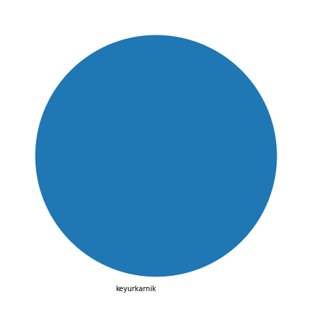
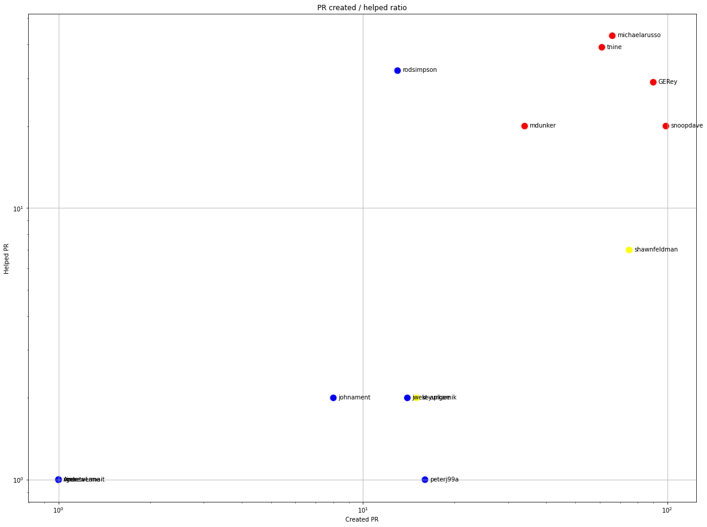
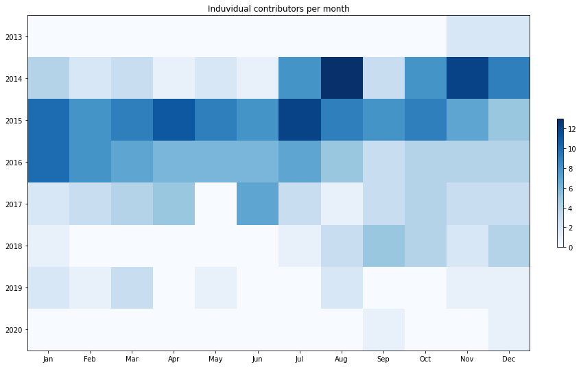
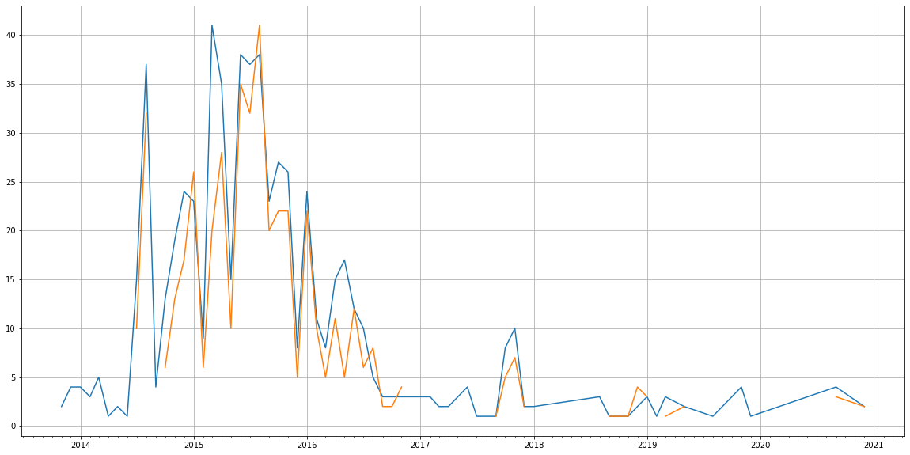
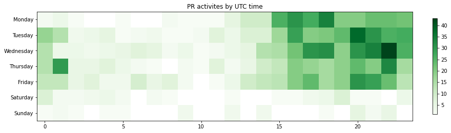

Latest record from the dataset:

<table border="1" class="dataframe">
  <thead>
    <tr style="text-align: right;">
      <th></th>
      <th>org</th>
      <th>repo</th>
      <th>type</th>
      <th>identifier</th>
      <th>subidentifier</th>
      <th>date</th>
      <th>author</th>
      <th>owner</th>
      <th>project</th>
    </tr>
  </thead>
  <tbody>
    <tr>
      <th>1424</th>
      <td>apache</td>
      <td>usergrid</td>
      <td>PR_MERGED</td>
      <td>638</td>
      <td>NaN</td>
      <td>2020-12-17 13:08:20+00:00</td>
      <td>keyurkarnik</td>
      <td>keyurkarnik</td>
      <td>usergrid</td>
    </tr>
  </tbody>
</table>

# Github Contributions per user

<table border="1" class="dataframe">
  <thead>
    <tr style="text-align: right;">
      <th></th>
      <th>contributions</th>
    </tr>
    <tr>
      <th>author</th>
      <th></th>
    </tr>
  </thead>
  <tbody>
    <tr>
      <th>asfgit</th>
      <td>454</td>
    </tr>
    <tr>
      <th>michaelarusso</th>
      <td>46</td>
    </tr>
    <tr>
      <th>tnine</th>
      <td>44</td>
    </tr>
    <tr>
      <th>rodsimpson</th>
      <td>37</td>
    </tr>
    <tr>
      <th>GERey</th>
      <td>33</td>
    </tr>
    <tr>
      <th>snoopdave</th>
      <td>33</td>
    </tr>
    <tr>
      <th>mdunker</th>
      <td>28</td>
    </tr>
    <tr>
      <th>shawnfeldman</th>
      <td>11</td>
    </tr>
    <tr>
      <th>asfbot</th>
      <td>9</td>
    </tr>
    <tr>
      <th>rgex</th>
      <td>4</td>
    </tr>
  </tbody>
</table>

## Contributors per participations in PRs which are not created by self (helping PRs)

<table border="1" class="dataframe">
  <thead>
    <tr style="text-align: right;">
      <th></th>
      <th>identifier</th>
    </tr>
    <tr>
      <th>author</th>
      <th></th>
    </tr>
  </thead>
  <tbody>
    <tr>
      <th>asfgit</th>
      <td>453</td>
    </tr>
    <tr>
      <th>michaelarusso</th>
      <td>43</td>
    </tr>
    <tr>
      <th>tnine</th>
      <td>39</td>
    </tr>
    <tr>
      <th>rodsimpson</th>
      <td>32</td>
    </tr>
    <tr>
      <th>GERey</th>
      <td>29</td>
    </tr>
    <tr>
      <th>mdunker</th>
      <td>20</td>
    </tr>
    <tr>
      <th>snoopdave</th>
      <td>20</td>
    </tr>
    <tr>
      <th>shawnfeldman</th>
      <td>7</td>
    </tr>
    <tr>
      <th>asfbot</th>
      <td>4</td>
    </tr>
    <tr>
      <th>hubot</th>
      <td>3</td>
    </tr>
    <tr>
      <th>johnament</th>
      <td>2</td>
    </tr>
    <tr>
      <th>jwest-apigee</th>
      <td>2</td>
    </tr>
    <tr>
      <th>keyurkarnik</th>
      <td>2</td>
    </tr>
    <tr>
      <th>0zguner</th>
      <td>1</td>
    </tr>
    <tr>
      <th>susthitsoft</th>
      <td>1</td>
    </tr>
    <tr>
      <th>maysam1986</th>
      <td>1</td>
    </tr>
    <tr>
      <th>rgex</th>
      <td>1</td>
    </tr>
    <tr>
      <th>peterj99a</th>
      <td>1</td>
    </tr>
    <tr>
      <th>AndrewLane</th>
      <td>1</td>
    </tr>
    <tr>
      <th>MattW86</th>
      <td>1</td>
    </tr>
  </tbody>
</table>

## Contributors per participations in any PRs

<table border="1" class="dataframe">
  <thead>
    <tr style="text-align: right;">
      <th></th>
      <th>identifier</th>
    </tr>
    <tr>
      <th>author</th>
      <th></th>
    </tr>
  </thead>
  <tbody>
    <tr>
      <th>asfgit</th>
      <td>453</td>
    </tr>
    <tr>
      <th>snoopdave</th>
      <td>119</td>
    </tr>
    <tr>
      <th>GERey</th>
      <td>119</td>
    </tr>
    <tr>
      <th>michaelarusso</th>
      <td>109</td>
    </tr>
    <tr>
      <th>tnine</th>
      <td>100</td>
    </tr>
    <tr>
      <th>shawnfeldman</th>
      <td>82</td>
    </tr>
    <tr>
      <th>mdunker</th>
      <td>54</td>
    </tr>
    <tr>
      <th>rodsimpson</th>
      <td>45</td>
    </tr>
    <tr>
      <th>r3b</th>
      <td>25</td>
    </tr>
    <tr>
      <th>keyurkarnik</th>
      <td>17</td>
    </tr>
    <tr>
      <th>peterj99a</th>
      <td>17</td>
    </tr>
    <tr>
      <th>jwest-apigee</th>
      <td>16</td>
    </tr>
    <tr>
      <th>ayesha12</th>
      <td>11</td>
    </tr>
    <tr>
      <th>johnament</th>
      <td>10</td>
    </tr>
    <tr>
      <th>lewismc</th>
      <td>8</td>
    </tr>
    <tr>
      <th>RobertWalsh</th>
      <td>7</td>
    </tr>
    <tr>
      <th>senthilkumarkj</th>
      <td>5</td>
    </tr>
    <tr>
      <th>amuramoto</th>
      <td>5</td>
    </tr>
    <tr>
      <th>heartmoving</th>
      <td>4</td>
    </tr>
    <tr>
      <th>dependabot</th>
      <td>4</td>
    </tr>
  </tbody>
</table>

# Bus factor (number of contributors responsible for the 50% of the prs) from last half year

## Contributors until the half of the all contributions

<table border="1" class="dataframe">
  <thead>
    <tr style="text-align: right;">
      <th></th>
      <th>author</th>
      <th>identifier</th>
      <th>cs</th>
      <th>ratio</th>
    </tr>
  </thead>
  <tbody>
  </tbody>
</table>

## Pony number (bus factor)

    1

## Dev power (All the contributions in the ration of the top contributor)

    1.0

    

    

## People with created PRs > reviewed/commented PRS

    

    

## Same graph with focusing to the last 6 month

Only contributors with both created pr and helped pr visible

    

    

# Number of individual contributors per month

Number of different Github users who either created PR, commented PR, added review to a PR

Note: only events from apache/hadoop-ozone repository are included. Earlier PRs/comments are not here.

    

    

# Number of PRs closed/created per month

    /usr/lib/python3.9/site-packages/pandas/core/arrays/datetimes.py:1101: UserWarning: Converting to PeriodArray/Index representation will drop timezone information.
      warnings.warn(

    

    

# PR activity heatmap

    

    

