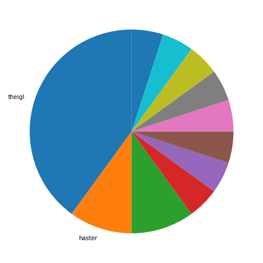
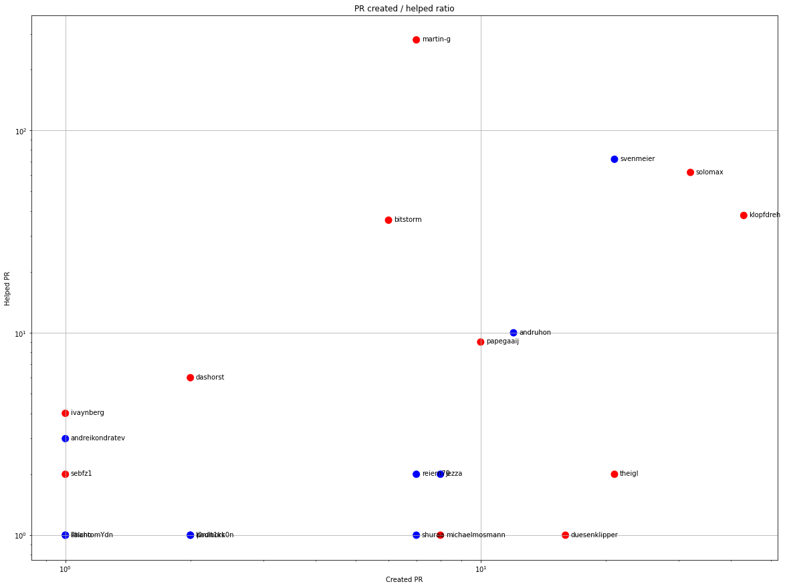
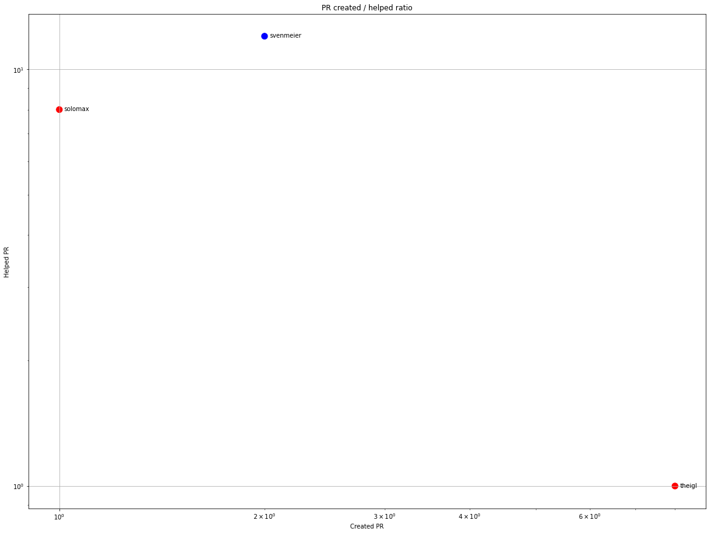
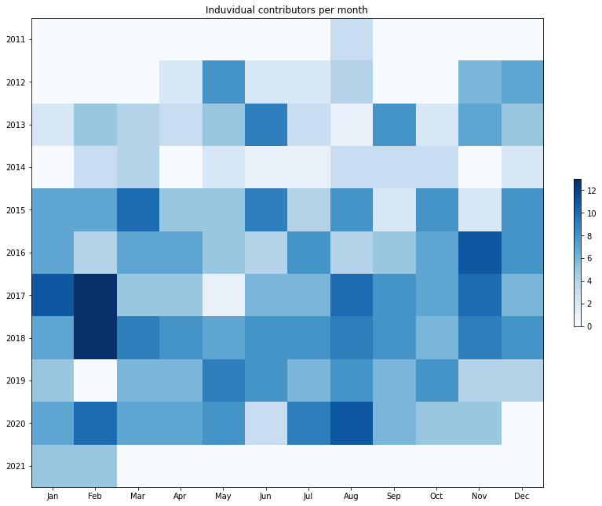
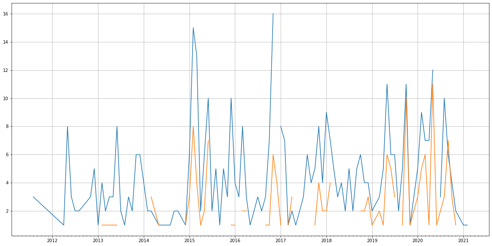
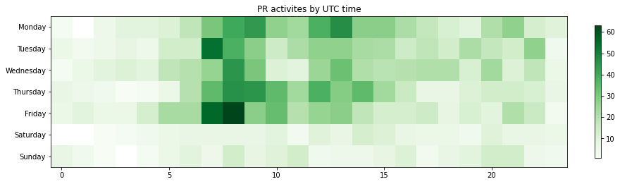

Latest record from the dataset:

<table border="1" class="dataframe">
  <thead>
    <tr style="text-align: right;">
      <th></th>
      <th>org</th>
      <th>repo</th>
      <th>type</th>
      <th>identifier</th>
      <th>subidentifier</th>
      <th>date</th>
      <th>author</th>
      <th>owner</th>
      <th>project</th>
    </tr>
  </thead>
  <tbody>
    <tr>
      <th>2311</th>
      <td>apache</td>
      <td>wicket</td>
      <td>PR_COMMENTED</td>
      <td>462</td>
      <td>NaN</td>
      <td>2021-02-10 20:08:35+00:00</td>
      <td>svenmeier</td>
      <td>svenmeier</td>
      <td>wicket</td>
    </tr>
  </tbody>
</table>

# Github Contributions per user

<table border="1" class="dataframe">
  <thead>
    <tr style="text-align: right;">
      <th></th>
      <th>contributions</th>
    </tr>
    <tr>
      <th>author</th>
      <th></th>
    </tr>
  </thead>
  <tbody>
    <tr>
      <th>martin-g</th>
      <td>577</td>
    </tr>
    <tr>
      <th>svenmeier</th>
      <td>159</td>
    </tr>
    <tr>
      <th>solomax</th>
      <td>148</td>
    </tr>
    <tr>
      <th>asfgit</th>
      <td>102</td>
    </tr>
    <tr>
      <th>bitstorm</th>
      <td>79</td>
    </tr>
    <tr>
      <th>klopfdreh</th>
      <td>57</td>
    </tr>
    <tr>
      <th>andruhon</th>
      <td>47</td>
    </tr>
    <tr>
      <th>papegaaij</th>
      <td>28</td>
    </tr>
    <tr>
      <th>ivaynberg</th>
      <td>10</td>
    </tr>
    <tr>
      <th>duesenklipper</th>
      <td>9</td>
    </tr>
  </tbody>
</table>

## Contributors per participations in PRs which are not created by self (helping PRs)

<table border="1" class="dataframe">
  <thead>
    <tr style="text-align: right;">
      <th></th>
      <th>identifier</th>
    </tr>
    <tr>
      <th>author</th>
      <th></th>
    </tr>
  </thead>
  <tbody>
    <tr>
      <th>martin-g</th>
      <td>280</td>
    </tr>
    <tr>
      <th>asfgit</th>
      <td>102</td>
    </tr>
    <tr>
      <th>svenmeier</th>
      <td>72</td>
    </tr>
    <tr>
      <th>solomax</th>
      <td>62</td>
    </tr>
    <tr>
      <th>klopfdreh</th>
      <td>38</td>
    </tr>
    <tr>
      <th>bitstorm</th>
      <td>36</td>
    </tr>
    <tr>
      <th>andruhon</th>
      <td>10</td>
    </tr>
    <tr>
      <th>papegaaij</th>
      <td>9</td>
    </tr>
    <tr>
      <th>dashorst</th>
      <td>6</td>
    </tr>
    <tr>
      <th>ivaynberg</th>
      <td>4</td>
    </tr>
    <tr>
      <th>kbachl</th>
      <td>3</td>
    </tr>
    <tr>
      <th>andreikondratev</th>
      <td>3</td>
    </tr>
    <tr>
      <th>jthomerson</th>
      <td>2</td>
    </tr>
    <tr>
      <th>Jezza</th>
      <td>2</td>
    </tr>
    <tr>
      <th>sebfz1</th>
      <td>2</td>
    </tr>
    <tr>
      <th>tdunning</th>
      <td>2</td>
    </tr>
    <tr>
      <th>theigl</th>
      <td>2</td>
    </tr>
    <tr>
      <th>reiern70</th>
      <td>2</td>
    </tr>
    <tr>
      <th>salcho</th>
      <td>1</td>
    </tr>
    <tr>
      <th>BugHunterPhilosopher</th>
      <td>1</td>
    </tr>
  </tbody>
</table>

## Contributors per participations in any PRs

<table border="1" class="dataframe">
  <thead>
    <tr style="text-align: right;">
      <th></th>
      <th>identifier</th>
    </tr>
    <tr>
      <th>author</th>
      <th></th>
    </tr>
  </thead>
  <tbody>
    <tr>
      <th>martin-g</th>
      <td>287</td>
    </tr>
    <tr>
      <th>asfgit</th>
      <td>102</td>
    </tr>
    <tr>
      <th>solomax</th>
      <td>94</td>
    </tr>
    <tr>
      <th>svenmeier</th>
      <td>93</td>
    </tr>
    <tr>
      <th>klopfdreh</th>
      <td>81</td>
    </tr>
    <tr>
      <th>bitstorm</th>
      <td>42</td>
    </tr>
    <tr>
      <th>theigl</th>
      <td>23</td>
    </tr>
    <tr>
      <th>andruhon</th>
      <td>22</td>
    </tr>
    <tr>
      <th>papegaaij</th>
      <td>19</td>
    </tr>
    <tr>
      <th>duesenklipper</th>
      <td>17</td>
    </tr>
    <tr>
      <th>Jezza</th>
      <td>10</td>
    </tr>
    <tr>
      <th>michaelmosmann</th>
      <td>9</td>
    </tr>
    <tr>
      <th>reiern70</th>
      <td>9</td>
    </tr>
    <tr>
      <th>dashorst</th>
      <td>8</td>
    </tr>
    <tr>
      <th>dependabot</th>
      <td>8</td>
    </tr>
    <tr>
      <th>shuraa</th>
      <td>8</td>
    </tr>
    <tr>
      <th>mafulafunk</th>
      <td>8</td>
    </tr>
    <tr>
      <th>jsarman</th>
      <td>7</td>
    </tr>
    <tr>
      <th>jmewes</th>
      <td>6</td>
    </tr>
    <tr>
      <th>pulse00</th>
      <td>5</td>
    </tr>
  </tbody>
</table>

# Bus factor (number of contributors responsible for the 50% of the prs) from last half year

## Contributors until the half of the all contributions

<table border="1" class="dataframe">
  <thead>
    <tr style="text-align: right;">
      <th></th>
      <th>author</th>
      <th>identifier</th>
      <th>cs</th>
      <th>ratio</th>
    </tr>
  </thead>
  <tbody>
    <tr>
      <th>0</th>
      <td>theigl</td>
      <td>8</td>
      <td>8</td>
      <td>40.0</td>
    </tr>
  </tbody>
</table>

## Pony number (bus factor)

    2

## Dev power (All the contributions in the ration of the top contributor)

    2.5

    

    

## People with created PRs > reviewed/commented PRS

    

    

## Same graph with focusing to the last 6 month

Only contributors with both created pr and helped pr visible

    

    

# Number of individual contributors per month

Number of different Github users who either created PR, commented PR, added review to a PR

Note: only events from apache/hadoop-ozone repository are included. Earlier PRs/comments are not here.

    

    

# Number of PRs closed/created per month

    /usr/lib/python3.9/site-packages/pandas/core/arrays/datetimes.py:1101: UserWarning: Converting to PeriodArray/Index representation will drop timezone information.
      warnings.warn(

    

    

# PR activity heatmap

    

    

