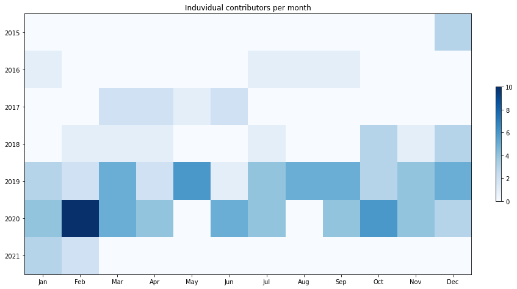

Latest record from the dataset:

<table border="1" class="dataframe">
  <thead>
    <tr style="text-align: right;">
      <th></th>
      <th>org</th>
      <th>repo</th>
      <th>type</th>
      <th>identifier</th>
      <th>subidentifier</th>
      <th>date</th>
      <th>author</th>
      <th>owner</th>
      <th>project</th>
    </tr>
  </thead>
  <tbody>
    <tr>
      <th>459</th>
      <td>apache</td>
      <td>yetus</td>
      <td>PR_COMMENTED</td>
      <td>212</td>
      <td>NaN</td>
      <td>2021-02-08 02:28:05+00:00</td>
      <td>aajisaka</td>
      <td>aajisaka</td>
      <td>yetus</td>
    </tr>
  </tbody>
</table>

# Github Contributions per user

<table border="1" class="dataframe">
  <thead>
    <tr style="text-align: right;">
      <th></th>
      <th>contributions</th>
    </tr>
    <tr>
      <th>author</th>
      <th></th>
    </tr>
  </thead>
  <tbody>
    <tr>
      <th>apache-yetus</th>
      <td>475</td>
    </tr>
    <tr>
      <th>busbey</th>
      <td>85</td>
    </tr>
    <tr>
      <th>aw-was-here</th>
      <td>39</td>
    </tr>
    <tr>
      <th>aajisaka</th>
      <td>25</td>
    </tr>
    <tr>
      <th>ndimiduk</th>
      <td>15</td>
    </tr>
    <tr>
      <th>rvs</th>
      <td>5</td>
    </tr>
    <tr>
      <th>saintstack</th>
      <td>5</td>
    </tr>
    <tr>
      <th>spacharya</th>
      <td>2</td>
    </tr>
    <tr>
      <th>Apache9</th>
      <td>1</td>
    </tr>
    <tr>
      <th>PierreSmits</th>
      <td>1</td>
    </tr>
  </tbody>
</table>

## Contributors per participations in PRs which are not created by self (helping PRs)

<table border="1" class="dataframe">
  <thead>
    <tr style="text-align: right;">
      <th></th>
      <th>identifier</th>
    </tr>
    <tr>
      <th>author</th>
      <th></th>
    </tr>
  </thead>
  <tbody>
    <tr>
      <th>apache-yetus</th>
      <td>84</td>
    </tr>
    <tr>
      <th>busbey</th>
      <td>57</td>
    </tr>
    <tr>
      <th>aw-was-here</th>
      <td>20</td>
    </tr>
    <tr>
      <th>aajisaka</th>
      <td>15</td>
    </tr>
    <tr>
      <th>ndimiduk</th>
      <td>12</td>
    </tr>
    <tr>
      <th>rvs</th>
      <td>5</td>
    </tr>
    <tr>
      <th>Apache9</th>
      <td>1</td>
    </tr>
    <tr>
      <th>PierreSmits</th>
      <td>1</td>
    </tr>
    <tr>
      <th>ajyoung</th>
      <td>1</td>
    </tr>
    <tr>
      <th>infraio</th>
      <td>1</td>
    </tr>
    <tr>
      <th>jojochuang</th>
      <td>1</td>
    </tr>
    <tr>
      <th>saintstack</th>
      <td>1</td>
    </tr>
    <tr>
      <th>sekikn</th>
      <td>1</td>
    </tr>
    <tr>
      <th>smengcl</th>
      <td>1</td>
    </tr>
    <tr>
      <th>spacharya</th>
      <td>1</td>
    </tr>
    <tr>
      <th>steveloughran</th>
      <td>1</td>
    </tr>
  </tbody>
</table>

## Contributors per participations in any PRs

<table border="1" class="dataframe">
  <thead>
    <tr style="text-align: right;">
      <th></th>
      <th>identifier</th>
    </tr>
    <tr>
      <th>author</th>
      <th></th>
    </tr>
  </thead>
  <tbody>
    <tr>
      <th>aw-was-here</th>
      <td>181</td>
    </tr>
    <tr>
      <th>apache-yetus</th>
      <td>84</td>
    </tr>
    <tr>
      <th>busbey</th>
      <td>59</td>
    </tr>
    <tr>
      <th>aajisaka</th>
      <td>41</td>
    </tr>
    <tr>
      <th>ndimiduk</th>
      <td>16</td>
    </tr>
    <tr>
      <th>rvs</th>
      <td>5</td>
    </tr>
    <tr>
      <th>Apache9</th>
      <td>4</td>
    </tr>
    <tr>
      <th>spacharya</th>
      <td>4</td>
    </tr>
    <tr>
      <th>sekikn</th>
      <td>3</td>
    </tr>
    <tr>
      <th>jatin-pathangi</th>
      <td>2</td>
    </tr>
    <tr>
      <th>petersomogyi</th>
      <td>2</td>
    </tr>
    <tr>
      <th>joshelser</th>
      <td>2</td>
    </tr>
    <tr>
      <th>infraio</th>
      <td>2</td>
    </tr>
    <tr>
      <th>Fokko</th>
      <td>2</td>
    </tr>
    <tr>
      <th>elek</th>
      <td>1</td>
    </tr>
    <tr>
      <th>pingsutw</th>
      <td>1</td>
    </tr>
    <tr>
      <th>smengcl</th>
      <td>1</td>
    </tr>
    <tr>
      <th>HorizonNet</th>
      <td>1</td>
    </tr>
    <tr>
      <th>saintstack</th>
      <td>1</td>
    </tr>
    <tr>
      <th>PierreSmits</th>
      <td>1</td>
    </tr>
  </tbody>
</table>

# Bus factor (number of contributors responsible for the 50% of the prs) from last half year

## Contributors until the half of the all contributions

<table border="1" class="dataframe">
  <thead>
    <tr style="text-align: right;">
      <th></th>
      <th>author</th>
      <th>identifier</th>
      <th>cs</th>
      <th>ratio</th>
    </tr>
  </thead>
  <tbody>
  </tbody>
</table>

## Pony number (bus factor)

    1

## Dev power (All the contributions in the ration of the top contributor)

    1.0576923076923077

    

    

## People with created PRs > reviewed/commented PRS

    

    

## Same graph with focusing to the last 6 month

Only contributors with both created pr and helped pr visible

    

    

# Number of individual contributors per month

Number of different Github users who either created PR, commented PR, added review to a PR

Note: only events from apache/hadoop-ozone repository are included. Earlier PRs/comments are not here.

    

    

# Number of PRs closed/created per month

    /usr/lib/python3.9/site-packages/pandas/core/arrays/datetimes.py:1101: UserWarning: Converting to PeriodArray/Index representation will drop timezone information.
      warnings.warn(

    

    

# PR activity heatmap

    

    

