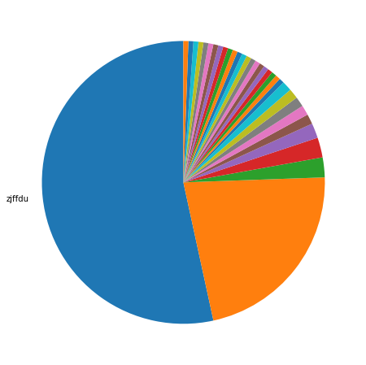
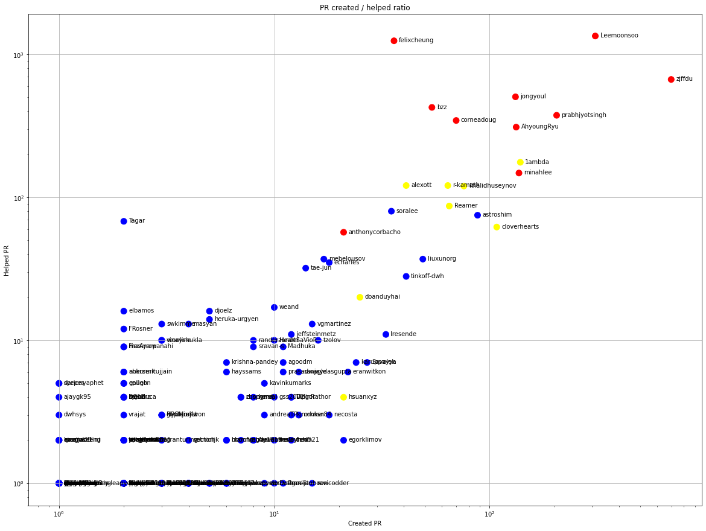
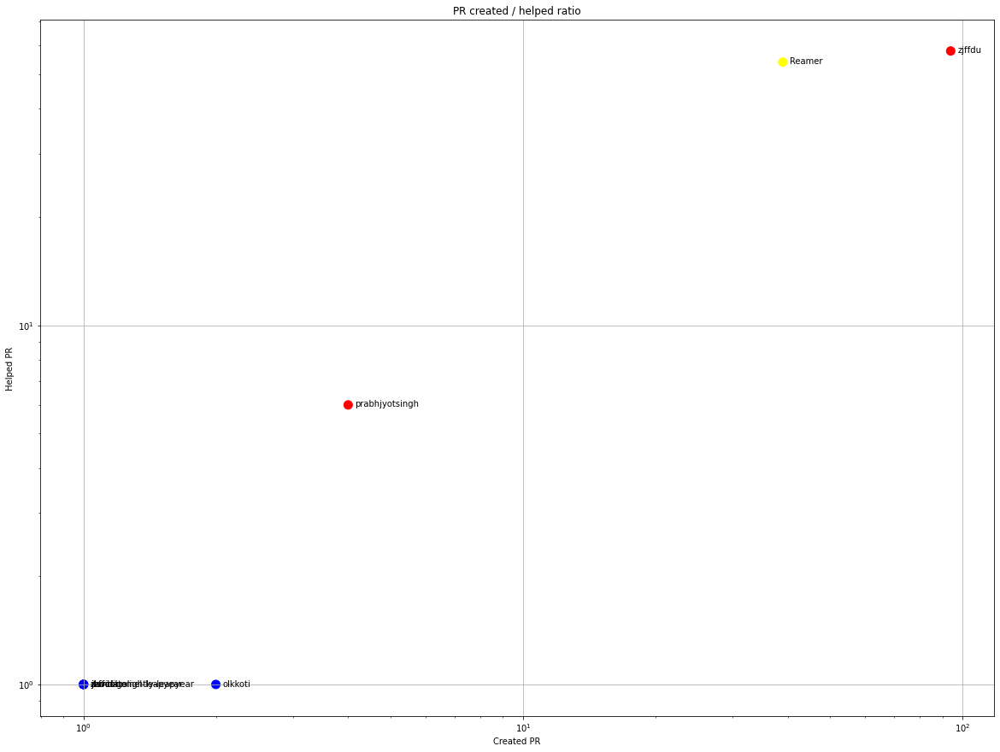
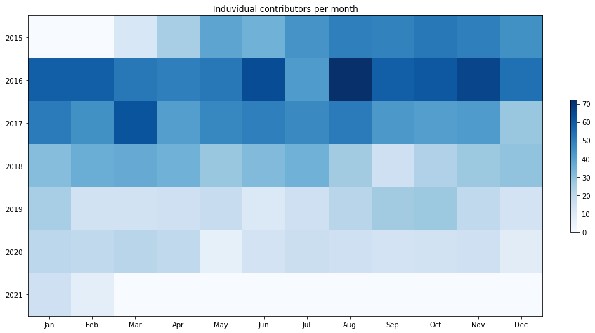
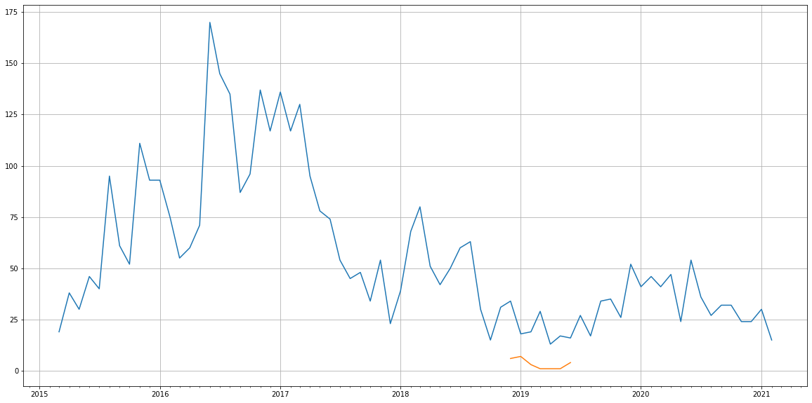
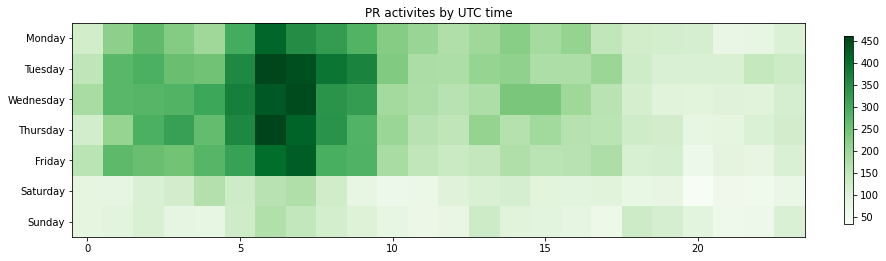

Latest record from the dataset:

<table border="1" class="dataframe">
  <thead>
    <tr style="text-align: right;">
      <th></th>
      <th>org</th>
      <th>repo</th>
      <th>type</th>
      <th>identifier</th>
      <th>subidentifier</th>
      <th>date</th>
      <th>author</th>
      <th>owner</th>
      <th>project</th>
    </tr>
  </thead>
  <tbody>
    <tr>
      <th>25188</th>
      <td>apache</td>
      <td>zeppelin</td>
      <td>PR_COMMENTED</td>
      <td>4053</td>
      <td>NaN</td>
      <td>2021-02-12 09:11:24+00:00</td>
      <td>Reamer</td>
      <td>omrisk</td>
      <td>zeppelin</td>
    </tr>
  </tbody>
</table>

# Github Contributions per user

<table border="1" class="dataframe">
  <thead>
    <tr style="text-align: right;">
      <th></th>
      <th>contributions</th>
    </tr>
    <tr>
      <th>author</th>
      <th></th>
    </tr>
  </thead>
  <tbody>
    <tr>
      <th>felixcheung</th>
      <td>2518</td>
    </tr>
    <tr>
      <th>Leemoonsoo</th>
      <td>2455</td>
    </tr>
    <tr>
      <th>zjffdu</th>
      <td>1976</td>
    </tr>
    <tr>
      <th>jongyoul</th>
      <td>1077</td>
    </tr>
    <tr>
      <th>bzz</th>
      <td>924</td>
    </tr>
    <tr>
      <th>corneadoug</th>
      <td>834</td>
    </tr>
    <tr>
      <th>AhyoungRyu</th>
      <td>709</td>
    </tr>
    <tr>
      <th>prabhjyotsingh</th>
      <td>610</td>
    </tr>
    <tr>
      <th>1ambda</th>
      <td>603</td>
    </tr>
    <tr>
      <th>minahlee</th>
      <td>231</td>
    </tr>
  </tbody>
</table>

## Contributors per participations in PRs which are not created by self (helping PRs)

<table border="1" class="dataframe">
  <thead>
    <tr style="text-align: right;">
      <th></th>
      <th>identifier</th>
    </tr>
    <tr>
      <th>author</th>
      <th></th>
    </tr>
  </thead>
  <tbody>
    <tr>
      <th>Leemoonsoo</th>
      <td>1345</td>
    </tr>
    <tr>
      <th>felixcheung</th>
      <td>1245</td>
    </tr>
    <tr>
      <th>zjffdu</th>
      <td>668</td>
    </tr>
    <tr>
      <th>jongyoul</th>
      <td>505</td>
    </tr>
    <tr>
      <th>bzz</th>
      <td>426</td>
    </tr>
    <tr>
      <th>prabhjyotsingh</th>
      <td>375</td>
    </tr>
    <tr>
      <th>corneadoug</th>
      <td>345</td>
    </tr>
    <tr>
      <th>AhyoungRyu</th>
      <td>310</td>
    </tr>
    <tr>
      <th>1ambda</th>
      <td>176</td>
    </tr>
    <tr>
      <th>minahlee</th>
      <td>148</td>
    </tr>
    <tr>
      <th>alexott</th>
      <td>121</td>
    </tr>
    <tr>
      <th>r-kamath</th>
      <td>121</td>
    </tr>
    <tr>
      <th>khalidhuseynov</th>
      <td>120</td>
    </tr>
    <tr>
      <th>Reamer</th>
      <td>87</td>
    </tr>
    <tr>
      <th>soralee</th>
      <td>80</td>
    </tr>
    <tr>
      <th>astroshim</th>
      <td>75</td>
    </tr>
    <tr>
      <th>Tagar</th>
      <td>68</td>
    </tr>
    <tr>
      <th>cloverhearts</th>
      <td>62</td>
    </tr>
    <tr>
      <th>anthonycorbacho</th>
      <td>57</td>
    </tr>
    <tr>
      <th>liuxunorg</th>
      <td>37</td>
    </tr>
  </tbody>
</table>

## Contributors per participations in any PRs

<table border="1" class="dataframe">
  <thead>
    <tr style="text-align: right;">
      <th></th>
      <th>identifier</th>
    </tr>
    <tr>
      <th>author</th>
      <th></th>
    </tr>
  </thead>
  <tbody>
    <tr>
      <th>Leemoonsoo</th>
      <td>1655</td>
    </tr>
    <tr>
      <th>zjffdu</th>
      <td>1366</td>
    </tr>
    <tr>
      <th>felixcheung</th>
      <td>1281</td>
    </tr>
    <tr>
      <th>jongyoul</th>
      <td>637</td>
    </tr>
    <tr>
      <th>prabhjyotsingh</th>
      <td>580</td>
    </tr>
    <tr>
      <th>bzz</th>
      <td>480</td>
    </tr>
    <tr>
      <th>AhyoungRyu</th>
      <td>443</td>
    </tr>
    <tr>
      <th>corneadoug</th>
      <td>415</td>
    </tr>
    <tr>
      <th>1ambda</th>
      <td>315</td>
    </tr>
    <tr>
      <th>minahlee</th>
      <td>285</td>
    </tr>
    <tr>
      <th>khalidhuseynov</th>
      <td>196</td>
    </tr>
    <tr>
      <th>r-kamath</th>
      <td>185</td>
    </tr>
    <tr>
      <th>cloverhearts</th>
      <td>170</td>
    </tr>
    <tr>
      <th>astroshim</th>
      <td>163</td>
    </tr>
    <tr>
      <th>alexott</th>
      <td>162</td>
    </tr>
    <tr>
      <th>Reamer</th>
      <td>152</td>
    </tr>
    <tr>
      <th>soralee</th>
      <td>115</td>
    </tr>
    <tr>
      <th>liuxunorg</th>
      <td>86</td>
    </tr>
    <tr>
      <th>anthonycorbacho</th>
      <td>78</td>
    </tr>
    <tr>
      <th>Tagar</th>
      <td>70</td>
    </tr>
  </tbody>
</table>

# Bus factor (number of contributors responsible for the 50% of the prs) from last half year

## Contributors until the half of the all contributions

<table border="1" class="dataframe">
  <thead>
    <tr style="text-align: right;">
      <th></th>
      <th>author</th>
      <th>identifier</th>
      <th>cs</th>
      <th>ratio</th>
    </tr>
  </thead>
  <tbody>
  </tbody>
</table>

## Pony number (bus factor)

    1

## Dev power (All the contributions in the ration of the top contributor)

    1.872340425531915

    

    

## People with created PRs > reviewed/commented PRS

    

    

## Same graph with focusing to the last 6 month

Only contributors with both created pr and helped pr visible

    

    

# Number of individual contributors per month

Number of different Github users who either created PR, commented PR, added review to a PR

Note: only events from apache/hadoop-ozone repository are included. Earlier PRs/comments are not here.

    

    

# Number of PRs closed/created per month

    /usr/lib/python3.9/site-packages/pandas/core/arrays/datetimes.py:1101: UserWarning: Converting to PeriodArray/Index representation will drop timezone information.
      warnings.warn(

    

    

# PR activity heatmap

    

    

