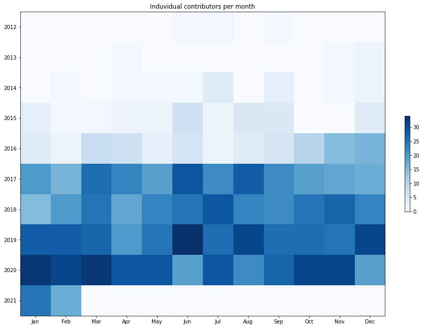

Latest record from the dataset:

<table border="1" class="dataframe">
  <thead>
    <tr style="text-align: right;">
      <th></th>
      <th>org</th>
      <th>repo</th>
      <th>type</th>
      <th>identifier</th>
      <th>subidentifier</th>
      <th>date</th>
      <th>author</th>
      <th>owner</th>
      <th>project</th>
    </tr>
  </thead>
  <tbody>
    <tr>
      <th>5997</th>
      <td>apache</td>
      <td>zookeeper</td>
      <td>PR_COMMENTED</td>
      <td>1602</td>
      <td>NaN</td>
      <td>2021-02-12 23:48:15+00:00</td>
      <td>smikes</td>
      <td>smikes</td>
      <td>zookeeper</td>
    </tr>
  </tbody>
</table>

# Github Contributions per user

<table border="1" class="dataframe">
  <thead>
    <tr style="text-align: right;">
      <th></th>
      <th>contributions</th>
    </tr>
    <tr>
      <th>author</th>
      <th></th>
    </tr>
  </thead>
  <tbody>
    <tr>
      <th>anmolnar</th>
      <td>1521</td>
    </tr>
    <tr>
      <th>eolivelli</th>
      <td>1439</td>
    </tr>
    <tr>
      <th>hanm</th>
      <td>850</td>
    </tr>
    <tr>
      <th>nkalmar</th>
      <td>516</td>
    </tr>
    <tr>
      <th>maoling</th>
      <td>467</td>
    </tr>
    <tr>
      <th>asfgit</th>
      <td>401</td>
    </tr>
    <tr>
      <th>lvfangmin</th>
      <td>310</td>
    </tr>
    <tr>
      <th>symat</th>
      <td>290</td>
    </tr>
    <tr>
      <th>phunt</th>
      <td>267</td>
    </tr>
    <tr>
      <th>afine</th>
      <td>170</td>
    </tr>
  </tbody>
</table>

## Contributors per participations in PRs which are not created by self (helping PRs)

<table border="1" class="dataframe">
  <thead>
    <tr style="text-align: right;">
      <th></th>
      <th>identifier</th>
    </tr>
    <tr>
      <th>author</th>
      <th></th>
    </tr>
  </thead>
  <tbody>
    <tr>
      <th>eolivelli</th>
      <td>560</td>
    </tr>
    <tr>
      <th>anmolnar</th>
      <td>543</td>
    </tr>
    <tr>
      <th>hanm</th>
      <td>308</td>
    </tr>
    <tr>
      <th>maoling</th>
      <td>254</td>
    </tr>
    <tr>
      <th>nkalmar</th>
      <td>242</td>
    </tr>
    <tr>
      <th>lvfangmin</th>
      <td>163</td>
    </tr>
    <tr>
      <th>phunt</th>
      <td>136</td>
    </tr>
    <tr>
      <th>symat</th>
      <td>101</td>
    </tr>
    <tr>
      <th>afine</th>
      <td>90</td>
    </tr>
    <tr>
      <th>asfgit</th>
      <td>88</td>
    </tr>
    <tr>
      <th>enixon</th>
      <td>66</td>
    </tr>
    <tr>
      <th>ctubbsii</th>
      <td>66</td>
    </tr>
    <tr>
      <th>eribeiro</th>
      <td>59</td>
    </tr>
    <tr>
      <th>ztzg</th>
      <td>57</td>
    </tr>
    <tr>
      <th>asf-ci</th>
      <td>55</td>
    </tr>
    <tr>
      <th>breed</th>
      <td>45</td>
    </tr>
    <tr>
      <th>rakeshadr</th>
      <td>38</td>
    </tr>
    <tr>
      <th>tamaashu</th>
      <td>27</td>
    </tr>
    <tr>
      <th>fpj</th>
      <td>22</td>
    </tr>
    <tr>
      <th>arshadmohammad</th>
      <td>21</td>
    </tr>
  </tbody>
</table>

## Contributors per participations in any PRs

<table border="1" class="dataframe">
  <thead>
    <tr style="text-align: right;">
      <th></th>
      <th>identifier</th>
    </tr>
    <tr>
      <th>author</th>
      <th></th>
    </tr>
  </thead>
  <tbody>
    <tr>
      <th>eolivelli</th>
      <td>657</td>
    </tr>
    <tr>
      <th>anmolnar</th>
      <td>631</td>
    </tr>
    <tr>
      <th>hanm</th>
      <td>379</td>
    </tr>
    <tr>
      <th>maoling</th>
      <td>337</td>
    </tr>
    <tr>
      <th>nkalmar</th>
      <td>312</td>
    </tr>
    <tr>
      <th>lvfangmin</th>
      <td>216</td>
    </tr>
    <tr>
      <th>phunt</th>
      <td>158</td>
    </tr>
    <tr>
      <th>symat</th>
      <td>149</td>
    </tr>
    <tr>
      <th>afine</th>
      <td>148</td>
    </tr>
    <tr>
      <th>enixon</th>
      <td>104</td>
    </tr>
    <tr>
      <th>ztzg</th>
      <td>90</td>
    </tr>
    <tr>
      <th>asfgit</th>
      <td>88</td>
    </tr>
    <tr>
      <th>ctubbsii</th>
      <td>80</td>
    </tr>
    <tr>
      <th>eribeiro</th>
      <td>76</td>
    </tr>
    <tr>
      <th>tamaashu</th>
      <td>57</td>
    </tr>
    <tr>
      <th>rakeshadr</th>
      <td>56</td>
    </tr>
    <tr>
      <th>asf-ci</th>
      <td>55</td>
    </tr>
    <tr>
      <th>arshadmohammad</th>
      <td>51</td>
    </tr>
    <tr>
      <th>TisonKun</th>
      <td>50</td>
    </tr>
    <tr>
      <th>jhuan31</th>
      <td>47</td>
    </tr>
  </tbody>
</table>

# Bus factor (number of contributors responsible for the 50% of the prs) from last half year

## Contributors until the half of the all contributions

<table border="1" class="dataframe">
  <thead>
    <tr style="text-align: right;">
      <th></th>
      <th>author</th>
      <th>identifier</th>
      <th>cs</th>
      <th>ratio</th>
    </tr>
  </thead>
  <tbody>
    <tr>
      <th>0</th>
      <td>ztzg</td>
      <td>19</td>
      <td>19</td>
      <td>11.111111</td>
    </tr>
    <tr>
      <th>1</th>
      <td>eolivelli</td>
      <td>10</td>
      <td>29</td>
      <td>5.847953</td>
    </tr>
    <tr>
      <th>2</th>
      <td>yanllearnn</td>
      <td>10</td>
      <td>39</td>
      <td>5.847953</td>
    </tr>
    <tr>
      <th>3</th>
      <td>zengchao1212</td>
      <td>9</td>
      <td>48</td>
      <td>5.263158</td>
    </tr>
    <tr>
      <th>4</th>
      <td>hanm</td>
      <td>9</td>
      <td>57</td>
      <td>5.263158</td>
    </tr>
    <tr>
      <th>5</th>
      <td>lanicc</td>
      <td>8</td>
      <td>65</td>
      <td>4.678363</td>
    </tr>
    <tr>
      <th>6</th>
      <td>symat</td>
      <td>6</td>
      <td>71</td>
      <td>3.508772</td>
    </tr>
    <tr>
      <th>7</th>
      <td>maoling</td>
      <td>5</td>
      <td>76</td>
      <td>2.923977</td>
    </tr>
    <tr>
      <th>8</th>
      <td>tamaashu</td>
      <td>5</td>
      <td>81</td>
      <td>2.923977</td>
    </tr>
  </tbody>
</table>

## Pony number (bus factor)

    10

## Dev power (All the contributions in the ration of the top contributor)

    8.999999999999998

    

    

## People with created PRs > reviewed/commented PRS

    

    

## Same graph with focusing to the last 6 month

Only contributors with both created pr and helped pr visible

    

    

# Number of individual contributors per month

Number of different Github users who either created PR, commented PR, added review to a PR

Note: only events from apache/hadoop-ozone repository are included. Earlier PRs/comments are not here.

    

    

# Number of PRs closed/created per month

    /usr/lib/python3.9/site-packages/pandas/core/arrays/datetimes.py:1101: UserWarning: Converting to PeriodArray/Index representation will drop timezone information.
      warnings.warn(

    

    

# PR activity heatmap

    

    

